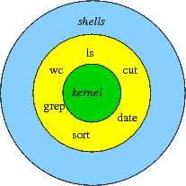

# linux

<div align="center">
  
</div>

Linux：是一种自由和开放源码的类 UNIX 操作系统。该操作系统的内核由林纳斯·托瓦兹在 1991 年 10 月 5 日首次发布，在加上用户空间的应用程序之后，成为 Linux 操作系统

## liunx 常用命令

1.  netstat -ntpl 查看进程
1.  netstat -atunlp
1.  ss –an –p | grep 8080
1.  ps -ef | grep jenkins
1.  lsof -i:80
1.  cat /etc/passwd 查看用户列表
1.  kill -9 pid 强制杀死进程
1.  killall nginx 杀死 nginx 所有的进程
1.  ssh 启动 sudo service ssh start
1.  tar -cvf vitest.zip vitest 压缩
1.  tar -xvf vitest.zip 解压缩
1.  systemctl start firewalld 开启防火墙
1.  systemctl stop firewalld 关闭防火墙
1.  systemctl status firewalld 查看防火墙状态
1.  firewall-cmd –list-all 查看所有的信息
1.  Chmod 600 ubuntu02_key 修改私钥权限
1.  ps -ef | grep nginx 查看 nginx 的进程
1.  sudo passwd 设置 root 用户密码
1.  su root 切换用户
1.  /etc/profile //环境变量配置文件
1.  ssh root@192.168.50.14 -P 8090
1.  复制文件：scp width.html roottest@192.168.50.141:home/newtest
1.  复制目录：scp -r filename roottest@192.168.50.141:home/newtest
1.  ssh roottest@192.168.50.141
1.  service jenkins restart 启动 jenkins 进程
1.  service nginx restar 启动 nginx 进程
1.  yum uninstall nginx 卸载
1.  curl 127.0.0.1; 访问网络
1.  Exit：退出
1.  hostname hb 更改主机用户名
1.  where is nginx 查找文件位置
1.  which nginx (别名)查找文件位置
1.  find /etc -name init.d 查找文件
1.  find /etc -name init.\* (多个)查找文件
1.  find /etc -name init.? （一个）查找文件
1.  find /etc -iname init.T 忽略大小写
1.  find /etc -atime 5 //文件访问时间
1.  find /etc -ctime 5 //改变文件属性
1.  find /etc -mtime 5 //修改时间
1.  find /etc -size -100k //文件小于 100k 的
1.  find /etc -size +100k //文件大于 100k 的
1.  find /etc -size 100k //文件等于 100k 的
1.  main ls 查看帮助
1.  history 查看历史记录
1.  top 产看系统信息
1.  free 查看内存
1.  ip a ip 地址
1.  telnet www.baidu.com 80 查看端口

### 配置免密登录

-   注如果 scp ssh 失败：
-   sudo ps -e |grep ssh“–>回车–>有 sshd,说明 ssh 服务已经启动，如果没有启动，输入”sudo service ssh start“–>回车–>ssh 服务就会启动 如果没有下载 apt-get install openssh-server 并且

*   ssh-keygen –t rsa –C ‘name’ -f 'wenjianming_key’
    > -   -t 选择加密算法
    > -   -C 名字
    > -   -f 生成密钥名字
    > -   rsa 加密方式
    > -   wenjianming_key.pub >> authorized_keys //把公钥追加 authorized_keys
    > -   > 覆盖
    > -   > > 追加
    > -   Exit：退出
*   ssh 登录：ssh -i pri-key root@192.168.50.134

### 拷贝公钥

```shell
ssh-copy-id <ip地址>
ssh-copy-id -i .ssh/id_rsa.pub  用户名字@192.168.x.xxx
```

```bash
    known_hosts: 存放其他服务器生成的指纹
    config 配置
            Host evil-cloud
            User root
            Host yideng
            HostName 192.168.50.142
            port 22
            IdentityFile ~/.ssh/new
            IdentitiesOnly yes
            Protocol 2
            Compression yes
            ServerAliveInterval 60
            ServerAliveCountMax 20
            LogLevel INFO
    ssh yideng  可直接登录
```

## 文件夹作用

```shell
/bin: /usr/bin: 可执行二进制文件的目录，如常用的命令ls、tar、mv、cat等。
/boot：放置linux系统启动时用到的一些文件。/boot/vmlinuz 为 linux 的内核文件，以及 /boot/gurb。建议单独分区，分区大小100M即可
/dev：存放linux系统下的设备文件，访问该目录下某个文件，相当于访问某个设备，常用的是挂载光驱 mount /dev/cdrom /mnt。
/etc：系统配置文件存放的目录，不建议在此目录下存放可执行文件，重要的配置文件有 /etc/inittab、/etc/fstab、/etc/init.d、/etc/X11、/etc/sysconfig、/etc/xinetd.d修改配置文件之前记得备份。
注：/etc/X11 存放与 x windows 有关的设置。
/home：系统默认的用户家目录，新增用户账号时，用户的家目录都存放在此目录下，~表示当前用户的家目录，~edu 表示用户 edu 的家目录。建议单独分区，并设置较大的磁盘空间，方便用户存放数据
/lib: /usr/lib: /usr/local/lib：系统使用的函数库的目录，程序在执行过程中，需要调用一些额外的参数时需要函数库的协助，比较重要的目录为 /lib/modules。
/lost+fount：系统异常产生错误时，会将一些遗失的片段放置于此目录下，通常这个目录会自动出现在装置目录下。如加载硬盘于 /disk 中，此目录下就会自动产生目录 /disk/lost+found
/mnt: /media：光盘默认挂载点，通常光盘挂载于 /mnt/cdrom 下，也不一定，可以选择任意位置进行挂载。
/opt：给主机额外安装软件所摆放的目录。如：FC4使用的Fedora 社群开发软件，如果想要自行安装新的 KDE 桌面软件，可以将该软件安装在该目录下。以前的 Linux 系统中，习惯放置在 /usr/local 目录下
/proc：此目录的数据都在内存中，如系统核心，外部设备，网络状态，由于数据都存放于内存中，所以不占用磁盘空间，比较重要的目录有 /proc/cpuinfo、/proc/interrupts、/proc/dma、/proc/ioports、/proc/net/* 等。
/root：系统管理员root的家目录，系统第一个启动的分区为 /，所以最好将 /root和 /放置在一个分区下。
/sbin: /usr/sbin: /usr/local/sbin：放置系统管理员使用的可执行命令，如fdisk、shutdown、mount 等。与 /bin 不同的是，这几个目录是给系统管理员 root使用的命令，一般用户只能"查看"而不能设置和使用。
/tmp：一般用户或正在执行的程序临时存放文件的目录,任何人都可以访问,重要数据不可放置在此目录下
/srv：服务启动之后需要访问的数据目录，如 www 服务需要访问的网页数据存放在 /srv/www 内。
/usr：应用程序存放目录，/usr/bin 存放应用程序，/usr/share 存放共享数据，/usr/lib 存放不能直接运行的，却是许多程序运行所必需的一些函数库文件。/usr/local: 存放软件升级包。/usr/share/doc: 系统说明文件存放目录。/usr/share/man: 程序说明文件存放目录，使用 man ls 时会查询 /usr/share/man/man1/ls.1.gz 的内容建议单独分区，设置较大的磁盘空间
/var：放置系统执行过程中经常变化的文件，如随时更改的日志文件 /var/log，/var/log/message：所有的登录文件存放目录，/var/spool/mail：邮件存放的目录，/var/run:程序或服务启动后，其PID存放在该目录下。建议单独分区，设置较大的磁盘空间
```

## 系统启动 变量文件执行过程

```shell
/etc/profile
~/.bash_profile -> /etc/profile.d/*.sh -> /etc/profile.d/lang.sh , /etc/sysconfig/i18n
~/.bashrc
/etc/bashrc -> /etc/profile.d/*.sh -> /etc/profile.d/lang.sh , /etc/sysconfig/i18n
命令提示符号

```

## 权限问题

ls -a 查看文件
chmod -R u+x tiral 给文件赋予所有者的执行权限
chmod -R u-x tiral 给文件减去所有者的执行权限
chmod -R u=rwx tiral 给文件赋予所有者的读写执行权限
chmod 755 trial

chown user1 trial 给文件赋予所有者的 fuzhi
chgrp user1 trial

#### 权限试用者

1.  u:所有者
2.  g:所有组
3.  o:其他人

#### 权限

r:读 4。（cat more head tail）

5.  w:写 2. echo vi
6.  x:执行 1

### 执行命令

```shall
ls :罗列文件列表
    -a :显示所有文件，包括隐藏文件
    -l :显示详细信息
    -d :查看目录属性
    -h :人性化显示文件大小
    -i :显示incode

mkdir 创建文件
    -p: 递归创建文件

cd  切换目录
    cd ~  :进入当前用户的家目录
    cd .. :进入上一次目录
    cd -  :进入上次目录
cp 切换目录
     -r :复制目录
     -p :连带文件属性
     -d :如果源文件是连接文件 则复制链接属性
     -a :相当于 -pdr
mv
```

#### 查询命令

```shall
locate 在后台数据库中按文件名搜索，搜索速度更快
    /var/lib/mlocate 存储文件名与数据库数据
    updatedb :更新创建的文件名存入数据库中
    /etc/updatedb.conf: 配置文件
        PRUNE_BIND_MOUNTS='yes' 开启搜索限制
        PRUNEFS=    搜索时，不搜索的文件系统
        PRUNENAMES=      搜索时，不搜索的文件类型
        PRINEPATHS=     搜索时，不搜索的文件路径

```

#### 搜索

```shall
which
whereis 查询命令的配置文件
    -b :查找可执行的文件
    -m :只查找帮助文件

whoami
whatis ls
whatis cd 确定是否是shell内部命令


find /root -iname install.log 不区分大小写
find /root -name "*[cd]"
find /root -nouser 没有所有者文件， sys proc 没有属于正常。外来文件
find /var/log  -mtime +10 10天前
find /var/log  -mtime -10 10天内
find . -size 25k 查找文件大小是25K的文件
find . -size +25K 查找文件大小是大于25K的文件
find /etc -size +20k -a size -50k 查找etc/ 目录下 大于20k并且小于50k 的文件
find /etc -size +20k -a size -50k -exec ls lh {}\; 查找etc/ 目录下 大于20k并且小于50k 的文件,并显示详细信息

grep  在文件当中匹配符合条件的字符串
    -i 忽略大小写
    -v 排除指定字符串
```

#### 帮助命令

```shall
man 帮助命令
man ls ls帮助信息
man  -f  相当 whatis
man  -k   相当 apropos
    man 的级别
    1: 查看命令帮助
    2: 查看可被内核调用的函数的帮助
    3: 查看函数和函数库的帮助
    4: 查看特殊文件的帮助
    5: 查看配置文件的帮助
    6: 查看游戏的帮助
    7: 查看其他杂项的帮助
    8: 查看系统管理员可用命令的帮助
    9: 查看和内核相关文件的帮助


apropos ls 含有ls关键字的帮助信息
ls --help 查看ls帮助信息
help cd 获取内部命令

info 帮助信息
    -回车 进入子帮助页面
    -u :进入上层页面
    -n :进入下一个帮助小节
    -p : 进入上一个帮助小节
    -q : 退出
```

#### 压缩

```shall
    .zip 格式压缩
    zip  压缩文件名 源文件
    zip -r 压缩文件名 源目录
    uzip  解压文件名
    .gz 格式压缩
    gzip 源文件
    gzip -c 源文件 压缩文件
    gzip -r 目录
    gzip -d 解压文件
    gunzip 解压文件
     .bz2 格式压缩
    bzip2 源文件 压缩.bz2格式 不保留源文件
    bzip2 -k 源文件 压缩之后保留源文件
    bzip2 -d 解压文件
    bunzip2 解压文件
    .tar.bz2 格式

    tar  -jcv -f filename.tar.bz2 被压缩的文件或目录
    tar -jxv -f filename.tar.bz2 -C 欲解压到的目录

    .tar.gz
    tar -zcvf 压缩名 源文件 压缩
    tar -zxvf 压缩包名称    解压
    .tar 格式
    tar -cvf filename.tar xxx 打包
    tar -xvf filename.tar  解压x

解压包
tar -cvf 压缩
tar -xvf 解压
先打包后压缩

```

#### 关机

```shall
shutdown -r now
shutdown -r 05:30 &
shutdown -c
halt
init 0
poweroff


reboot
init 6
```

#### 用户

```shall
w 用户名
命令输出
    USER:登陆的用户名
    TTY: 登陆终端
    FROM:ip地址登录
    LOGIN@:登陆时间
    IDLE:用户闲置时间
    JCPU:指的是和改终端连接的所有占用时间
    PCPU:当前进程所占用的时间
    WHAT:当前正在运行的命令
who 用户名称
    命令输出
    -:用户名
    -: 登陆终端
    -:ip登录时间
```

### 系统信息

```shall
last
last 默认读取/var/log/wtmp 文件数据
命令输出
-:用户名
-:登陆终端
-:登陆 ip
-:登录时间
-:退出时间
lastlog
lastlog 默认读取/var/log/lastlog 文件数据
命令输出
-:用户名
-:登陆终端
-:登陆 ip
-:最后一次登录时间
history 历史命令
-c:清空历史命令
-w:把缓存中的历史命令写入历史命令保存文件 ～/.bash_history

alias ls='ls --color=never' 添加别名
alias 查看别名
unalias 删除别名 1. 第一顺位 用绝对路径或相对路径执行的命令 2. 第二顺位 执行别名 3. 第三顺位 执行 bash 的内部命令 4. 第三顺位 按照\$PATH 环境变量定义的目录查找顺序找到的第一个命令


输出重定向

命令 >> 文件 2>&1 以追加的方式，把正确输出和错误的输出都保存到同一个文件中
命令 &>>文件 以追加的方式，把正确输出和错误的输出都保存到同一个文件中
命令 >>文件 1 2>>文件 2 ：把正确的追加到文件 1 中 把错误的追加到文件 2 中

wc 输入重定向
-c 统计字节数
-w 统计单词数
-l 统计行数

```

<!-- > useradd user1
> pasword user1 -->

## 源码包编译过程

| 编译方法 |                 命令                 |       产物       |
| :------: | :----------------------------------: | :--------------: |
| 检测配置 | ./configure --prefix=/user/local/xxx |     Makefile     |
|   编译   |                 make                 | 二进制可执行文件 |
|   安装   |             make install             |  安装到指定目录  |

!> prefix:指定文件编译地址

## rpm 包

```shell
rpm -q 包名称 ：查询是否安装
rpm -qa ：查询所有已经安装的包
rpm -qf 系统文件名

   -q query 查询
   -a all 所有
   -i information 软件信息
   -p package 未按装包信息
   -l list 列表
   -f file 查询系统文件属于那个软件包
   -R requires 依赖

rpm -qa | grep httpd
rpm -ivh 包全名:安装包名
   -i install 安装
   -v verbose 详细信息
   -h hash 显示进度
   --nodeps 不检测依赖性

rpm -Uvh 包全名 ：升级
    -U upgrade 升级

rpm -V 校验已安装的包信息
    验证信息的8个信息具体内容
    s:文件大小是否改变
    M: 文件类型或者文件权限是否改变
    5: 文件MD5校验是否改变
    D: 设备主从代码是否改变
    L: 文件路径是否改变
    U: 文件属主是否改变
    G:文件的数组是否改变
    T:文件修改时间是否改变
文件类型
    c:配置文件 config file
    d:普通文档 documenttion
    g:鬼文件   gost file
    L:授权文件 license file
    r:描述文件 readme
rpm 包中文件提取
rpm2cpio 包全名 |cpio -idv .文件绝对路径

```

## yum

yum list 列出所有可安装的列表
yum seacrh nginx 搜索关于 nginx 列表
yum -y update nginx 升级
yum -y remove nginx 卸载

yum grouplist 列出所有可用的软件组列表
yum groupinstall “Chinese Suport” 安装软件组
yum groupremove “Chinese Suport” 删除软件组

## shell 命令



1.  /bin/bash -x first_shell.sh //执行 shell 文件 调试错误
2.  /bin/bnsh -n first_shell.sh //执行 shell 文件 调试错误

### shell 编程常见的系统变量解析

```shall
1.  $0   当前程序的名称
2.  $n   当前程序的第 n 个参数,$1-$9 代表第一到第九个参数
3.  $_ :代表命令行中的所有参数，$_ 把所有的参数看成一个整体
4.  $@ :这个变量也代表命令行中所有参数，不过$@把每个参数区分中
5.  $\*   当前程序的所有参数 ( 不包括程序本身 )
6.  $#   当前程序的参数个数 ( 不包括程序本身 )
7.  $?   命令或程序执行完后的状态，一般返回 0 表示执行成功。
8.  $$ 当前进程号
9.  $! 后台运行的进程号 pid
10.  $UID   当前用户的 ID
11.  $PWD 当前所在的目录

12. ‘’：单引号 在单引号中所有的特殊符号，如"\$" 和 "`" 都没有特殊含义 "": 双引号 在双引号中特殊符号都没有特殊含义 但是 "\$" 和 "`"和“\”例外 拥有 “调用变量的值”，“引用命令”，“转义符”的特殊含义
13.  ``: 反引号 在反引号扩起来的内容是系统命令，在 Bash 中会优先执行它，和$()作用一样，不过推荐用 $(),
14.  $(): 和反引号一样，用来引用系统命令
15.  #: 在shell脚本中，#开头的行代表注释
16.  $: 用于调用变量的值，如需要调用 name 的值时，需要用$name的方式
17.  \ : 转义符号 跟在\之后的特殊符号将失去特殊含义，变为普通自负 \$ 将输出 $ 符号 ，而不做变量引用


8.  \a 输出警告
9.  \b 退格键 向左侧删除
10. \n 换行符
11. \r 回车键
12. \t tap 键
13. \v 垂直制表符
14. \0nnn 八进制
15. \xhh 十六进制

```

```shell

echo -e "\e[1;31m hello world \e[0m"
echo -e "\e[1;32m hello world \e[0m"
echo -e "\e[1;33m hello world \e[0m"
echo -e "\e[1;34m hello world \e[0m"
echo -e "\e[1;35m hello world \e[0m"
echo -e "\e[1;36m hello world \e[0m"
echo -e "\e[1;37m hello world \e[0m"
echo -e "\e[1;30m hello world \e[0m"

Var="1234"
readonly Var //使用 readonly 命令可以将变量定义为只读变量
unset Var  //使用 unset 命令可以删除变量
echo ${#Var}  #获取字符串长度 输出 4
echo ${Var:2:3} # 输出34 //提取子字符串

nameone=(1 2 3 4);
${array_name[n]} //数组元素值的一般格式
${array_name[@]} //获取数组中的所有元素
length=${#array_name[@]} //取得数组元素的个数
length=${#array_name[*]} // 或者
lengthn=${#array_name[n]}// 取得数组单个元素的长度
```

### 注释

1.  以 # 开头的行就是注释，会被解释器忽略
2.  多行注释

```shell

:<<EOF
注释内容...
EOF

:<<'
注释内容...
'
```

### 脚本执行

```shell
方式一

chmod 755 hello.sh
./hello.sh

方式二
bash hello.sh
```

### 设置环境变量

```shall
export HD='hello Docker'

echo $PATH  查看系统环境变量
PATH = "$PATH":/root/sh 增加 PATH 变量的值
ps1 环境变量

locale 当前语言
-LANG 定义系统主语系变量
-LC_ALL 罗列支持的语言
echo \$LANG 当前语言
locale -a | more 罗列支持的语言
cat /etc/sysconfig/i18n
```

#### 创建目录

```shall
#!/bin/bash
DIR=$1
echo -e '\033 [32m-------------------\033[0m'


:

if ( ! -d $DIR ); then
    mkdir -p $DIR
    echo "the $DIR create success!!"
else
    echo "the $DIR is exist"
    exit
fi
```

#### 创建文件

```shell
#!/bin/bash
FILE=$1

if [ ! -f $FILE ]; then
    touch $FILE
    echo "the $FILE create success!!"
else
    echo "the $FILE is exist"
    exit
fi
```

## 算术运算符

expr 是一款表达式计算工具，使用它能完成表达式的求值操作。

```shell
+   加法  `expr $a + $b` 结果为 30。
-   减法  `expr $a - $b` 结果为 -10。
*   乘法  `expr $a \* $b` 结果为  200。
/   除法  `expr $b / $a` 结果为 2。
%   取余  `expr $b % $a` 结果为 0。
=   赋值  a=$b 将把变量 b 的值赋给 a。
==  相等。用于比较两个数字，相同则返回 true。 [ $a == $b ] 返回 false。
!=  不相等。用于比较两个数字，不相同则返回 true。

-eq 检测两个数是否相等，相等返回 true。    [ $a -eq $b ] 返回 false。
-ne 检测两个数是否不相等，不相等返回 true。  [ $a -ne $b ] 返回 true。
-gt 检测左边的数是否大于右边的，如果是，则返回 true。 [ $a -gt $b ] 返回 false。
-lt 检测左边的数是否小于右边的，如果是，则返回 true。 [ $a -lt $b ] 返回 true。
-ge 检测左边的数是否大于等于右边的，如果是，则返回 true。   [ $a -ge $b ] 返回 false。
-le 检测左边的数是否小于等于右边的，如果是，则返回 true。   [ $a -le $b ] 返回 true。

!   非运算，表达式为 true 则返回 false，否则返回 true。  [ ! false ] 返回 true。
-o  或运算，有一个表达式为 true 则返回 true。  [ $a -lt 20 -o $b -gt 100 ] 返回 true。
-a  与运算，两个表达式都为 true 才返回 true。  [ $a -lt 20 -a $b -gt 100 ] 返回 false。
&&  逻辑的 AND [[ $a -lt 100 && $b -gt 100 ]] 返回 false
||  逻辑的 OR  [[ $a -lt 100 || $b -gt 100 ]] 返回 true
```

## 文件测试运算符

```shell
=   检测两个字符串是否相等，相等返回 true。  [ $a = $b ] 返回 false。
!=  检测两个字符串是否相等，不相等返回 true。 [ $a != $b ] 返回 true。
-z  检测字符串长度是否为0，为0返回 true。  [ -z $a ] 返回 false。
-n  检测字符串长度是否为0，不为0返回 true。 [ -n "$a" ] 返回 true。
$   检测字符串是否为空，不为空返回 true。   [ $a ] 返回 true。
-b file 检测文件是否是块设备文件，如果是，则返回 true。  [ -b $file ] 返回 false。
-c file 检测文件是否是字符设备文件，如果是，则返回 true。 [ -c $file ] 返回 false。
-d file 检测文件是否是目录，如果是，则返回 true。 [ -d $file ] 返回 false。
-f file 检测文件是否是普通文件（既不是目录，也不是设备文件），如果是，则返回 true。    [ -f $file ] 返回 true。
-g file 检测文件是否设置了 SGID 位，如果是，则返回 true。  [ -g $file ] 返回 false。
-k file 检测文件是否设置了粘着位(Sticky Bit)，如果是，则返回 true。  [ -k $file ] 返回 false。
-p file 检测文件是否是有名管道，如果是，则返回 true。   [ -p $file ] 返回 false。
-u file 检测文件是否设置了 SUID 位，如果是，则返回 true。  [ -u $file ] 返回 false。
-r file 检测文件是否可读，如果是，则返回 true。  [ -r $file ] 返回 true。
-w file 检测文件是否可写，如果是，则返回 true。  [ -w $file ] 返回 true。
-x file 检测文件是否可执行，如果是，则返回 true。 [ -x $file ] 返回 true。
-s file 检测文件是否为空（文件大小是否大于0），不为空返回 true。 [ -s $file ] 返回 true。
-e file 检测文件（包括目录）是否存在，如果是，则返回 true。    [ -e $file ] 返回 true。
```

## Shell 函数

```shell
#!/bin/bash

demoFun(){
    echo "这是我的第一个 shell 函数!"
}
echo "-----函数开始执行-----"
demoFun
echo "-----函数执行完毕-----"
funWithReturn(){
    echo "这个函数会对输入的两个数字进行相加运算..."
    echo "输入第一个数字: "
    read aNum
    echo "输入第二个数字: "
    read anotherNum
    echo "两个数字分别为 $aNum 和 $anotherNum !"
    return $(($aNum+$anotherNum))
}
funWithReturn
echo "输入的两个数字之和为 $? !"
```

## shell 编程之其他环境变量

### 启动时执行的文件

1. /etc/profile
2. /etc/profile.d/\*.sh
3. ~/.bash_profile
4. ~/.bashrc
5. /etc/bashrc

### 启动时执行的文件

ls
y
