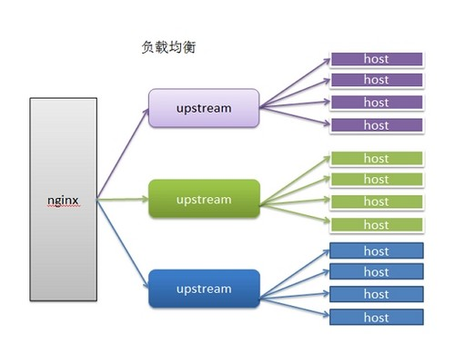
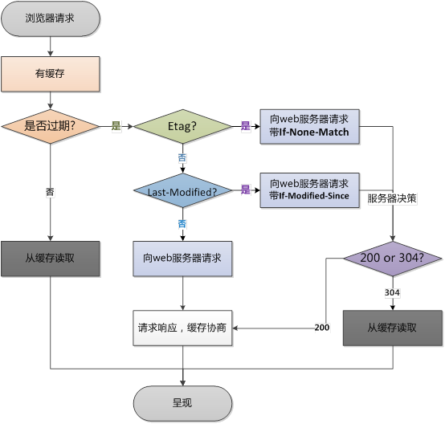
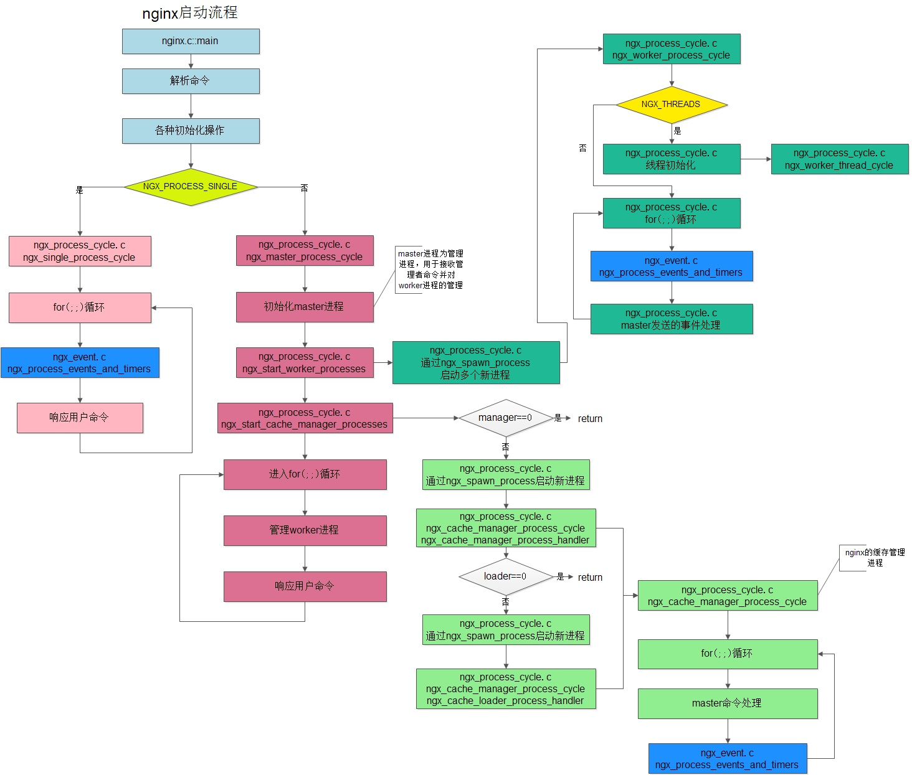

# Nginx

<div align="center">
  
</div>

Nginx（发音同 engine x）是异步框架的网页服务器，也可以用作反向代理、负载平衡器和 HTTP 缓存。该软件由伊戈尔·赛索耶夫创建并于 2004 年首次公开发布。2011 年成立同名公司以提供支持

## 优势

1.  解决 c10k 问题（万级并发问题）
1.  IO 多路复用 多个描述符的 IO 操作都能在一个线程里并发交替顺序完成，复用线程 select 线性遍历文件描述符列表 1. 效率低下 2.最多只能有 1024 epoll 每当 fd 就绪，采用系统回调函数将 fd 放入 1.效率高 2.没有 1024 限制
1.  CPU 亲和 一种把 CPU 核心和 Nginx 工作进程绑定方式，把每个 worker 进程固定在一个 CPU 上执行，减少切换 CPU 和提交缓存命中率,获得更好的性能。
1.  sendfile 零拷贝传输模式 ![usercore]

## Nginx 配置

```bash
# 设置工作进程的数量
worker_processes  1;
# 处理连接
events {
    # 设置连接数
    worker_connections  1024;
}

http {
    # 文件拓展名查找集合
    include       mime.types;
    # 当查找不到对应类型的时候默认值
    default_type  application/octet-stream;

    # 日志格式，定义别名为 main
    #log_format  main  '$remote_addr - $remote_user [$time_local] "$request" '
    #                  '$status $body_bytes_sent "$http_referer" '
    #                  '"$http_user_agent" "$http_x_forwarded_for"';

    # 指定日志输入目录
    #access_log  logs/access.log  main;

    # 调用 sendfile 系统传输文件
    sendfile        on;
    #tcp_nopush     on;

    # 客户端与服务器连接超时时间，超时自动断开
    #keepalive_timeout  0;
    keepalive_timeout  65;

    # 开启gizip 压缩
    #gzip  on;

    # 虚拟主机
    server {
        listen       80;
        server_name  localhost;

        #charset koi8-r;

        #access_log  logs/host.access.log  main;

        # 路由
        location / {
                root   html;
                index  index.html index.htm;
            }
    }

    # 引入其他的配置文件
    include servers/*;
}
```

<!-- ## unbuntu 下载 nginx

```code
    wget http://nginx.org/download/nginx-1.13.6.tar.gz
    tar -xvf  nginx //解压
-   进入 nginx
    sudo ./configure
    //报错的话执行
    sudo apt-get install libpcre3 libpcre3-dev
    sudo apt-get install openssl libssl-dev
    执行 install make
    进入安装后的文件夹
    进入 sbin
    启动 sudo ./nginx
```
 -->

## 常用的 nginx 命令

```bash
systemctl start nginx   启动nginx
ps –ef | grep nginx 查看 nginx 进程
netstat -ntpl 80 查看端口号
nginx -v  //查看版本
nginx -t //测试配置是否正确
nginx -s stop  //停止nginx
nginx -s qute  //优雅停止nginx
nginx -s reload //重启nginx
nginx -s reopen //重新打开日志
```

## 日志备份

mv logs/assets.bak logs/assets.lock.bak
nginx -s reopen 重新打开日志

rewrite 重写
rewrite （\*.)$ /index/$1
try_files $uri ? /index.html?$uri

## 强缓存

!>Cache-Control 的优先级高于 Expires

1· expires 30d;
1· Cache-Control
1· add_header Cache-Control no-cache;

## 协商缓存

1.  etag on
1.  last-modified

## 压缩

```bash
  gzip on;
  gzip_static on; //静态资源
  gzip_vary on;  //是否在 http header 中添加 Vary: Accept-Encoding，建议开启
  gzip_comp_level 5; //(建议) gzip 压缩比，1 压缩比最小处理速度最快，9 压缩比最大但处理最慢（传输快但比较消耗 cpu）
  gzip_min_length 0 ; //默认值是 0，不管页面多大都压缩。 建议设置成大于 1k 的字节数，小于 1k 可能会越压越大
  gzip_http_version 1.1; //版本信息
  gzip_types text/plain application/x-javascript text/css application/xml text/javascript application/x-httpd-php image/jpeg image/gif image/png;
```

## 动静分离


```bash
location ～ .\.(jpg|png|jpeg) $ {
proxy_pass http://192.168.1.2.0:90
proxy_set_header X_Forwarded_for $remote_addr; //设置头部 IP 地址
}
```

## 配置文件访问权限(防盗链)

```bash
   location ～ .\.(jpg|png) $ {
        valid_referers none blocked 192.186.1.1;
        if ($invalid_referer) {
                return 403;
        }
        root /data/images
        }
```

-   valid_referers

    -   none : 允许没有 http_refer 的请求访问资源；
    -   blocked : 允许不是http://开头的，不带协议的请求访问资源；
    -   119.28.190.215 : 只允许指定 ip 来的请求访问资源；

## 配置跨域

```bash
location ~ .*\.json$ {
        add_header Access-Control-Allow-Origin http://localhost:3000;
        add_header Access-Control-Allow-Methods GET,POST,PUT,DELETE,OPTIONS;
        root /data/json;
    }
```

<!-- ## 随机展示文件

```bash
location /  {
            root  /usr/share/nginx/html;
            random_index  on;
    }
``` -->

<!-- ## 文件修改

```bash
location /  {
            root  /usr/share/nginx/html;
            index index.html index.htm;
            sub_filter 'work' 'hello';
            sub_filter_once :off;
    }
``` -->

## 配置反向代理

```bash
 upstream web_crm {
        server 127.0.0.1:8080;
}
   location /crm/ {
            proxy_pass http://web_crm/crm/;
            proxy_redirect  off;
            proxy_set_header Host $host;
            proxy_http_version 1.1;
            proxy_set_header Upgrade $http_upgrade;
            proxy_set_header Connection ‘upgrade’;
            proxy_cache_bypass $http_upgrade;
            proxy_set_header X-Real-IP $remote_addr;
            proxy_set_header X-Forwarded-For $proxy_add_x_forwarded_for;
        }
```

## 过滤网络爬虫

```bash
 location / {
        if ($http_user_agent ~* "python|curl|java|wget|httpclient|okhttp") {
            return 503;
        }
        # 正常处理
        ...
    }
```

## URL 重定向

```bash
server {
        listen        80;
        server_name www.abc.com;
        location / {
            rewrite ^/ http://192.168.18.250;

          }
}
```

## 配置负载均衡



```bash
upstream web_mgrsys {
    server 127.0.0.1:8090 weight=10;
    server 127.0.0.1:3000 weight=3;
}
proxy_pass http://web_mgrsys;
```

### 负载均衡算法（策略）：

1.  基于 cookie 值区别用户
2.  基于 uri 利用一致性算法
3.  基于 IP 地址

### 其他参数

-   1.backup ：备份机，所有服务器挂了之后才会生效
-   2.Weight：默认为 1.weight 越大，负载的权重就越大。
-   3.max_fails：允许请求失败的次数默认为 1.当超过最大次数时，返回 proxy_next_upstream 模块定义的错误
-   4.fail_timeout：max_fails 次失败后，暂停的时间。
-   5.max_conns：限制分配给某台 Server 处理的最大连接数量，超过这个数量，将不会分配新的连接给它。默认为 0，表示不限制。注意：1.5.9 之后的版本才有这个配置
-   6 ip_hash; 每个请求按访问 ip 的 hash 结果分配，这样每个访客固定访问一个后端服务器，可以解决 session 的问题
-   7 least_conn 最小连接数，哪个连接少就分给谁
-   8 url_hash（第三方) 按访问的 URL 地址来分配 请求，每个 URL 都定向到同一个后端 服务器上(缓存)
-   9 fair（第三方) 按后端服务器的响应时间来分配请求，响应时间短的优先分配。

## https

ssl on;
ssl_certificate_key ../certs

### if 指令的条件表达式

-   检查变量为空或者值是否为 0,直接使用
-   将变量与字符串做匹配,使用=或者 !=
-   将变量与正则表达式做匹配
    > -   大小写敏感,~或者!
    > -   大小写不敏感,\*或者!
-   检查文件是否存在,使用-f 或者 !-f
-   检查目录是否存在,使用 d 或者 !d
-   检查文件、目录、软链接是否存在,使用-e 或者!-e
-   检查是否为可执行文件,使用 x 或者!-x

### location 匹配规则

常规
= ：精确匹配
^～：匹配后不再进行正则匹配
然后使用最长的前缀字符串

## 限制客户端的并发连接数

ngx_http_limit_conn_module

## 限制客户端的每秒处理请求数

ngx_http_limit_req_module

## 请求限制

limit_req_zone

## cpu 核数

worker_cpu_affinity

## 限制 IP 地址访问

```bash
location / {
deny 192.168.1.1;
}
```

## 浏览器缓存与 nginx 缀存

### 浏览器缓存



优点

1.  使用有效缓存时,没有网络消耗,速度最快
2.  即使有网络消耗,但对失效缓存使用 304 响应做到网络流量消耗最小化

缺点

仅提升一个用户的体验

### nginx 缓存



优点

1.  提升所有用户的体验
2.  相比浏览器缓存,有效降低上游服务的負载
3.  通过 304 响应减少 nginx 与上游服务间的流量消耗

缺点

1.  用户仍然保持网络消耗
    1 同时使用浏览器与 nginx 缓存

## nginx 内置变量

```bash
$arg_PARAMETER 这个变量值为：GET请求中变量名PARAMETER参数的值。
$args 这个变量等于GET请求中的参数。例如，foo=123&bar=blahblah;这个变量只可以被修改
$binary_remote_addr 二进制码形式的客户端地址。
$body_bytes_sent 传送页面的字节数
$content_length 请求头中的Content-length字段。
$content_type 请求头中的Content-Type字段。
$cookie_COOKIE cookie COOKIE的值。
$document_root 当前请求在root指令中指定的值。
$document_uri 与$uri相同。
$host 请求中的主机头(Host)字段，如果请求中的主机头不可用或者空，则为处理请求的server名称(处理请求的server的server_name指令的值)。值为小写，不包含端口。
$hostname  机器名使用 gethostname系统调用的值
$http_HEADER   HTTP请求头中的内容，HEADER为HTTP请求中的内容转为小写，-变为_(破折号变为下划线)，例如：$http_user_agent(Uaer-Agent的值), $http_referer...;
$sent_http_HEADER  HTTP响应头中的内容，HEADER为HTTP响应中的内容转为小写，-变为_(破折号变为下划线)，例如： $sent_http_cache_control, $sent_http_content_type...;
$is_args 如果$args设置，值为"?"，否则为""。
$limit_rate 这个变量可以限制连接速率。
$nginx_version 当前运行的nginx版本号。
$query_string 与$args相同。
$remote_addr 客户端的IP地址。
$remote_port 客户端的端口。
$remote_user 已经经过Auth Basic Module验证的用户名。
$request_filename 当前连接请求的文件路径，由root或alias指令与URI请求生成。
$request_body 这个变量（0.7.58+）包含请求的主要信息。在使用proxy_pass或fastcgi_pass指令的location中比较有意义。
$request_body_file 客户端请求主体信息的临时文件名。
$request_completion 如果请求成功，设为"OK"；如果请求未完成或者不是一系列请求中最后一部分则设为空。
$request_method 这个变量是客户端请求的动作，通常为GET或POST。
包括0.8.20及之前的版本中，这个变量总为main request中的动作，如果当前请求是一个子请求，并不使用这个当前请求的动作。
$request_uri 这个变量等于包含一些客户端请求参数的原始URI，它无法修改，请查看$uri更改或重写URI。
$scheme 所用的协议，比如http或者是https，比如rewrite ^(.+)$ $scheme://example.com$1 redirect;
$server_addr 服务器地址，在完成一次系统调用后可以确定这个值，如果要绕开系统调用，则必须在listen中指定地址并且使用bind参数。
$server_name 服务器名称。
$server_port 请求到达服务器的端口号。
$server_protocol 请求使用的协议，通常是HTTP/1.0或HTTP/1.1。
$uri 请求中的当前URI(不带请求参数，参数位于$args)，不同于浏览器传递的$request_uri的值，它可以通过内部重定向，或者使用index指令进行修改。不包括协议和主机名，例如/foo/bar.html
```

### http 请求相关变量

1.  arg 参数名 ：URL 中某个具体参数的值
1.  query_string: 与 args 变量完全相同
1.  args : 全部 URL 参数
1.  is_args: 如果请求 URL 中有参数则返回?否则返回空
1.  content_length: http 请求中标识包体长度的 Content-Length 头部的值
1.  content tvpe: 示识请求包体类型的 Content-Type 头部的值
1.  uri:请求的 URI (不同于 URL,不包括?后的参数)
1.  document_uri: 与 uri 完全相同
1.  request_uri: 请求的 URL(包括 UR 以及完整的参数)
1.  scheme: 协议名,例如 HTTP 或者 Https
1.  request_method: 请求方法,例如 GET 或者 POST
1.  request_length: 所有请求内容的大小,包括请求行、头部、包体等
1.  remote_user: 由 Http Basic Authentication 协议传入的用户名
1.  request_body_file : 临时存放请求包体的文件 client_body_in_file_only 强制所有包体存入的文件，且可是否决定删除
1.  request_body : 临时存放请求包体的文件

注 ⚠️

1.  先从请求行中获取
1.  如果含有 Host 头部,则用其值替换掉请求行中的主机名
1.  如果前两者都取不到,则使用匹配上的 server name

### TCP 连接相关的变量

1.  binary_remote_addr: 客户端地址的整型格式,对于 IPv4 是 4 字节,对于 Iv6 是 16 字节
1.  connection: 递增的连接序号
1.  connection_requests: 当前连接上执行过的请求数,对 keepalive 连接有意义
1.  remote_addr: 客户端端口
1.  remote_port: 客户端端口
1.  proxy_protocol_addr: 若使用了 proxy protocol 协议则返回协议中的地址,否则返回空

1.  proxy_protocol_port: 若使用了 proxy protocol 协议则返回协议中的端口,否则返回空
1.  server_addr: 服务器端地址
1.  server_port: 服务器端端口
1.  TCP_INFO: tcp 内核层参数,包括 $tcpinfo_rtt, $tcpinfo_rttvar, $tcpinfo_snd_cwnd, $tcpinfo_rev_space
1.  server protocol: 服务器端协议,例如 HTTP/1.l

### nginx 处理请求过程中产生的变量

1.  request_time: 请求处理到现在的耗时,单位为秒,精确到毫秒
1.  server_name: 匹配上请求的 server_name 值
1.  https: 如果开启了 TLS/SSL,则返回 on,否则返回空
1.  request_completion: 若请求处理完则返回 OK,否则返回空
1.  request_id: 以 16 进制输出的请求标识 id,该 id 共含有 16 个字节,是随机生成的
1.  request_filename: 待访问文件的完整路径
1.  document_root:由 UR 和 root/alias 规则生成的文件夹路径
1.  realpath_root: 将 document roc 中的软链接等换成真实路径
1.  limit_rate:返回客户端响应时的速度上限,单位为每秒字节数。可以通过 set 指令修改对请求产生效果

### nginx 系统变量

1.  time_local: 以本地时间标准输出的当前时间,例如 14Nov2018:15:55:37+C
1.  time_iso8601: 使用 ISO8601 标准输出的当前时间,例如 2018-114T15:5:37
1.  nginx-version: Nginx 版本号
1.  pid: 所属 worker 进程的进程 id
1.  pipe: 使用了管道则返回 p,否则返回
1.  hostname: 所在服务器的主机名,与 hostname 命令输出一致
1.  hostname: 1970 年 1 月 1 日到现在的时间,单位为秒,小数点后精确到毫秒
1.  限制 proxy_next_upstream 的时间与次数
1.  用 error_page 拦截上游失败相应

## 文件缓存配置

1.  open_file_cache 打开缓存的同时也指定了缓存最大数目，以及缓存的时间。我们可以设置一个相对高的最大时间，这样我们可以在它们不活动超过 20 秒后清除掉。
1.  open_file_cache_valid 在 open_file_cache 中指定检测正确信息的间隔时间。
1.  open_file_cache_min_uses 定义了 open_file_cache 中指令参数不活动时间期间里最小的文件数。
1.  open_file_cache_errors 指定了当搜索一个文件时是否缓存错误信息，也包括再次给配置中添加文件。我们也包括了服务器模块，这些是在不同文件中定义的。如果你的服务器模块不在这些位置，你就得修改这一行来指定正确的位置。

<!-- ## 问题

nginx 访问时报 403 设置 user 有问题； -->
