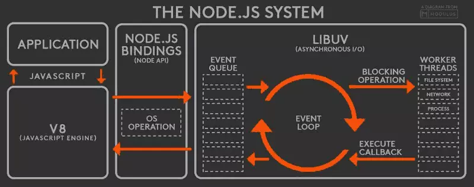
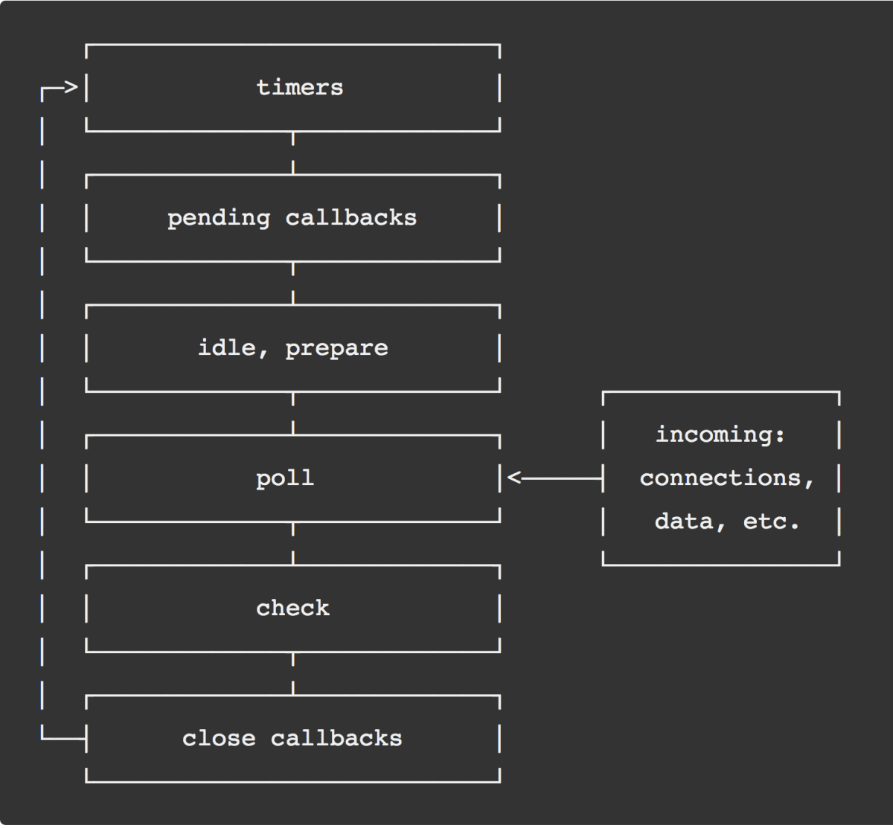
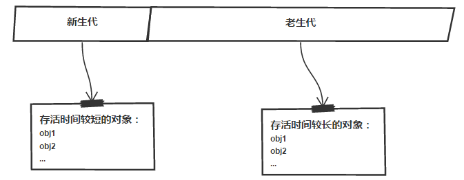
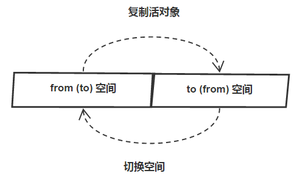

## Node

<div align="center">
  
</div>

Node.js 是一个能够在服务器端运行 JavaScript 的开放源代码、跨平台 JavaScript 运行环境。Node.js 由 Node.js 基金会持有和维护，并与 Linux 基金会有合作关系。Node.js 采用 Google 开发的 V8 运行代码，使用事件驱动、非阻塞和异步输入输出模型等技术来提高性能，可优化应用程序的传输量和规模。这些技术通常用于数据密集的即时应用程序。

### fs

文件系统

```javascript
fs.readFile //读取文件夹异步读取
fs.readFileSync(path[, options]) //同步读取
fs.writeFile //写入文件
fs.writeFileSync(file, data[, options])
fs.appendFile //追加文件
fs.mkdirSync('a') // 同步创建文件 要求父目录必须存在
fs.readdir(path[, options], callback) //读取目录下所有的文件
fs.stat(path, callback）//查看文件目录信息
stat.isDirectory() //判断是否是文件夹
stat.isFile() //判断是否是文件
fs.rename(oldPath, newPath, callback) // 移动文件或目录
fs.unlink(path, callback)// 删除文件
fs.unlinkSync(path, callback)// 删除文件  同步
fs.rmdir(path, callback) //删除文件夹
fs.rmdirSync(path, callback) //删除文件夹 同步
fs.accessSync('a') //查找文件是否存在
fs.ftruncate(fd[, len], callback)//截断文件
```

### path

路径

```javascript
__filename。全局值，当前文件绝对路径
__dirname。全局值，当前文件夹绝对路径。等效于path.resolve(__filename, '..')
path.join([...paths])。相当于把所传入的任意多的参数 按照顺序 进行命令行般的推进
path.resolve([...paths])。以当前文件的路径为起点，返回绝对路径。可以理解为每次都是新建cd命令
path.dirname(path)。返回指定路径所在文件夹的路径
path.basename(path)。返回指定Path路径所在文件的名字
path.extname(path)。获取指定字符串或者文件路径名字的后缀名，带.比如.txt
path.isAbsolute(path) 是否是绝对路径,返回boolean值
```

### util

实用工具

```code
promisify //promise
util.inherits(constructor, superConstructor) 是一个实现对象间原型继承的函数。
util.inspect(object,[showHidden],[depth],[colors]) 是一个将任意对象转换为字符串的方法，通常用于调试和错误输出。它至少接受一个参数 object，即要转换的对象
util.isArray(object) 如果给定的参数 "object" 是一个数组返回true，否则返回false。
util.isRegExp(object) 如果给定的参数 "object" 是一个正则表达式返回true，否则返回false。
util.isDate(object) 如果给定的参数 "object" 是一个日期返回true，否则返回false
util.isError(object) 如果给定的参数 "object" 是一个错误对象返回true，否则返回false。
```

### event

-   事件触发器

```code
addListener:为指定事件添加一个监听器到监听器数组的尾部。
    on: 为指定事件注册一个监听器，接受一个字符串 event 和一个回调函数
    off
    emmit:按监听器的顺序执行执行每个监听器，如果事件有注册监听返回 true，否则返回 false
    once:为指定事件注册一个单次监听器，即 监听器最多只会触发一次，触发后立刻解除该监听器。
    removeListener:移除指定事件的某个监听器，监听器必须是该事件已经注册过的监听器
    newListener
```

### os

-   操作系统

```code
os.tmpdir()返回操作系统的默认临时文件夹
os.hostname() 返回操作系统的主机名。
os.type()返回操作系统名
os.release() 返回操作系统的发行版本。
os.cpus()返回一个对象数组，包含所安装的每个 CPU/内核的信息：型号、速度（单位 MHz）、时间（一个包含 user、nice、sys、idle 和 irq 所使用 CPU/内核毫秒数的对象）
os.networkInterfaces() 获得网络接口列表
os.homedir() 方法以字符串的形式返回当前用户的主目录
```

?> IO 密集型：大量的输入输出; CUP 密集型 :大量的计算；

## 守护进程

在开发 nodejs 应用时遇到过这样的情况，修改 node 应用中的程序文件后,必须重启 node 才能重新加载应用代码。node 加载过一次文件后就将其缓存在内存中，以后再读取这个文件是从内存中读取，导致后面再修改此文件都不会加载了。这样的设计提高了性能，但降低了开发效率。

常见的进程守护工具

1.  [nodemoon](https://github.com/remy/nodemon#nodemon)
2.  [supervisor](https://github.com/petruisfan/node-supervisor/)
3.  [forever](https://github.com/nodejitsu/forever)

```shall
npm install -g nodemon
npm install -g supervisor
npm install forever -g
```

## 事件循环

事件循环是 Node.js 处理非阻塞 I/O 操作的机制——尽管 JavaScript 是单线程处理的——当有可能的时候，它们会把操作转移到系统内核中去。



1.  V8 引擎解析 JavaScript 脚本。
1.  解析后的代码，调用 Node API。
1.  libuv 库负责 Node API 的执行。它将不同的任务分配给不同的线程，形成一个 Event Loop（事件循环），以异步的方式将任务的执行结果返回给 V8 引擎。
1.  V8 引擎再将结果返回给用户。

### libuv

Node 中的 Event Loop 和浏览器中的是完全不相同的东西。Node.js 采用 V8 作为 js 的解析引擎，而 I/O 处理方面使用了自己设计的 libuv，libuv 是一个基于事件驱动的跨平台抽象层，封装了不同操作系统一些底层特性，对外提供统一的 API，事件循环机制也是它里面的实现

!> liunx 轮循通知 custom threadpool 、 windows 事件通知 IOCP



Node 事件循环分成了 6 个不同的阶段，其中每个阶段都维护着一个回调函数的队列，在不同的“阶段”（我们使用阶段来描述事件循环，它并没有任何特别之处，本质上就是不同方法的顺序调用），事件循环会处理不同类型的事件，日常开发中的绝大部分异步任务都是在这 timers、poll、check 个阶段处理

1.  Timers：用来处理 setTimeOut()和 setInterval()的回调。
2.  pending callbacks（I/O callbacks）：大多数的回调方法在这个阶段执行，除了 timers、close 和 setImmediate 事件的回调函数。
3.  idle，prepare：仅仅在内部使用，我们不管它。
4.  poll：轮询，不断检查有没有新的 I/O 事件，事件环可能会在这里阻塞。
5.  check：处理 setImmediate()事件的回调。
6.  close：处理一些 close 相关的事件，例如 socket.on('close',...)等。

```javascript
setTimeout(()=>{
    console.log('timer1')

    Promise.resolve().then(function() {
        console.log('promise1')
    })
}, 0)

setTimeout(()=>{
    console.log('timer2')

    Promise.resolve().then(function() {
        console.log('promise2')
    })
}, 0)

浏览器输出：
time1
promise1
time2
promise2
Node输出：
time1
time2
promise1
promise2
```

1.  V8 引擎解析 JavaScript 脚本。
1.  解析后的代码，调用 Node API。
1.  libuv 库负责 Node API 的执行。它将不同的任务分配给不同的线程，形成一个 Event Loop（事件循环），以异步的方式将任务的执行结果返回给 V8 引擎。
1.  V8 引擎再将结果返回给用户。

### 控制异步手段

> -   原始 jquery 时代：deferred, Q.js, Wind, Bigpipe, bluebird
> -   然后 es6 的时代：generator yield next 和 promise then
> -   然后 es7 的时代：async await

## node 内存管理

V8 的垃圾回收策略主要基于分代式垃圾回收机制。在自动垃圾回收的演变过裎中,人们发现没有一种垃圾回收算法能够胜任所有场景。V8 中内存分为新生代和老主代两代。新生代为存话时间较短对象,老主代中为存活时间较长的对象。



?> node 使用 javascript 在服务端操作大内存对象收到了一定的限制 新生代 64 位系统是 From、To 各占 16MB， 16MB x 2 ;32 位系统是 From、To 各占 8MB，8MB x 2 老生代 64 位系统是 1.4G ;32 位系统是 0.7G

!>在 node 启动时，通过--max-new-space-size 和--max-old-space-size 可分别设置新生代和老生代的默认内存限制

#### 垃圾回收 GC 包括三个主要步骤

1.  枚举根节点的引用
2.  发现并标记活对象
3.  垃圾内存清理

## Scavenge



scavenge：当分配指针达到了新生区的末尾，就会有一次清理 这个算法的大概意思是：新生区被分为两个等大的区（from 和 to），绝大多数内存的分配都会出现在 from 区（但是某些可执行的代码对象是分配在老生区的），当 from 区耗尽时，我们交换 from 和 to，然后将 from 区中活跃的对象复制到 to 区或者晋升到老生区中，其中标记的过程时深度优先搜索！

新生代被回收过多次 ，发现 to 的使用空间超过 25%晋升到老生代

缺点：scavenge 算法对于快速回收和紧缩内存效果很好，但是对于大片内存则消耗过大，频繁的拷贝对于 cpu 是不可承受之重，老生区包含有上百 M 的数据，对于这种区域我们采用标记-清除，标记-压缩算法

## 清除算法 (Mark-Sweep) 压缩算法 (Mark-Compact)

V8 老生代主要采用 Mark-Sweep 和 Mark- Compact 在使用 Scavenge 不合适。一个是对象较多需要赋值量太大，而且还是改能解决间问题。Mark-Sweep 是标记清除,标记那些死亡的对象,然后清條。但是清除过后出现内存不连续的情况,所以我们要使用 Mark- Compact,它是基于 Mark-Sweep 演变而来的,他先将活着的对象移到一边,移动完成后,直接清理边界外的内存。当 CPU 空间不足的时候会非常的高效。V8 后续还引入了延迟处理,增量处理,并计划引入行标记处理。

?> 由于 Mark-Conpact 需要移动对象，所以它的执行速度不可能很快，在取舍上，V8 主要使用 Mark-Sweep，在空间不足以对从新生代中晋升过来的对象进行分配时，才使用 Mark-Compact


## 算法对比

|   回收算法   | Mark-Sweep | Mark-Compact |      Scavenge      |
| :----------: | :--------: | :----------: | :----------------: |
|     速度     |    中等    |     最慢     |        最快        |
|   空间开销   |     少     |      少      | 双倍空间（无碎片） |
| 是否移动对象 |     否     |      是      |         是         |

## node 常见的内存泄漏

1.  无线增长的数组
1.  无线设置属性和值
1.  任何模块内的私有变量和方法均是永驻内存的

### 检测内存泄漏

1. [node-inspector](https://github.com/node-inspector/node-inspector)
2. [Easy-Monitor](https://www.yuque.com/hyj1991/easy-monitor)
3. [alinode](https://cn.aliyun.com/product/nodejs)
4. [ wrk](https://github.com/wg/wrk)
5. [ autocannon](https://github.com/mcollina/autocannon#readme)
