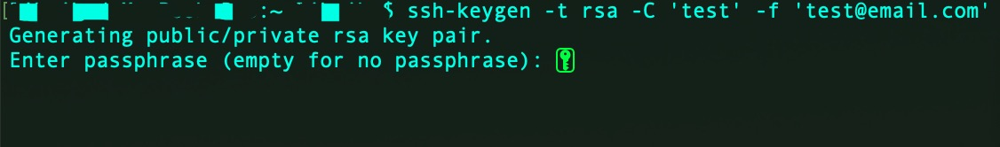
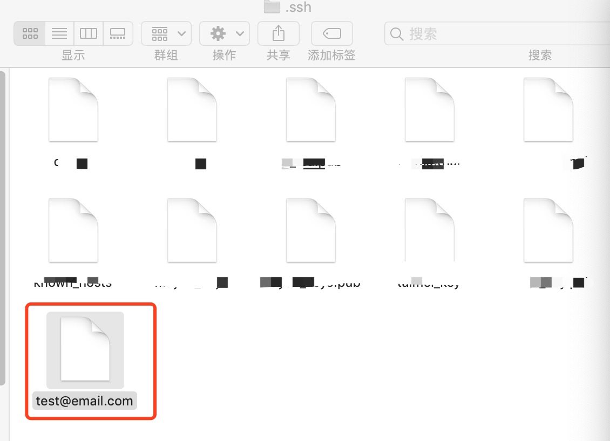
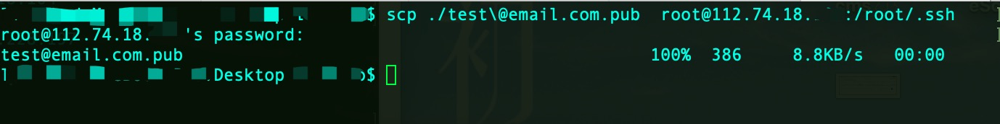
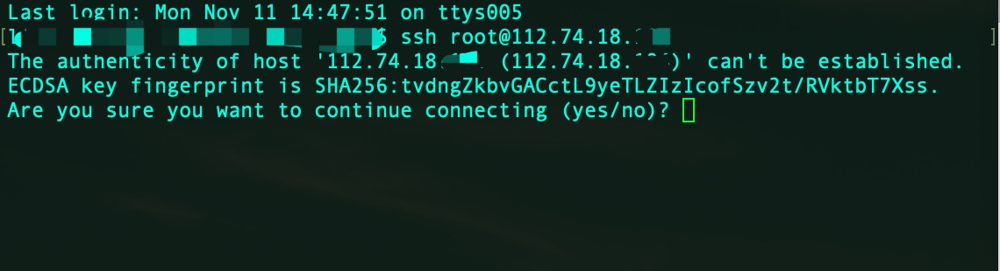
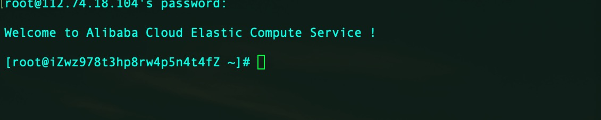
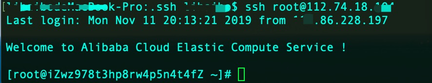

# ssh

准备工作：首先你需要一台服务器，我临时在阿里云买了一台服务器

## 本机

第一步打开本地命令行，输入" ssh-keygen -t rsa -C 'test' -f 'test@email.com' " 创建公钥-私钥对 ，回车！回车！ 回车！！！



找到当前用户文件夹下的 ”.ssh“ 隐藏文件（一般是 “/User/xxxx/.ssh”）


然后把 ”test@email.com“（私钥） 拷贝到 “.ssh”文件夹下



用 vim 打开 .ssh 文件夹下的 config 文件（如果没有文件就新建)


输入以下的信息 Host: 是你的远程服务器地址， IdentityFile ：是你的私钥文件地址

```shell
Host 112.73.18.XXX //别名
HostName  112.73.18.XXX //主机名
Port 22  //使OpenSSH通过num端口与远程系统连接。默认值为22
PreferredAuthentications publickey //强制使用Public Key验证
IdentityFile ~/.ssh/test@email.com //密钥文件的路径

```


## scp 拷贝

scp 命令跟 cp 命令类似，只不过 cp 命令是在同一台机器上用的，scp 是在两台机器上复制传输数据的命令。scp 实质相当于利用 SSH 协议来传输数据的 cp 命令。

```shell
scp [参数] [原路径] [目标路径]
```

### 参数

1. -1 强制 scp 命令使用协议 ssh1
2. -2 强制 scp 命令使用协议 ssh2
3. -4 强制 scp 命令只使用 IPv4 寻址
4. -6 强制 scp 命令只使用 IPv6 寻址
5. -B 使用批处理模式（传输过程中不询问传输口令或短语）
6. -C 允许压缩。（将-C 标志传递给 ssh，从而打开压缩功能）
7. -p 保留原文件的修改时间，访问时间和访问权限。
8. -q 不显示传输进度条。
9. -r 递归复制整个目录。
10. -v 详细方式显示输出。scp 和 ssh(1)会显示出整个过程的调试信息。这些信息用于调试连接，验证和配置问题。
11. -c cipher 以 cipher 将数据传输进行加密，这个选项将直接传递给 ssh。
12. -F ssh_config 指定一个替代的 ssh 配置文件，此参数直接传递给 ssh。
13. -i identity_file 从指定文件中读取传输时使用的密钥文件，此参数直接传递给 ssh。
14. -l limit 限定用户所能使用的带宽，以 Kbit/s 为单位。
15. -o ssh_option 如果习惯于使用 ssh_config(5)中的参数传递方式，
16. -P port 注意是大写的 P, port 是指定数据传输用到的端口号
17. -S program 指定加密传输时所使用的程序。此程序必须能够理解 ssh(1)的选项。

使用”scp“ 把公钥拷贝到你指定的服务器上根目录下的“.ssh” 文件 至此本地配置结束 ✌️



## 远程服务器

第一次登录远程服务器 输入‘yes’，然后在输入密码即可



登录成功



找到根目录下的".ssh" 文件


把 公钥 使用“ >> ”追加到 “authorized_keys” 文件里（如果没有文件就新建)


**注意**

> -   .ssh 目录的权限必须是 700；
> -   .ssh/authorized_keys 文件权限必须是 600；

```shell
chmod 700 -R .ssh
chmod 600 authorized_keys
```

## 成功

尝试 "ssh root@112.74.18.XXX" 发现不用输入密码㊙ ️ 就可以直接登录到远程服务器上，到此配置成功 ✌️


