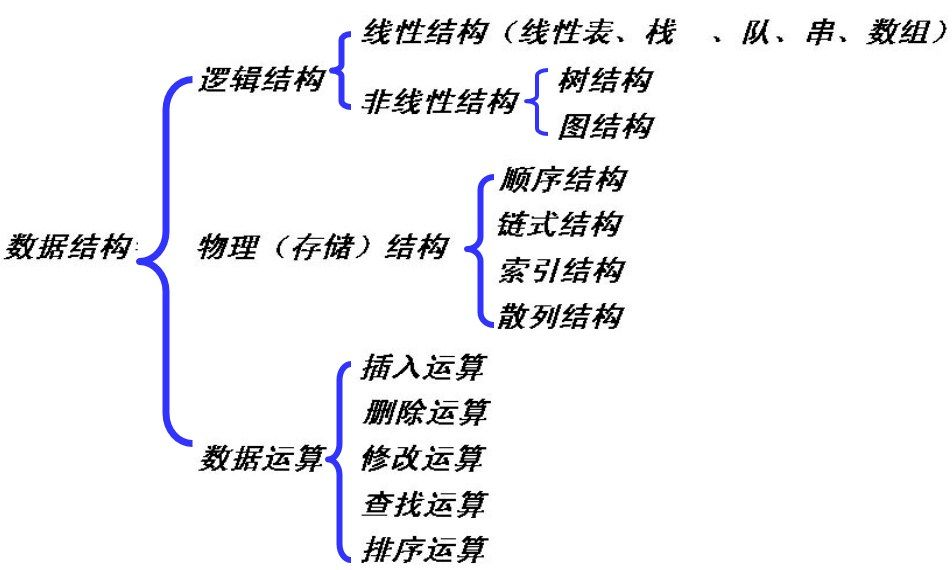
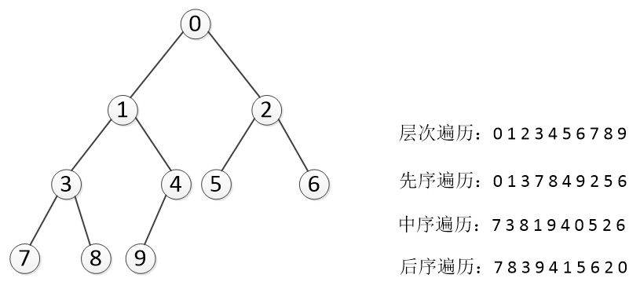
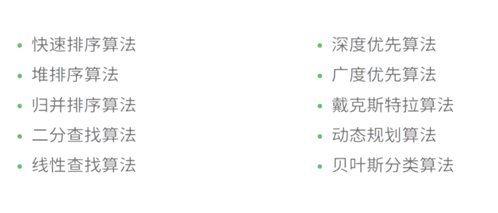
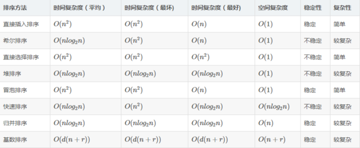

提到数据结构与算法都感觉这应该是后端要掌握的知识，对前端来说只要写写页面，绑定事件，向后台发发数据就好了，用不到数据结构与算法，也许对于一些数据查找 简单的 for 循环就能搞定，也许只是提高了几毫秒而已，可忽略不计，假入 node 做后台开发的时候，
一次请求节约的几毫秒，千万次请求节约的就不是毫秒的时间的，数据结构是作为高级程序工程师必会的知识

## 数据类型

基本类型(栈 stack) : Number、String 、Boolean、Null 和 Undefined , Symbol(es6 新增)； 基本数据类型是按值访问 由高向低分配,栈内存最大是 8MB,（超出报栈溢出）， String:是特殊的栈内存 （向高分配大小不定）,程序员分配

引用类型(堆 heap) :Object 、Array 、Function 、Data；引用类型数据在栈内存中保存的实际上是对象在堆内存中的引用地址(指针),向高分配,系统自动分配

### 一、堆栈空间分配区别：

栈（操作系统）：由操作系统自动分配释放 ，存放函数的参数值，局部变量的值等。其操作方式类似于数据结构中的栈；

堆（操作系统）： 一般由程序员分配释放，若程序员不释放，程序结束时可能由 OS 回收，分配方式倒是类似于链表。

### 二、堆栈缓存方式区别：

栈使用的是一级缓存， 他们通常都是被调用时处于存储空间中，调用完毕立即释放；

堆是存放在二级缓存中，生命周期由虚拟机的垃圾回收算法来决定（并不是一旦成为孤儿对象就能被回收）。所以调用这些对象的速度要相对来得低一些。

### 三、堆 、栈数据结构区别：

堆（数据结构）：堆可以被看成是一棵树，如：堆排序；

栈（数据结构）：一种先进后出的数据结构。

## 数据结构

数据结构是指相互之间存在着一种或多种关系的数据元素的集合和该集合中数据元素之间的关系组成;数据结构的基本操作的设置的最重要的准则是,实现应用程序与存储结构的独立(数据结构=数据的存储+算法)



### 数据结构分类

逻辑结构:反映数据之间的逻辑关系;

存储结构:数据结构在计算机中的表示;

### 逻辑结构:

1.  集合:结构中的数据元素除了同属于一种类型外，别无其它关系。(无逻辑关系)
1.  线性结构 :数据元素之间一对一的关系(线性表)
1.  树形结构 :数据元素之间一对多的关系(非线性)
1.  图状结构或网状结构: 结构中的数据元素之间存在多对多的关系(非线性)

### 存储结构:

1.  顺序存储数据结构
1.  链式存储数据结构
1.  索引存储数据结构
1.  散列存储数据结构

### 线性结构 :

1.  队列: 也是一种运算受限的线性表。它只允许在表的一端进行插入，而在另一端进行删除。允许删除的一端称为队头(front)，允许插入的一端称为队尾(rear)。先进先出。
1.  栈: 是限制在表的一端进行插入和删除运算的线性表，通常称插入、删除的这一端为栈顶(Top)，另一端为栈底(Bottom)。先进后出。top= 1.1 时为空栈，top=0 只能说明栈中只有一个元素，并且元素进栈时 top 应该自增. 后进先出
1.  串 :是零个或多个字符组成的有限序列。长度为零的串称为空串(Empty String)，它不包含任何字符。通常将仅由一个或多个空格组成的串称为空白串(Blank String) 注意：空串和空白串的不同，例如“ ”和“”分别表示长度为 1 的空白串和长度为 0 的空串。

### 非线性结构

-   树:一种非线性结构。树是递归结构，在树的定义中又用到了树的概念
    > -   有序数:子节点之间有顺序关系
    > -   无序树:子节点之间没有顺序关系
    > -   二叉树:一种非线性结构。树是递归结构，在树的定义中又用到了树的概念

### 二叉树遍历

使得每一个结点均被访问一次，而且仅被访问一次。非递归的遍历实现要利用栈。

-   先序遍历 DLR：根节点->左子树->右子树(广度遍历)
-   中序遍历 LDR：左子树->根节点->右子树。必须要有中序遍历才能得到一棵二叉树的正确顺序(广度遍历)
-   后续遍历 LRD：左子树->右子树->根节点。需要栈的支持。(广度遍历)
-   层次遍历：用一维数组存储二叉树时,总是以层次遍历的顺序存储结点。层次遍历应该借助队列。(深度遍历)



!> 内存: 一条很长一维数组;

## 算法

### 算法特征:

有穷性、确定性、可行性、输入、输出

### 算法设计衡量：

正确性、可读性、健壮性, 时间复杂度, 空间复杂度

### 算法分类



### 基本算法(必会)

#### 冒泡排序


```javascript
function bubbleSort(arr) {
    var len = arr.length;
    for (var i = 0; i < len - 1; i++) {
        for (var j = 0; j < len - 1 - i; j++) {
            if (arr[j] > arr[j + 1]) {
                // 相邻元素两两对比
                var temp = arr[j + 1]; // 元素交换
                arr[j + 1] = arr[j];
                arr[j] = temp;
            }
        }
    }
    return arr;
}
```

#### 快速排序


```javascript
function swap(items, firstIndex, secondIndex) {
    var temp = items[firstIndex];
    items[firstIndex] = items[secondIndex];
    items[secondIndex] = temp;
}

function partition(items, left, right) {
    var pivot = items[Math.floor((right + left) / 2)],
        i = left,
        j = right;
    while (i <= j) {
        while (items[i] < pivot) {
            i++;
        }
        while (items[j] > pivot) {
            j--;
        }
        if (i <= j) {
            swap(items, i, j);
            i++;
            j--;
        }
    }
    return i;
}

function quickSort(items, left, right) {
    var index;
    if (items.length > 1) {
        index = partition(items, left, right);
        if (left < index - 1) {
            quickSort(items, left, index - 1);
        }
        if (index < right) {
            quickSort(items, index, right);
        }
    }
    return items;
}

var items = [3, 8, 7, 2, 9, 4, 10];
var result = quickSort(items, 0, items.length - 1);
```

#### 插入排序


```javascript
function insertionSort(arr) {
    var len = arr.length;
    var preIndex, current;
    for (var i = 1; i < len; i++) {
        preIndex = i - 1;
        current = arr[i];
        while (preIndex >= 0 && arr[preIndex] > current) {
            arr[preIndex + 1] = arr[preIndex];
            preIndex--;
        }
        arr[preIndex + 1] = current;
    }
    return arr;
}
```

#### 选择排序


```javaScript
function selectionSort(arr) {
    var len = arr.length;
    var minIndex, temp;
    for (var i = 0; i < len - 1; i++) {
        minIndex = i;
        for (var j = i + 1; j < len; j++) {
            if (arr[j] < arr[minIndex]) {     // 寻找最小的数
                minIndex = j;                 // 将最小数的索引保存
            }
        }
        temp = arr[i];
        arr[i] = arr[minIndex];
        arr[minIndex] = temp;
    }
    return arr;
}
```

#### 时间空间复杂度

在冒泡排序，插入排序，选择排序，快速排序中，在最最坏情况下，快速排序的时间复杂为 O(n2) ，插入排序 O(n2)，选择排序 O(n2)，冒泡排序 O(n2)


