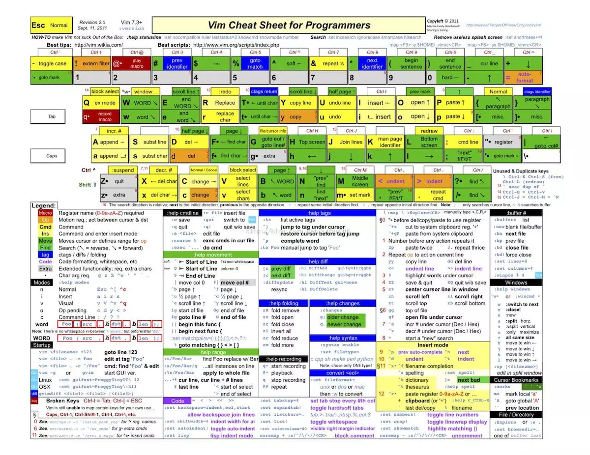

<div align="center">
  
</div>

Vim 是从 vi 发展出来的一个文本编辑器。其代码补完、编译及错误跳转等方便编程的功能特别丰富，在程序员中被广泛使用。和 Emacs 并列成为类 Unix 系统用户最喜欢的编辑器。

# 插入

```shell
i : 当前字符插入
I : 当前行的最前面
o ： 当前行的下一行
O： 当前行的上一行
a： 当前字符后
A：行的最后面
cw： 替换从光标所在位置后到一个单词结尾的字符
shift+i/A 插入模式并移动到行首/尾
[n]O/o 行前/后插入n 次
[n]+i 插入模式重复n次
```

## 删除

```shell
x/X 删除光标下/前当个字符
dw 删除一个单词
dd:删除一行
d{hjkl} 删除到上下左右一个操作前的字符
ds=D 删除光标到行尾的字符
d^  删除光标到行首的字符
d+0 :删除到开头
d+¥ ：删除到结尾
s:删除当前字符并进入插入模式
ctrl+h : 删除一个字符
ctrl+w：删除当前单词
ctrl+u ：删除一行
```

## 组合删除

```shell
dd 删除当前行
{n} dd 向下删除n行
5dw 删除正向单词5个
3w 正向移动单词三次
D3w 正向删除3w 动作
2d3w    正向删除3w 动作两次
```

## 缩进

```shell
》/ :>   //右缩进
m,n> / :m>(n-m+1)    //n-m 行缩进
```

## 查找

```shell
F/f{char}  //反向/正向查找单个字符
t{char} 查找字符前一个字符
/{char} 命令行查找
f{char} :当前行上搜索
;:向后继续查找
,：向前查找
H/M/L 开头 中间 结尾
```

## 光标移动

```
hjkl：左下上右
w/W ：移动到下一个 world/WORLD 开头
e/E ：移动到下一个 world/WORLD 结尾
b/B：移动到上一个 world/WORLD 结尾
0: 零移动到行首的第一个字符
¥ ：移动到末尾最后一个字符
gg/G 移动到开头和结尾
```

## 跳转

```shell
ctrl - f/F  //下一页
ctrl - b/B  //上一页
ctrl - d/u  // 向下/向上翻半页
gg  //跳转到文件首行
number gg/G  //跳转到指定的行
G               //跳转到文件最后一行
```

## 替换

```shell
s/going/rolling/g 当前行所有的going 替换成 rolling
%s/going/roling/g 匹配所有范围
shift+r/R 替换模式
r。单个字符替换
cw  修改单个单词
c$ /C 修改光标之后的字符
: % s/java/python/g :全局替换 java
```

## 复制 粘贴

```shell
d =delete =cut  //剪切
y =yank = copy  //类似复制
p/P =put = paste //粘贴到光标后/光标前
u =undo 撤销之前操作
ctrl-r =redo 重做/恢复之前的操作
yw 复制但前光标单词
y2w 复制正向两个单词
yy 复制当前光标之前
```

## 转换

```shell
～ 单个字符大小写转换
g ~ w 单词大小写转换
gU/uw 单词转换大/小写
```

## visual 下模式

```shell
v ：
V 选择行
ctrl+v：进行块状选择
d :删除
y: 复制
u:撤销操作
p:粘贴
r：替换
c：修改
```

## 多模式

```shell
:vs 横分屏
:sp 竖分屏
:set nu ：显示行号
zz 把当前行放到中间
:q :退出
```

## 文件

～/.vimrc
:set nu

```shell
set number
" 设置行号
syntax on
" 高亮
```

#### 修改主题

```shell
:colortheme 空格 control+d 选择主题
```

<!--
查询
使用/ 或者 ? 进行向前或者反向搜索
使用 n/N 跳转到下一个或者上一个匹配
使用 \*或者 # 进行单词的向前和向后匹配

easy-motion:插件 xs
宏
 -->

## VIM 速查卡

<table><tr><td bgcolor=Green>Green = 存活级</td>
<td bgcolor=Yellow>Yellow = 感觉良好</td>
<td bgcolor=Orange>Orange / Blue = 高级</td>
<td bgcolor=Red>Red = 专家级</td></tr></table>


