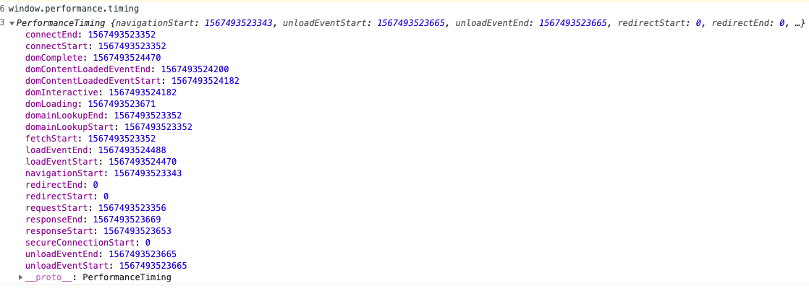
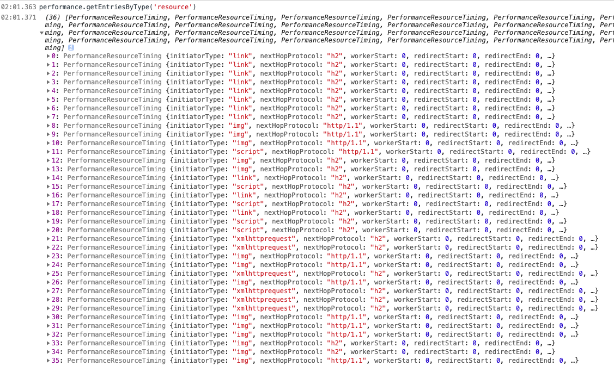

## 监控

**初始化页面->重定向时间, 清除前一个页面 -> 缓存->DNS 解析->TCP 三次握手 四次挥手->向服务器发送请求->服务器响应返回请求->处理文件->加载
的整个流程图**


## 衡量性能的指标



- 上个页面的到这个页面的时长 fetchStartfet-navigationStart
- 重定向时常 ： redirectEnd-redirectStart
- DNS 查询耗时 ：domainLookupEnd - domainLookupStart
- TCP 链接耗时 ：connectEnd - connectStart
- request 请求耗时 ：responseEnd - responseStart
- 解析 dom 树耗时 ： domComplete - domInteractive
- 白屏时间 ：responseStart - navigationStart
- domready 时间(用户可操作时间节点) ：domContentLoadedEventEnd - navigationStart
- onload 时间(总下载时间) ：loadEventEnd - navigationStart

## 静态资源监控

performance.getEntriesByType('resource')



```javascript
performance.js;
//修改新数据
let processData = _ => {
  let newdata = {
    name: _.name,
    initiatorType: _.initiatorType,
    duration: _.duration
  };
  return newdata;
};

export default {
  init(cb) {
    // 获取资源相关的信息  可以收到一个发送一个
    if (window.PerformanceObserver) {
      // MutationObserver。ie9 不兼容
      let observer = new PerformanceObserver(list => {
        let data = list.getEntries(); //data是一个数组类型
        cb(processData(data[0]));
      });
      observer.observe({entryTypes: ['resource']});
    } else {
      window.onload = function() {
        let resourceData = performance.getEntriesByType('resource');
        let data = resourceData.map(_ => processData(_));
        cb(data);
      };
    }
  }
};

index.js;

let fotmatObj = data => {
  let arr = [];
  for (let key in data) {
    arr.push(`${key}=${data[key]}`);
  }
  return arr.join('&'); //{a:1,b:2} =>a=1&b=2
};
performance.init(data => {
  // 获取到页面性能相关的数据
  // 图片可能没大小 空的图片
  new Image().src = '/p.gif?' + fotmatObj(data);
  console.log(data);
});
```

ajax 请求监控

## 前端异常监控

##### window.onerror

error 事件的事件处理程序。针对各种目标的不同类型的错误触发了 Error 事件

- 语法：window.onerror=(message, source, lineno, colno, error){}
- 参数：
  - message：错误信息（字符串）。可用于 HTML onerror=""处理程序中的 event。
  - source：发生错误的脚本 URL（字符串）
  - lineno：发生错误的行号（数字）
  - colno：发生错误的列号（数字）
  - error：Error 对象（对象）
- 返回值：若该函数返回 true，则阻止执行默认事件处理函数

!> promise 失败了不能通过 onerror .... 捕获 promise 错误

```javascript
window.onerror = function(msg, url, lineNo, columnNo, error) {
  // 处理错误信息
};
```

##### element.onerror

- 语法：element.onerror = function(event) { ... }
- 参数：
  - event HTML onerror=""处理程序中的 event。

element.onerror 使用单一 Event 参数的函数作为其处理函数

!> 资源加载失败不能用冒泡得到错误,可以用捕获处理可以到的错误监听

```javascript
export default {
  init(callback) {
    // window.addEventListener('error',fn,true)
    window.addEventListener(
      'error',
      function(evt) {
        //捕获文件加载错误
        console.log('error', evt);
      },
      true
    );

    window.onerror = function(message, source, lineno, colno, error) {
      //捕获行内js执行错误
      console.dir(error);
      let info = {
        message: error.message,
        name: error.name
      };
      let stack = error.stack;
      let matchUrl = stack.match(/http:\/\/[^\n]*/)[0];
      console.log(matchUrl);
      info.filename = matchUrl.match(/http:\/\/(?:\S*)\.js/)[0];
      console.log(info.filename);
      let [, row, colume] = matchUrl.match(/:(\d+):(\d+)/);
      info.row = row;
      info.colume = colume; // 上线的时候代码会压缩 source-map 找到对应的真实的报错
      callback(info);
    };
  }
};
```

##### try ...catch

标记要尝试的语句块，并指定一个出现异常时抛出的响应

try 语句包含了由一个或者多个语句组成的 try 块, 和至少一个 catch 子句或者一个 finally 子句的其中一个，或者两个兼有， 下面是三种形式的 try 声明：

```javascript
  try...catch
  try...finally
  try...catch...finally
```

注意 ⚠️

1.  finally 子句在 try 块和 catch 块之后执行但是在下一个 try 声明之前执行。无论是否有异常抛出或捕获它总是执行。
1.  try..catch 之后错误就此止步，除非手动抛出错误
1.  finally 块中返回一个值，那么这个值将会成为整个 try-catch-finally 的返回值

```javascript
try {
  try {
    throw new Error('oops');
  } finally {
    console.log('finally'); //finally
  }
} catch (ex) {
  console.error('outer-666', ex.message); //outer-666
}

try {
   throw "myException"; // generates an exception
};
catch (e) {
   // statements to handle any exceptions
   console.log('123',e); // pass exception object to error handler
}
```

## 框架

vue 内部发生的错误会被 Vue 拦截，因此 vue 提供方法给我们处理 vue 组件内部发生的错误。

```javascript
Vue.config.errorHandler = function (err, vm, info) {
```

React 16 引入了一个新的概念 —— 错误边界,可以捕获并打印发生在其子组件树任何位置的 JavaScript 错误，并且，它会渲染出备用 UI，

```javascript
class ErrorBoundary extends React.Component {
  constructor(props) {
    super(props);
    this.state = {hasError: false};
  }

  static getDerivedStateFromError(error) {
    // 更新 state 使下一次渲染能够显示降级后的 UI
    return {hasError: true};
  }

  componentDidCatch(error, errorInfo) {
    // 你同样可以将错误日志上报给服务器
    logErrorToMyService(error, errorInfo);
  }

  render() {
    if (this.state.hasError) {
      // 你可以自定义降级后的 UI 并渲染
      return <h1>Something went wrong.</h1>;
    }
    return this.props.children;
  }
}

<ErrorBoundary>
  <MyWidget />
</ErrorBoundary>;
```

### 数据上报

```javascript
new Image().src = 'http://www.xxxx.com';
navigator.sendBeacon('a.php'); //埋点
```

## 常见的监控

1.  [fundebug](https://www.fundebug.com/)
2.  [sentry](https://sentry.io/welcome/)
