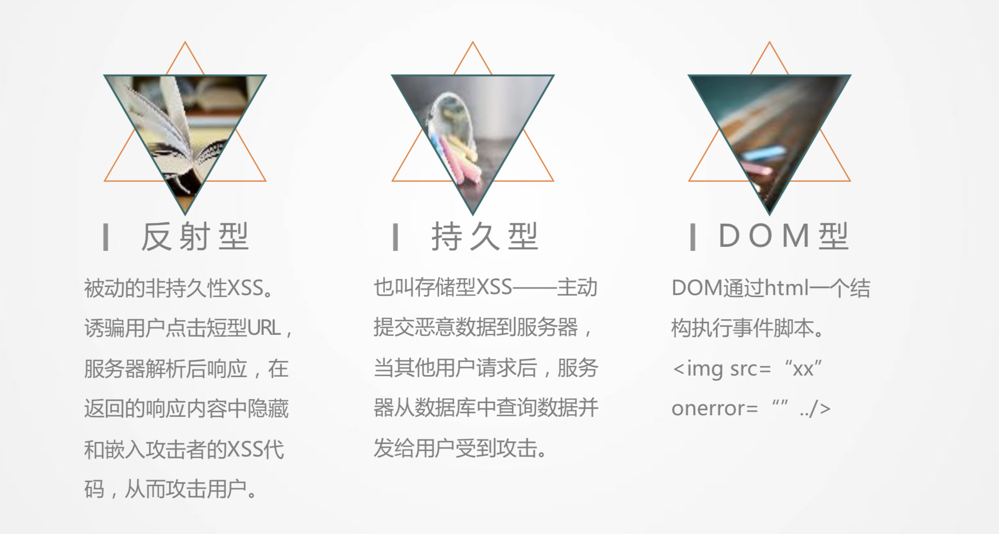
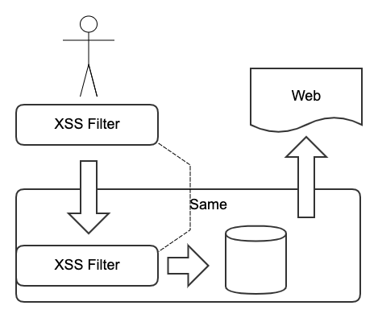
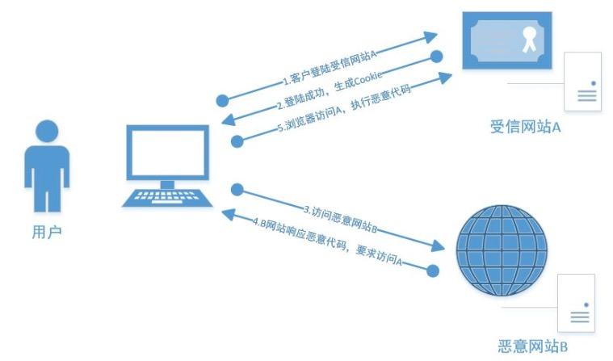

# web 安全

Web 前端的黑客攻防技术是一门非常新颖且有趣的黑 客技术，主要包含 Web 前端安全的跨站脚本(XSS)、 跨站请求伪造(CSRF)、界面操作劫持、WebShell 这 几大类，涉及的知识点涵盖信任与非信任关系、Cookie 安全、Flash 安全、DOM 渲染、字符集、跨域、原生态 攻击、高级钓鱼、蠕虫思想。

## 跨站脚本(XSS)

XSS 攻击通常指的是通过利用网页开发时留下的漏洞，通过巧妙的方法注入恶意指令代码到网页，使用户加载并执行攻击者恶意制造的网页程序。这些恶意网页程序通常是 JavaScript，但实际上也可以包括 Java、 VBScript、ActiveX、 Flash 或者甚至是普通的 HTML。



1.  持久型跨站：最直接的危害类型，跨站代码存储在服务器（数据库）。
1.  非持久型跨站：反射型跨站脚本漏洞，最普遍的类型。用户访问服务器-跨站链接-返回跨站代码。
1.  DOM 跨站（DOM XSS）：DOM（document object model 文档对象模型），客户端脚本处理逻辑导致的安全问题。

### 主要危害

1.  盗取各类用户帐号，如机器登录帐号、用户网银帐号、各类管理员帐号
1.  控制企业数据，包括读取、篡改、添加、删除企业敏感数据的能力
1.  盗窃企业重要的具有商业价值的资料
1.  非法转账
1.  强制发送电子邮件
1.  网站挂马
1.  控制受害者机器向其它网站发起攻击

### 跨站脚本(XSS)防患



1.  入参字符过滤 [ xss 攻击防范](http://jsxss.com/zh/index.html)
2.  出参进行编码
3.  入参长度限制
4.  设置 cookie httponly 为 true
5.  CSP 白名单制度

        1.  一种是：通过 HTTP 头信息的 Content-Security-Policy 的字段。
        1.  一种是：在网页中设置<meta>标签，

```html
<meta http-equiv="Content-Security-Policy" content="script-src 'self'; object-src 'none'; style-src cdn.example.org third-party.org; child-src https:">
```

## CSRF 跨站请求

CSRF（Cross-site request forgery）跨站请求伪造，也被称为“One Click Attack”或者 Session Riding，通常缩写为 CSRF 或者 XSRF，是一种对网站的恶意利用



### 主要危害

1.被黑客抓包，捕获请求地址，直接修改参数。

2.  加入验证码，判断 reffer。 这些参数前端都是可以篡改的。

### 解决方案

1.  验证 HTTP Referer 字段；
1.  验证 Token 请求。每次动 强验证码+动态 Token 请求 态刷新。
1.  在 HTTP 头中自定义属性并验证。
