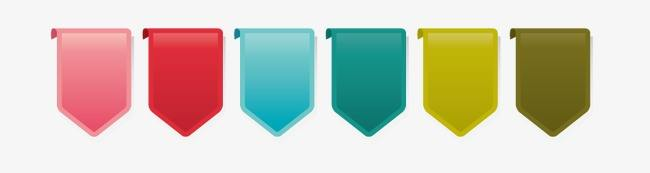

# 组件开发规范

## 简述



?> 大致描述组件名称，作用

## 引用关联页面(组件)

1.  首页 src/view/home
1.  产品页面 src/view/prodict

?> 通过页面列举引用组件，在后期维护修改时可以很快定位到其他页面的功能是否会受到影响

## 组件项目结构

```
|   +-- index.js //组件入口
|   +-- index.less //样式
|   +-- navbar.js //弹框内表单信息操作
|   +-- navbar.less//样式
|   +-- readme.md// 组件描述文档
|   +-- util.js // 一些组件用函数封装📦
```

?> 列举页面文件目录，可以很清晰的明白各个文件所承担的角色，方便后期或其他小伙伴查找

## 实现方式

1.  index.js 主要是入口文件，导航的接口对接，对外交互，
2.  navbar.js 导航条实现的主要信息，根据不同的导航信息需要匹配对应的背景色
3.  util.js 通过枚举的方式封装了导航背景色函数

?> 记录实现思路以及对当时业务场景的细节记录 方便后期查看修改

## 用法

```javascript
import Nav from 'src/component/nav/index.js';

<Nav
    navlist={navList} //导航列表
    active={home} // 当前选择状态
    onhandelChange={this.onhandelChange} //导航发生改变会调函数
/>;
```

?> 方便后期引用

## 对外依赖

-   静态资源 src/assets/less.less
-   静态资源 src/assets/common.js

?> 列举页面外部依赖，方便组件的对外项目的复用
