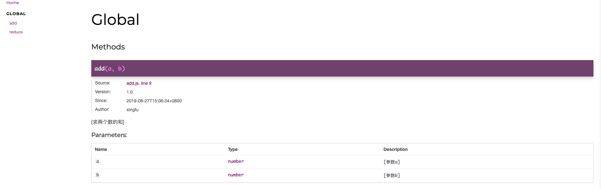

# jsdoc

JSDoc 是一个根据 javascript 文件中注释信息，生成 JavaScript 应用程序或库、模块的 API 文档 的工具。你可以使用他记录如：命名空间，类，方法，方法参数等。类似 JavaDoc 和 PHPDoc。现在很多编辑器或 IDE 中还可以通过 JSDoc 直接或使用插件生成智能提示。从而使开发者很容易了解整个类和其中的属性和方法，并且快速知道如何使用，从而提高开发效率，降低维护成本。

## 写法

```js
/**
 * [求两个数的和]
 * @Author  xingfu
 * @since   2019-08-27T15:06:34+0800
 * @version                          1.0
 * @param   {number}                 a   [参数a]
 * @param   {number}                 b   [参数b]
 */
function add(a, b) {
    return a + b;
}
```

## 生成的文档



## 安装

```bash
$ npm install jsdoc --save-dev.  //下载依赖包
$ npm install docdash  --save-dev //ui
```

### 新建 jsdoc.json

```json
{
    "tags": {
        "allowUnknownTags": false
    },

    "plugins": ["plugins/markdown"],
    "opts": {
        "template": "node_modules/docdash"
    },
    "templates": {
        "cleverLinks": false,
        "monospaceLinks": false
    },
    "source": {
        "include": "src/",
        "includePattern": ".js$",
        "excludePattern": "(node_modules/|docs)"
    }
}
```

?> 在 package.json 添加命令

```bash
"test:docs": "node_modules/.bin/jsdoc -c jsdoc.json"
```

### 命令行参数

1.  -a <value>, --access <value>: 只显示特定 access 方法属性的标识符： private, protected, public, or undefined, 或者 all（表示所有的访问级别）。默认情况下， 显示除 private 标识符以外的所有标识符。
2.  -c <value>, --configure <value>: JSDoc 配置文件的路径。默认为安装 JSDoc 目录下的 conf.json 或 conf.json.EXAMPLE。
3.  -d <value>, --destination <value>: 输出生成文档的文件夹路径。JSDoc 内置的 Haruki 模板，使用 console 将数据转储到控制台。默认为./out。
4.  --debug : 打印日志信息，可以帮助调试 JSDoc 本身的问题。
5.  -e <value>, --encoding <value> :当 JSDoc 阅读源代码时假定使用这个编码，默认为 utf8。
6.  -h, --help: 显示 JSDoc 的命令行选项的信息，然后退出。
7.  --match <value> : 只有运行测试，其名称中包含 value。
8.  --nocolor :当运行测试时，在控制台输出信息不要使用的颜色。在 Windows 中，这个选项是默认启用的。
9.  -p, --private : 将标记有[@private 标签][tags-private.md]的标识符也生成到文档中。默认情况下，不包括私有标识符。
10. -P, --package:包含项目名称，版本，和其他细节的 package.json 文件。默认为在源路径中找到的第一个 package.json 文件。
11. --pedantic:将错误视为致命错误，将警告视为错误。默认为 false。
12. -q <value>, --query <value> :一个查询字符串用来解析和存储到全局变量 env.opts.query 中。示例：foo=bar&baz=true。
13. -r, --recurse :扫描源文件和导览时递归到子目录
14. -R, --readme :用来包含到生成文档的 README.md 文件。默认为在源路径中找到的第一 README.md 文件。
15. -t <value>, --template <value>: 用于生成输出文档的模板的路径。默认为 templates/default，JSDoc 内置的默认模板。
16. -T, --test :运行 JSDoc 的测试套件，并把结果打印到控制台。
17. -u <value>, --tutorials <value> :导览路径，JSDoc 要搜索的目录。如果省略，将不生成导览页。查看导览说明，以了解更多信息。
18. -v, --version 显示 JSDoc 的版本号，然后退出。
19. --verbose 日志的详细信息到控制台 JSDoc 运行。默认为 false。
20. -X, --explain 以 JSON 格式转储所有的 doclet 到控制台，然后退出。

## jsdoc.json 配置参数

1.  tags.allowUnknownTags:JSDoc 允许您使用无法识别的标签;
1.  tags.dictionaries:这两个标准 JSDoc 标签和 closure 标签被启用;
1.  source.includePattern:只有以.js 和.jsdoc 结尾的文件将会被处理;
1.  source.excludePattern:任何文件以下划线开始或开始下划线的目录都将被忽略;
1.  plugins:插件加载;

1.  templates.cleverLinks，templates.monospaceLinks:@link 标签呈现在纯文本
1.  templates.monospaceLinks: true，从@link 标签生成的所有链接文本将会以等宽字体渲染
1.  templates.cleverLinks：为 true，如果“百度”是一个 URL
1.  source.include：可选的路径数组，JSDoc 应该为它们生成文档。JSDoc 将会结合命令行上的路径和这些文件名，以形成文件组，并且扫描。如果路径是一个目录，可以使用 -r 选项来递归。
1.  source.exclude：可选的路径数组，JSDoc 应该忽略的路径。在 JSDoc3.3.0 或更高版本，该数组可包括 source.include 路径中的子目录。
1.  source.includePattern：一个可选的字符串，解释为一个正则表达式。如果存在，所有文件必须匹配这个正则表达式，以通过 JSDoc 进行扫描。默认情况下此选项设置为.+.js(doc)?$，这意味着只有以.js 或者.jsdoc 结尾的文件将被扫描。
1.  source.excludePattern：一个可选的字符串，解释为一个正则表达式。如果存在的话，任何匹配这个正则表达式的文件将被忽略。默认设置是以下划线开头的文件（或以下划线开头的目录下的所有文件）将被忽略。

!> 对于 source 配置这些选项中使用的顺序是：

1.  以命令行上给定的路径开始，并且在 source.include 中的所有文件（记得，使用 -r 命令行选项将在子目录中搜索）。
1.  对于在步骤 1 中找到的每个文件，如果正则表达式 source.includePattern 存在，该文件必须匹配，否则将被忽略。
1.  对于在步骤 2 中遗留下的每个文件，如果正则表达式 source.excludePattern 存在，任何匹配这个正则表达式的文件将被忽略。
1.  对于在步骤 3 中遗留下的每个文件，如果路径在 source.exclude 中，那么它将被忽略。

### JSDoc 支持两种不同类型的标签：

1.  块标签, 这是在一个 JSDoc 注释的最高级别。
2.  内联标签, 块标签文本中的标签或说明

## 常用参数

1.  @example ：提供一个如何使用描述项的例子
2.  @exports ：标识一个由 JavaScript 模块导出的成员。
3.  @file ： 描述一个文件
4.  @function ： 描述一个函数或方法。
5.  @global : 记录一个全局对象
6.  @ignore: 忽略文档中的一个标识。
7.  @inner : 描述一个内部对象。
8.  @instance: 记录一个实例成员
9.  @kind: 标识的类型
10. @license： 标识你的代码采用何种软件许可协议
11. @member：记录一个成员
12. @module：记录一个 JavaScript 模块
13. @name：记录一个对象的名称
14. @namespace：记录一个命名空间对象
15. @param: 记录传递给一个函数的参数
16. @private: 标记为私有
17. @property: 记录一个对象的属性
18. @protected: 这个标识是受保护的
19. @public: 标记为公开的。
20. @readonly：标记为只读的
21. @returns : 记录一个函数的返回值。
22. @see: 更多详细信息请参阅其他一些文档
23. @since: 此功能何时被添加进来的
24. @static: 记录一个静态成员
25. @summary:完整描述的一个简写版本
26. @this： this 关键字的指向
27. @throws: 说明可能会被抛出什么样的错误。
28. @todo: 记录一个将要完成的任务
29. @type: 记录一个对象的类型
30. @typedef: 记录一个自定义的类型
31. @version: 描述版本信息。
32. @alias：标记成员有一个别名
33. @author：指定项目的作者
34. @callback： 描述一个回调函数
35. @class：此函数旨在需要使用"new"关键字调用，即构造函数。
36. @classdesc: 使用后面的文字来描述整个类。
37. @constant: 记录一个对象作为一个常量
38. @constructs: 这个函数成员将成为类的构造函数
39. @copyright:描述一些版权信息
40. @default: 记录默认值。
41. @deprecated: 说明这已不再是首选方法。
42. @description: 描述一个标识.
43. @enum:描述一个相关属性的集合。
