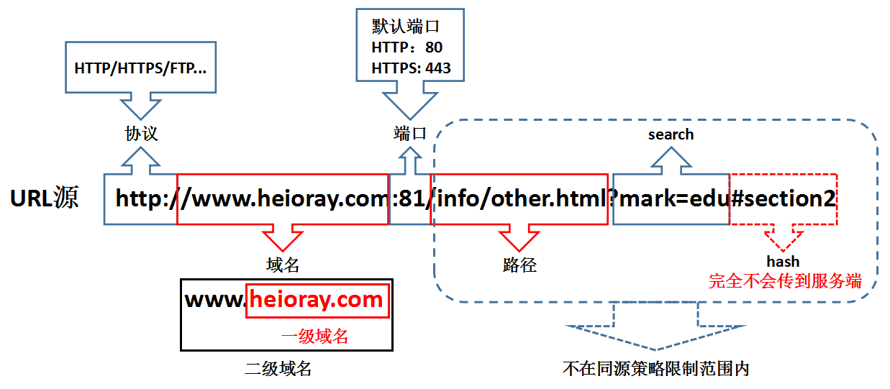
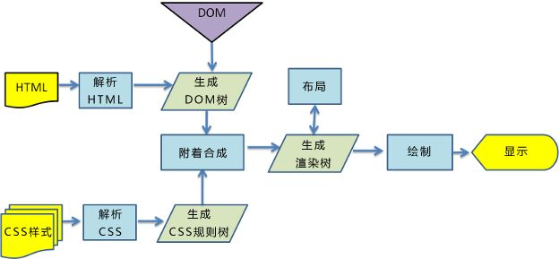
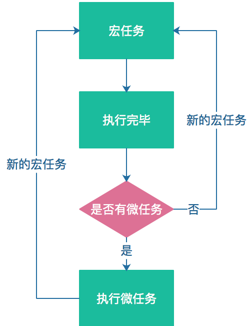
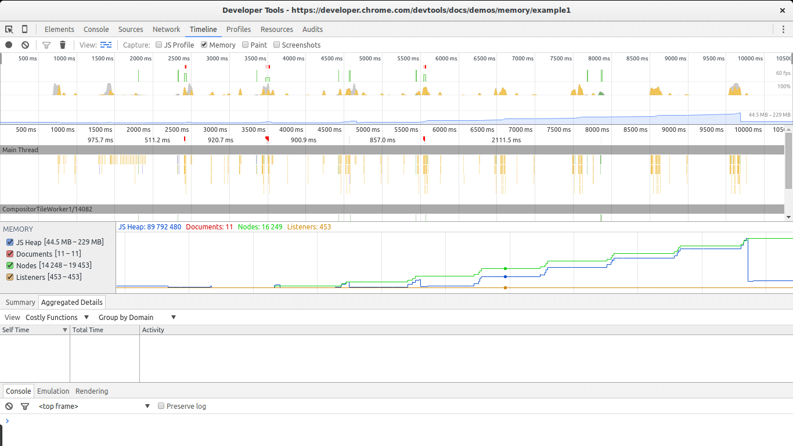

# 浏览器

是一种用于检索并展示万维网信息资源的应用程序。这些信息资源可为网页、图片、影音或其他内容，它们由统一资源标志符标志。信息资源中的超链接可使用户方便地浏览相关信息

## 网页 加载

## 缓存

缓存可以说是性能优化中简单高效的一种优化方式了。一个优秀的缓存策略可以缩短网页请求资源的距离，减少延迟，并且由于缓存文件可以重复利用，还可以减少带宽，降低网络负荷

打开浏览器输入一段网址，首先是先经过浏览器的强缓存，判断缓存是否过期，如果没有过期就直接读取本地缓存，如果过期了，再带着协商缓存信息向服务器发送消息，此时看看协商缓于服务器的协商缓存信息是否一致，如果一致则返回 304 状态码，告诉浏览器本地缓存依旧可用，如果不一致则重新加载网页，更新本地缓存信息


## 同源策略

协议相同、域名相同、端口相同

!> 是为了保证用户信息的安全，防止恶意的网站窃取数据。



## 跨域的方式

1.  img ,script,link,iframe
2.  jsonp ,
3.  postMessage,
4.  webSocket、
5.  http-proxy,
6.  nginx,

### jsonp 原理

jsonp 能达到跨域这种效果，无非是动态创建 script 标签的达到跨域

```javascript
var script = document.createElement('script');
script.type = 'text/javascript';

// 传入参数并指定回调执行函数为callback
script.src = 'http://www.xxxx/login?user=admin&callback=callback';
document.head.appendChild(script);

// 回调执行函数
function callback(res) {
    console.log(res);
}
```

### postMessage

```javascript
    A page
    let frame=document.getElementById('frame');
    frame.contentWindow.postMessage('hahha',"http://localhost:3000")
    B page
    window.onmessage=functiopn(e){
    consoel.log(e.data)
    e.source.postMessage('hehehh',e.origin)
    }
```

### location.Hash

```javascript
    c.html
    <script>
        console.log(location.hash)
        let iframe=docuemnt.createElement('iframe');
        ifrime.src="http://localhost:3000/b.html#hhehehe"
        document.body.appendChild('iframe')
    </script>
    b.html
     <script>
        window.parent.parent.location.hash=location.hash
     </script>

    A.html
    <iframe src="http://localhost:4000/c.html#hqhqh" id="iframe"></iframe>
    <script>
    let iframe =docuemnt.getElementById('iframe');
    window.onhashchange=function(){
        console.log.log(location.hash)
    }

    </script>
```

### cors

```javascript
setHeader('Access_Control_Allow-Origin', 'http://localhost:3000');
```

### document.domain

!>根域名相同

```javascript
a.html; //a.bb.com

    <script>
    document.domain=bb.com
        var a=109;
    </script>
b.html; b.bb.com
<
    <iframe src="http://a.bb.com/a.html" id="iframe" onload="load()"></iframe>
    <script>
    document.domain=bb.com
    function load(){
           let iframe =docuemnt.getElementById('iframe');
          iframe.contentWindow.a;
    }
    </script>
```

### window.name

```javascript
    c.html
    <script>
        window.name="666";
    </script>
    A.html
    <iframe src="http://localhost:4000/c.html" id="iframe" onload="load()"></iframe>
    <script>
    function load(){
        let first =true;
           let iframe =docuemnt.getElementById('iframe');
        if(first){

             iframe.src='http:http://localhost:3000/b.html';
             first =false;
            }else{
                console.log(iframe.contentWindow.name)
            }
    }
    </script>
```

## DOM 渲染



1.  构建文档对象模型（DOM）；
2.  构建 CSS 对象模型（CSSOM）；
3.  构建渲染树（Render Tree）；
4.  布局（Layout）；
5.  绘制（Painting）

当浏览器从磁盘或网络中获取到网页（HTML 文件）的数据时，会通过一系列的转换解析出各个 标签，并最终构建文档对象模型，即我们经常说的 DOM Tree，DOM Tree 的构建过程是一个深度遍历的过程，当前节点的所有子节点构建好后才会去构建当前节点的下一个兄弟节点。

在构建文档对象模型的过程中，若遇到 标签，则浏览器会发出一个获取该资源的请求，最终获得包含有各种 CSS 样式的样式文件。与 HTML 文件一样，浏览器会将该文件通过一系列的转换和解析构建出 CSS 对象模型，即 CSS Rule Tree

DOM Tree 描述的是文档内容，而 CSS Rule Tree 描述的是应用于文档的样式规则，二者是独立的对象。浏览器会把 DOM Tree 和 CSS Rule Tree 组合起来构建渲染树，即 Render Tree

!>某些不可见的节点如 标签、 标签等和某些通过 CSS 隐藏的节点不会体现在渲染结果中，因此会被忽略

## 统计加载信息

Sumary chrome 浏览器加载信息 ,可以清楚的看出堆快照的分布情况。


1.  蓝色:网络通信
1.  黄色:javascript 执行
1.  紫色:样式计算 重排
1.  绿色:重绘

## 重排重绘

在页面的生命周期中，一些效果的交互都有可能发生重排（Layout）和重绘（Painting），这些都会使我们付出高额的性能代价。 浏览器从下载文件至本地到显示页面是个复杂的过程，这里包含了重绘和重排。

其中重排和重绘是最耗时的部分，一旦触发重排，我们对 DOM 的修改引发了 DOM 几何元素的变化，渲染树需要重新计算， 而重绘只会改变 vidibility、outline、背景色等属性导致样式的变化，使浏览器需要根据新的属性进行绘制。更比而言，重排会产生比重绘更大的开销。所以，我们在实际生产中要严格注意减少重排的触发

!> 重绘不一定会引起重排, 重排一定引起重绘


### 那些能引起重排

1.  添加或者删除可见的 DOM 元素
2.  元素位置改变
3.  元素尺寸改变
4.  元素内容改变（例如：一个文本被另一个不同尺寸的图片替代）
5.  页面渲染初始化（这个无法避免）
6.  浏览器窗口尺寸改变

### 触发重绘的属性

1.  vidibility、outline、
2.  背景色颜色属性的改变
3.  css3 动画

### 优化

-   分离读写操作
-   样式集中改变
-   元素批量修改
-   开启 3D 优化

## event loop

JavaScript 语言的一大特点就是单线程，也就是说，同一个时间只能做一件事。单线程就意味着，所有任务需要排队，前一个任务结束，才会执行后一个任务。如果前一个任务耗时很长，后一个任务就不得不一直等着，因为 IO 设备（输入输出设备）很慢（比如 Ajax 从网络读取数据），不得不等待结果返回之后才能继续，这样的执行效率很慢，于是分成了两种任务来处理，同步任务和异步任务

1.  同步任务是指在主线程排队的任务，只有前面的任务执行完之后才执行后面的任务。
1.  异步任务指的是任务不进入主线程，而进入到一个任务队列（task queue），主线程的任务可以继续往后执行，而在任务队列里的异步任务执行完会通知主线程。


异步任务又分为宏任务与微任务两种，微任务并不是老老实实的按照事件队列的顺序去执行，而是按照 microTask—>macroTask 的顺序去执行，先执行完队列中所有的 microTask 再去执行 macroTask



1.  微任务包括 process.nextTick ，promise ，Object.observe (废弃)，MutationObserver
1.  宏任务包括 script ， setTimeout ，setInterval ，setImmediate ，I/O ，UI rendering

## 内存泄漏

内存泄漏：有些代码本来要被回收的，但没有被回收，还一直占用着操作系统内存，从而越积越多，最终会导致内存占用越来越高，轻则影响系统性能，重则导致进程崩溃（可以理解为，内存满了，就溢出了）。

1.  循环引用、递归
2.  无用的全局变量
3.  计时器和回调函数
4.  大量的 DOM
5.  闭包

#### 内存泄漏检测

Chrome 内存分析工具

###### Timeline



1.  打开 Chrome 开发者工具，选择 Timeline 工具
2.  在顶部的勾选 ☑️ Memory 选项
3.  点击左上角的录制按钮。
4.  在页面上进行各种操作，模拟用户的使用情况。
5.  一段时间后，点击对话框的 stop 按钮，面板上就会显示这段时间的内存占用情况。

## 垃圾回收

浏览器的 Javascript 具有自动垃圾回收机制(GC:Garbage Collecation)，也就是说，执行环境会负责管理代码执行过程中使用的内存。其原理是：垃圾收集器会定期（周期性）找出那些不在继续使用的变量，然后释放其内存。但是这个过程不是实时的，因为其开销比较大并且 GC 时停止响应其他操作，所以垃圾回收器会按照固定的时间间隔周期性的执行。

### 标记清除

1.  垃圾回收器，在运行的时候会给存储在内存中的所有变量都加上标记。
2.  去掉环境中的变量以及被环境中的变量引用的变量的标记。
3.  再被加上标记的会被视为准备删除的变量。
4.  垃圾回收器完成内存清除工作，销毁那些带标记的值并回收他们所占用的内存空间。

### 引用计数

1.  声明了一个变量并将一个引用类型的值赋值给这个变量，这个引用类型值的引用次数就是 1。
1.  同一个值又被赋值给另一个变量，这个引用类型值的引用次数加 1.
1.  当包含这个引用类型值的变量又被赋值成另一个值了，那么这个引用类型值的引用次数减 1.
1.  当引用次数变成 0 时，说明没办法访问这个值了。
1.  当垃圾收集器下一次运行时，它就会释放引用次数是 0 的值所占的内存。
