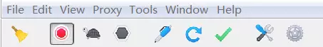

# Charles

  

Charles 是在 PC 端常用的网络封包截取工具，在做移动开发时，我们为了调试与服务器端的网络通讯协议，常常需要截取网络封包来分析。除了在做移动开发中调试端口外，Charles 也可以用于分析第三方应用的通讯协议。配合 Charles 的 SSL 功能，Charles 还可以分析 Https 协议。

<!-- [参考文档](https://juejin.im/post/5b8350b96fb9a019d9246c4c?utm_source=gold_browser_extension)
 -->

## Charles 主要功能

1.  截取 Http 和 Https 网络封包。
2.  支持重发网络请求，方便后端调试。
3.  支持修改网络请求参数。
4.  支持网络请求的截获并动态修改。
5.  支持模拟慢速网络。

?> Charles 的主菜单包括：File、Edit、View、Proxy、Tools、Window、Help。用的最多的主菜单分别是 Proxy 和 Tools。

### Proxy 菜单包含以下功能：

1.  Start/Stop Recording：开始/停止 🤚 记录会话。
1.  Start/Stop Throttling：开始/停止 🤚 节流。
1.  Enable/Disable Breakpoints：开启 🔛/关闭断点模式。
1.  Recording Settings：记录会话设置。
1.  Throttle Settings：节流设置。
1.  Breakpoint Settings：断点设置。
1.  Reverse Proxies Settings：反向代理设置。
1.  Port Forwarding Settings：端口转发。
1.  Windows Proxy：记录计算机 💻 上的所有请求。
1.  Proxy Settings：代理设置。
1.  SSL Proxying Settings：SSL 代理设置。
1.  Access Control Settings：访问控制设置。
1.  External Proxy Settings：外部代理设置。
1.  Web Interface Settings：Web 界面设置。

### Tools 菜单包含以下功能：

1.  No Caching Settings：禁用 🈲️ 缓存设置。
1.  Block Cookies Settings：禁用 🈲️ Cookie 设置。
1.  Map Remote Settings：远程映射设置。
1.  Map Local Settings：本地映射设置。
1.  Rewrite Settings：重写设置。
1.  Black List Settings：黑名单设置。
1.  White List Settings：白名单设置。
1.  DNS Spoofing Settings：DNS 欺骗设置。
1.  Mirror Settings：镜像设置。
1.  Auto Save Settings：自动保存设置。
1.  Client Process Settings：客户端进程设置。
1.  Compose：编辑修改。
1.  Repeat：重复发包 📦。
1.  Repeat Advanced：高级重复发包 📦。
1.  Validate：验证。
1.  Publish Gist：发布要点。
1.  Import/Export Settings：导入/导出设置。
1.  Profiles：配置文件。
1.  Publish Gist Settings：发布要点设置。

## Charles 使用方式

#### 通过 Charles 进行 PC 端抓包

1.  Charles 会自动配置浏览器和工具的代理设置，所以说打开工具直接就已经是抓包状态了。只需要保证一下几点即可：
2.  确保 Charles 处于 Start Recording 状态。
3.  勾选 Proxy | Windows Proxy 和 Proxy | Mozilla FireFox Proxy。

#### 通过 Charles 进行移动端抓包

1.  手机抓包的原理，和 PC 类似，手机通过把网络委托给 Charles 进行代理与服务端进行对话。具体步骤如下：
1.  使手机和电脑在一个局域网内，不一定非要是一个 IP 段，只要是在同一个路由器下即可。 ######电脑端配置：
1.  关掉电脑端的防火墙（这点很重要）。
1.  打开 Charles 的代理功能：通过主菜单打开 Proxy | Proxy Settings 弹窗，填入代理端口(端口默认为 8888，不用修改)，勾选 Enable transparent HTTP proxying。
1.  如果不需要抓取电脑上的请求，可以取消勾选 Proxy | Windows Proxy 和 Proxy | Mozilla FireFox Proxy。 ######手机端配置：
1.  通过 Charles 的主菜单 Help | Local IP Address 或者通过命令行工具输入 ipconfig 查看本机的 IP 地址。
1.  设置代理：打开手机端的 WIFI 代理设置，输入电脑 IP 和 Charles 的代理端口。
1.  设置好之后，我们打开手机上的任意需要网络请求的程序，就可以看到 Charles 弹出手机请求连接的确认菜单（只有首次弹出），点击 Allow 即可完成设置。
1.  完成以上步骤，就可以进行抓包了。

### 通过 Charles 进行 HTTPS 抓包

1.  HTTPS 的抓包需要在 HTTP 抓包基础上再进行设置。需要完成一下步骤：
1.  完成 HTTP 抓包配置。
1.  电脑端安装 Charles 证书：通过 Charles 的主菜单 Help | SSL Proxying | Install Charles Root Certificate 安装证书。
1.  设置 SSL 代理：通过主菜单打开 Proxy | SSL Proxy Settings 弹窗，勾选 Enable SSL proxying。
1.  移动端安装 Charles 证书：通过 Charles 的主菜单 Help | SSL Proxying | Install Charles Root Certificate on a Mobile Device or >Remote Browser 安装证书。
1.  设置好之后，我们打开手机上的任意需要网络请求的程序，就可以看到 Charles 弹出手机请求连接的确认菜单（只有首次弹出），点击 Allow 即可完成设置。
1.  完成以上步骤，就可以进行 HTTPS 抓包了。
