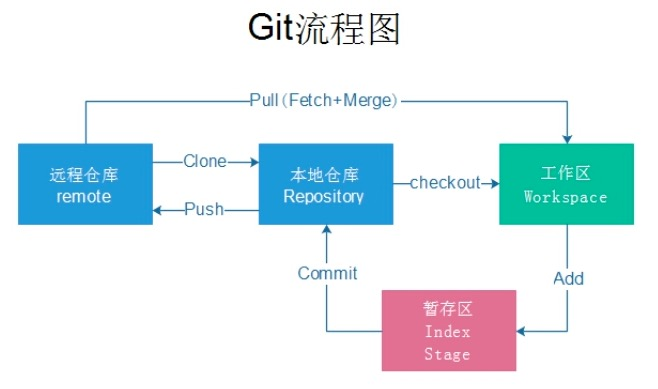
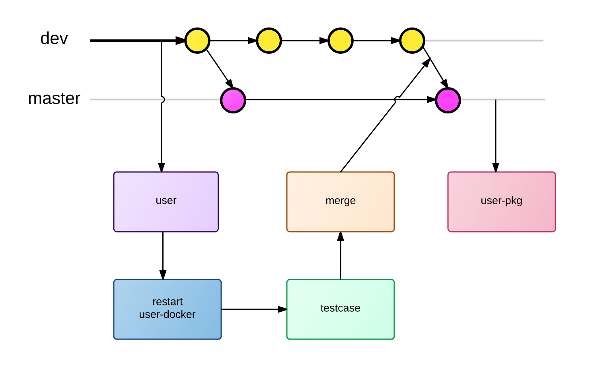
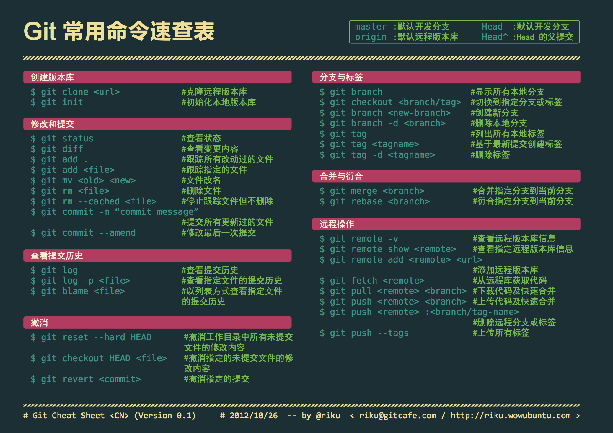

# Git

<div align="center">
  
</div>

git 是一个分布式版本控制软件，最初由林纳斯·托瓦兹创作，于 2005 年以 GPL 发布。最初目的是为更好地管理 Linux 内核开发而设计

## 描述

[Git](https://git-scm.com/) 是一个开源的分布式版本控制系统，可以有效、高速地处理从很小到非常大的项目版本管理。 [1] Git 是 Linus Torvalds 为了帮助管理 Linux 内核开发而开发的一个开放源码的版本控制软件。

## 优点

- 分布式开发，强调个体。
- 公共服务器压力和数据量都不会太大。
- 速度快、灵活。
- 任意两个开发者之间可以很容易的解决冲突。

## 常用命令

### 配置 config

```shell
git config –list 查看信息
git config --global user.email xxx@xx.com
git config --global user.name "name"
git config user.name  查看自己的用户名
git config user.email  查看自己的邮箱地址

git config --global alias.a add 添加别名 git add .
git config --global alias.co checkout
git config --global alias.ci commit
git config --global alias.br branch
```

### 拉取代码

```shell
git push -u https://gitee.com/silenceLi/test.git master -f 强制push 一般会丢失远程代码
git push origin master 提交本地代码
git push origin --delete dev 删除远程仓库分支
git pull origin master 拉取本地代码
--allow-unrelated-histories
git remote add qhht git@https://gitee.com/silenceLi/QHHT.git 取个别名方便拉取
git remote  //查看关联的远程仓库的名称
git remote -v // 查看关联的远程仓库的详细信息
git remote remove <name> 删除远程仓库的关联
git remote set-url origin <newurl> 修改远程仓库的关联地址
git remote update origin --prune 刷新获取远程分支
ls –a 查看代码
```



### 基本信息操作

```
git add .     暂存区
git status  查看状态
git Untracked  未被追踪
git Modified  修改未提交
git commit -m '修改代码'  提交到代码区
git reset HEAD~  --   撤销最近一次commit
git reset --hard xxxx  撤销版本
// 注意 --hard 参数会抛弃当前工作区的修改
// 使用 --soft 参数的话会回退到之前的版本，但是保留当前工作区的修改，可以重新提交
git diff <file> # 比较当前文件和暂存区文件差异 git diff
git diff HEAD -- <文件> 工作区和暂存区的比较
```

### 删除分支

```shell
//branch
git branch  查看本地分支
git branch -a  查看本地 远程分支 remotes开头的代表是远程分支
git branch -r 查看远程分支
git branch dev 创建dev分支
git branch -d dev  删除本地分支
git branch -m oldname newname 分支重命名
git push origin --delete dev   删除远程分支
git branch -D test 删除没有合并的分支
git branch –m dev fix  修改分支名称
git branch --merged 查看已经合并的分支
git branch --no-merged 查看已经合并的分支
```

### 切换分支

```shell
git checkout . //恢复stage中的文件的工作区
git checkout -- 取消本次修改在工作区内
git checkout dev 切换分支 dev
git checkout -b dev 创建并切换分支 dev
git checkout a.tex. 恢复上次版本
git checkout -b D_1.3.0 origin/D_1.3.0 拉取远程分支到本地 <本地分支名称> <远程分支名称>
git checkout -b origin/ 在本地创建和远程分支对应的分支
ssh-keygen -C 'email@maik.com' 生成 密钥 注 用 ssh 协议生成

git rebase master (test 分支 向后移)
git merge test 合并分支
git cherry-pick dev-3.0 分支的某些 commit-hash

git reset --hard 【merge 前的版本号】
git revert -m merge 前的版本号 撤销合并当前 merge
git revert <commitd> //撤销指定的提交

git remote –v 查看项目
git remote add home git@github.com:Silence520/homework02.git 添加项目别名
$ ssh-keygen -t rsa -C 'xxx@qq.com' 配置密钥对 公钥在 git 上配置

```



### 查看 log

```shell
//log
git log –oneline 查看log信息
git log -p <file> # 查看每次详细修改内容的diff
git log -p -2 # 查看最近两次详细修改内容的diff
git log --pretty=oneline 查看log信息列表
git log -p --online 行内变化
git log --name-only 查看变化的文件
git log --name-status 查看文件变化
git log --stat 显示每次提交的信息
git show <commitid> 显示某次提交的内容
git blame style.less  查看文件的什么人修改的每行的变化信息
git log --pretty=oneline  显示所有提交记录，每条记录只显示一行
git whatchanged file  显示某个文件的每个版本提交信息：提交日期，提交人员，版本号，提交备注（没有修改细节）
git commit --amend 修改上次提交描述 本次提交并存到上次
git commit  -v //提交时显示所有的diff
git commit --amend -m 'meggahe' //使用新的commit 提交替换上次commit
git reset --hard fdce8d 回到指定版本
git reset HEAD a.txt 撤销暂存文件
git reset --hard HEAD^ 回到上一版本
git reset HEAD 取消本次修改在暂存区
git reflog 查看提交历史log
按 shift+Z+Z保存编辑并退出
```

### 标签 tag

```shell
//tag
git tag v1.0  //创建一个标签，默认为HEAD当前分支添加标签
git tag v2.0 e8b8ef6 为版本号为e8b8ef6添加v2.0标签
git tag -a v3.0 -m "version 0.2 released" 6cb5a9e 为版本号为6cb5a9e添加带有说明的标签，-a指定标签名,-m指定说明文字
git show v0.2 根据标签查看指定分支
git tag 查看所有标签
git tag -d v1.0 删除v1.0标签
git push origin v0.9 把v0.9标签推送到远程
git push origin --tags 推送所有尚未推送到远程的本地标签
git tag -d v0.9 删除远程标签, 先删除本地标签，再删除远程标签
git push origin :refs/tags/v0.9
```

### 暂存区

```shell
//stash
git stash 放到暂存区
git stash list
git stash apply 恢复暂存
git stash apply stash{0} 回复第一个
git stash pop 恢复并且删除暂存区
git stash drop stash{0} 删除暂存区
```

### git cherry-pick

```shell
//stash
git cherry-pick 调减需合并的代码
```



## Git 钩子函数

和其它版本控制系统一样，Git 能在特定的重要动作发生时触发自定义脚本。 有两组这样的钩子：客户端的和服务器端的。 客户端钩子由诸如提交和合并这样的操作所调用，而服务器端钩子作用于诸如接收被推送的提交这样的联网操作。 你可以随心所欲地运用这些钩子。
也即绝大部分项目中的 .git/hooks，默认存在的都是示例，其名字都是以 .sample 结尾，如果你想启用它们，得先移除这个后缀。把一个正确命名且可执行的文件放入 Git 目录下的 hooks 子目录中，即可激活该钩子脚本

```shell
pre-commit 钩子在键入提交信息前运行
prepare-commit-msg 钩子在启动提交信息编辑器之前，默认信息被创建之后运行。
commit-msg 钩子接收一个参数，此参数即上文提到的，存有当前提交信息的临时文件的路径
post-commit 钩子在整个提交过程完成后运行。
post-applypatch 运行于提交产生之后，是在 git am 运行期间最后被调用的钩子
pre-rebase 钩子运行于变基之前，以非零值退出可以中止变基的过程。
post-rewrite 钩子被那些会替换提交记录的命令调用，比如 git commit --amend 和 git rebase（不过不包括 git filter-branch）。
pre-push 钩子会在 git push 运行期间， 更新了远程引用但尚未传送对象时被调用

//服务器端钩子
update 脚本和 pre-receive 脚本十分类似，不同之处在于它会为每一个准备更新的分支各运行一次
post-receive 挂钩在整个过程完结以后运行，可以用来更新其他系统服务或者通知用户
pre-receive处理来自客户端的推送操作时，最先被调用的脚本是 pre-receive
```

## .gitignore

.gitignore 文件对其所在的目录及所在目录的全部子目录均有效。通过将.gitignore 文件添加到仓库，其他开发者更新该文件到本地仓库，以共享同一套忽略规则

```shell
# 以'#'开始的行，被视为注释.

# 忽略掉所有文件名是 index.txt的文件.

index.txt

# 忽略所有生成的 html文件,

*.html

# index.html是手工维护的，所以例外.

!index.html

# 忽略所有.o和 .a文件.

*.[oa]
配置语法：
以斜杠“/”开头表示目录；
以星号“*”通配多个字符；
以问号“?”通配单个字符
以方括号“[]”包含单个字符的匹配列表；
以叹号“!”表示不忽略(跟踪)匹配到的文件或目录；
```

## Git 插件

### husky

husky 能够防止不规范代码被 commit、push、merge 🐶🐶

```bash
npm install husky --save-dev
```

```json
// package.json
{
  "husky": {
    "hooks": {
      "pre-commit": "npm test",
      "pre-push": "npm test",
      "...": "..."
    }
  }
}
```

### pre-commit

pre-commit 能够防止不规范代码被 commit，没有 husky 这么全面，但是你可以接着安装 pre-push 等插件来防止对应的 git 操作

```bash
  npm install pre-commit --save-dev
```

```json
//package.json
 "scripts": {
    "test:jest": "jest ",
    "test:report": "jest  --coverage --coverageDirectory=testreport",
    "test-reportone": "jest --testResultsProcessor=jest-stare ",
    "test:docs": "node_modules/.bin/jsdoc -c jsdoc.json",
    "test": "jest  --coverage --coverageDirectory=testreport  --testResultsProcessor=jest-stare ",
    "precommit": "npm run jest"
  },
  "pre-commit": {
    "run": "test"
  },
```

## Git 私有库搭建

1.  [gogs](https://gogs.io/)
2.  [gitlab](https://about.gitlab.com/install/)
