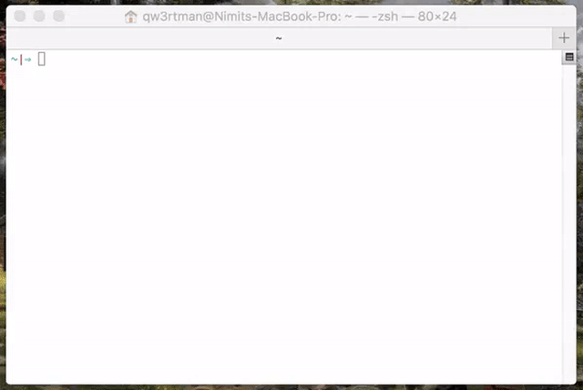

## npm

<div align="center">
  
</div>

NPM 的全称是 Node Package Manager，是随同 NodeJS 一起安装的包管理和分发工具，它很方便让 JavaScript 开发者下载、安装、上传以及管理已经安装的包

#### 常用命令

可以用下面的命令去修改默认配置：

```bash
npm config set init.author.email "xxx@xxx.com" //设置 package.js email
npm config set init.author.name "xxx"
npm config set init.author.url "http://github.com/xxx"
npm config set init.license "MIT"
npm config set init.version "0.1.0"
npm cache clean -f 清除缓存
```

让多个 npm script 串行

```bash
 "test": "npm run lint:js && npm run lint:css && npm run lint:json && npm run lint:markdown "
```

从输出可以看到子命令的执行顺序是严格按照我们在 scripts 中声明的先后顺序来的 eslint ==> stylelint ==> jsonlint ==> markdownlint

多个 npm script 并行

```bash
 "test": "npm run lint:js & npm run lint:css & npm run lint:json & npm run lint:markdown & mocha tests/"
```

npm run lint:js 的结果在进程退出之后才输出，如果你自己运行，不一定能稳定复现这个问题，但 npm 内置支持的多条命令并行跟 js 里面同时发起多个异步请求非常类似，它只负责触发多条命令，而不管结果的收集，如果并行的命令执行时间差异非常大，上面的问题就会稳定复现

```bash
 npm run lint:js & npm run lint:css & npm run lint:json & npm run lint:markdown & mocha tests/ & wait
```

原生方式来运行多条命令很臃肿，幸运的是，我们可以使用 npm-run-all 实现更轻量和简洁的多命令运行

```bash
npm i npm-run-all -D

"mocha": "mocha tests/",
"test": "npm-run-all lint:js lint:css lint:json lint:markdown mocha"

npm-run-all 还支持通配符匹配分组的 npm script
"test": "npm-run-all lint:* mocha"

多个 npm script 并行执行
"test": "npm-run-all --parallel lint:* mocha"
```

#### npm scripts 的生命周期管理

prepublish：在模块被发布前，其实在你安装本地包也会触发
publish, postpublish：在发布后执行
preinstall：模块被安装前执行
install, postinstall：模块安装后
preuninstall, uninstall：模块被卸载前执行
postuninstall：模块卸载后执行
preversion, version：获取版本号前执行
ostversion：获取版本号之后执行
pretest, test, posttest：执行 test 脚本时会执行
prestop, stop, poststop：在脚本结束时执行
prestart, start, poststart：调用 start 时执行
prerestart, restart, postrestart：在执行 restart 时会调用
restart 脚本比较特殊，如果你设置了 restart 脚本则只会执行：prerestart, restart, postrestart，但是如果你没有设置 restart，则会执行 stop，start 脚本。

```javascript
"scripts": {
    "pretest" : "echo \" this is pre test \"",
    "test" : "echo \" this is test \"",
    "posttest" : "echo \" this is post test \"",
​
    "prerestart" : "echo \" this is pre restart \"",
    "restart" : "echo \" this is restart \"",
    "postrestart" : "echo \" this is post restart \"",

    "prestop" : "echo \" this is pre stop \"",
    "stop" : "echo \" this is stop \"",
    "poststop" : "echo \" this is post stop \"",
​
    "prestart" : "echo \" this is pre start \"",
    "start" : "echo \" this is start \"",
    "poststart" : "echo \" this is post start \"",
​
    "preinstall" : "echo \" this is pre install \"",
    "install" : "echo \" this is install \"",
    "postinstall" : "echo \" this is post install \"",
​
    "prepublish" : "echo \" this is pre install \"",
    "publish" : "echo \" this is publish \"",
    "postpublish" : "echo \" this is post install \"",
​
    "preuninstall" : "echo \" this is pre uninstall \"",
    "uninstall" : "echo \" this is uninstall \"",
    "postuninstall" : "echo \" this is post uninstall \"",

    "prebuild" : "echo \" this is pre build \"",
    "build" : "echo \" this is build \"",
    "postbuild" : "echo \" this is post build \""
  },
```

##### npm script 运行时日志

##### 显示尽可能少的有用信息

调用 npm script 的时候比较有用，需要使用 --loglevel silent，或者 --silent，或者更简单的 -s 来控制

##### 显示尽可能多的运行时状态

需要使用 --loglevel verbose，或者 --verbose，或者更简单的 -d 来控制
peerDependencies:但是如果是组件（前端组件或后端组件都包含）依赖一些框架或比较大型的包，可以考虑放

##### 代码检查自动格式化

我们使用的代码检查工具 stylelint、eslint、jsonlint 不全支持 watch 模式，这里我们需要借助 onchange 工具包来实现，onchange 可以方便的让我们在文件被修改、添加、删除时运行需要的命令。

```code
npm i onchange -D
 "watch": "npm-run-all --parallel watch:*",
 "watch:lint": "onchange -i \"**/*.js\" \"**/*.less\" -- npm run lint",
"watch:test": "npm t -- --watch",
```

watch:lint 里面的文件匹配模式可以使用通配符，但是模式两边使用了转义的双引号，这样是跨平台兼容的；
watch:lint 里面的 -i 参数是让 onchange 在启动时就运行一次 -- 之后的命令，即代码没变化的时候，变化前后的对比大多数时候还是有价值的；
watch 命令实际上是使用了 npm-run-all 来运行所有的 watch 子命令；

有没有好奇过 onchange 是怎么实现文件系统监听的？所有的魔法都藏在它的源代码里面，实际上它使用了跨平台的文件系统监听包 chokidar，基于它，你能做点什么有意思的事情呢？

```bash
npm install 安装模块
npm uninstall 卸载模块
npm update 更新模块
npm outdated 检查模块是否已经过时
npm ls 查看安装的模块
npm init 在项目中引导创建一个package.json文件
npm help 查看某条命令的详细帮助
npm root 查看包的安装路径
npm root -g  //npm安装目录
npm config 管理npm的配置路径
npm config set registry https://registry.npm.taobao.org //设置淘宝源
npm config get cache //npm的缓存目录
npm config get prefix //npm的安装全局node包地址
npm list -g --depth 0 //npm 全局安装的包列表
npm config edit //编辑配置文件
npm config list //查看npm配置信息
npm cache 管理模块的缓存
npm cache clean -f //npm清除缓存
npm start 启动模块
npm stop 停止模块
npm restart 重新启动模块
npm test 测试模块
npm version 查看模块版本
npm view 查看模块的注册信息‘
npm view moudleName dependencies：查看包的依赖关系
npm view moduleName repository.url：查看包的源文件地址
npm view moduleName engines：查看包所依赖的Node的版本
npm adduser  用户登录
npm publish 发布模块
npm access 在发布的包上设置访问级别
npm link：将会在全局包下面创建一个指向命令执行的地方的符号链接
```

## npm 发布自己的包

```bash
npm install [name]   //检查npm 是否存在
```

如果没有 新建一个 [name] 的文件夹

```bash
cd  [name]
npm init  -y
```

进入 package.json 文件

```json
 "name": "name", //必填项目名称
 "version": "0.0.1" //必填版本信息
 "repository": { //关联github 的库
    "type": "git",
    "url": "git@github.com:****/**.git"
  },
```

登录 npm

```bash
 npm login //输入用户名、密码和邮箱
```

更新 npm 包 修改 package.json 文件夹中的 version 版本信息 执行以下命令

```bash
 npm publish
```

利用 npm 撤销发布包

```bash
 npm unpublish 包名
```

## nvm

[nvm](https://github.com/nvm-sh/nvm) 是一个可以让你在同一台机器上安装和切换不同版本的 node 管理工具

!> nvm 不支持 Windows 环境

```bash
npm  install   -g   nvm //安装nvm
nvm install ##  //安装指定node版本，可模糊安装，如：安装v6.2.0，既可nvm install v6.2.0，又可nvm install 6.2
nvm uninstall ## //删除已安装的指定版本，语法与install类似
nvm use ## //切换使用指定的版本node
nvm ls ## //列出所有安装的版本
nvm ls-remote ## //列出所以远程服务器的版本（官方node version list）
nvm current ## //显示当前的版本
nvm alias ## //给不同的版本号添加别名
nvm unalias ## //删除已定义的别名
nvm alias default ## //全局设置默认版本
nvm reinstall-packages ## //在当前版本node环境下，重新全局安装指定版本号的npm包
```

## n

[n](https://github.com/tj/n) 是一个可以让你在同一台机器上安装和切换不同版本 node 的工具



```bash
npm install -g n
n --help //查看帮助
n ls  //查看可用的Node版本
n 8.10.3 //安装指定版本
n latest //安装最新的版本
n stable //安装稳定版本
n rm 8.10.1 //删除某个版本
n use 8.10.21 index.js //以指定的版本来执行脚本
npm -g outdated //查看npm可更新的版本
```

## nrm 自由切换 npm 源

[nrm](https://github.com/Pana/nrm)(npm registry manager )是 npm 的镜像源管理工具,允许你在不同的 npm 源自由切换

```bash
nrm help　 查看nrm帮助
nrm ls  列出可用的源
nrm current 查看当前使用的源
nrm use [name] 选择国内淘宝的源
nrm home [name]　　跳转到指定源的官网
nrm test [name] 测试速度
nrm add [name]  [url]  添加源
nrm del  [name] 删除对应的源
```

## npx

[npm](https://github.com/npm/npx) v5.2.0 引入的一条命令（npx），npx 会帮你执行依赖包里的二进制文件。引入这个命令的目的是为了提升开发者使用包内提供的命令行工具的体验

全局安装 parcel，但有时不同项目使用不同版本，不允许使用全局包，只能考虑下面一些方法
使用 npm scripts，在 package.json 加一个 script ,将 node_modules 的可执行目录加到 PATH 中.指定可执行命令路径

当我们执行 npx parcel index.html 时，会自动去./node_modules/.bin 目录下搜索。

```code
old:
npm install -g create-react-app
create-react-app my-app
new:
npx create-react-app my-app
```

<!--
## rpm

> RPM 软件包管理器

```code
 rpm －e xv
 RPM 的常用参数还包括：
 －vh：显示安装进度；
 －U：升级软件包；
 －qpl：列出 RPM 软件包内的文件信息；
 －qpi：列出 RPM 软件包的描述信息；
 －qf：查找指定文件属于哪个 RPM 软件包；
 －Va：校验所有的 RPM 软件包，查找丢失的文件；
 －qa: 查找相应文件，如 rpm -qa mysql
 RPM 主要功能
 安装、卸载、升级和管理软件
 组件查询功能
 验证功能
 软件包 GPG 和 MD5 数字签名的导入、验证和发布
 软件包依赖处理
 选择安装
 网络远程安装功能
 rpm 命令：遵循 GPL 协议且功能强大的包管理，它可以建立、安装、请求、确认、和卸载软件包。间接的提升了 Linux 的易用性
 -e 卸载 rpm 包
 -q 查询已安装的软件信息
 -i 安装 rpm 包
 -u 升级 rpm 包
 --replacepkgs 重新安装 rpm 包
 --justdb 升级数据库，不修改文件系统
 --percent 在软件包安装时输出百分比
 --help 帮助
 --version 显示版本信息
 -c 显示所有配置文件
 -d 显示所有文档文件
 -h 显示安装进度
 -l 列出软件包中的文件
 -a 显示出文件状态
 -p 查询/校验一个软件包文件
 -v 显示详细的处理信息
 --dump 显示基本文件信息
 --nomd5 不验证文件的 md5 支持
 --nofiles 不验证软件包中的文件
 --nodeps 不验证软件包的依赖关系
 --whatrequires 查询/验证需要一个依赖性的软件包
 --whatprovides 查询/验证提供一个依赖性的软件包
```

>     范例 1：安装软件

```code
[root@hnlinux lx1 3 8.c o m]# rpm -hvi dejagnu-1.4.2-10.noarch.rpm
　　警告：dejagnu-1.4.2-10.noarch.rpm: V3 DSA 签名：NOKEY, key ID db42a60e
　　准备...
　　########################################### [100%]
　　范例 2： 显示软件安装信息
　　[root@hnlinux lx1 3 8.c o m]# rpm -qi dejagnu-1.4.2-10.noarch.rpm
```

onchange: 监听指定的目录，在源文件有更改的时候，

```code
"scripts": {
"watch": "onchange \"src/**/\*.js\" \"src/**/\*.less\" -- npm run dev"
}
```

另外敏捷开发过程中，代码复查是至关重要的一环，团队需要使用工具辅助代码分析。经比较和实践后，使用工具：
jsinspect： jsinspect 检测前端代码库中的重复/近似代码
jsinspect 工具支持 js 和 jsx 格式的文件，基于抽象语法树，可以检测出结构类似的代码块
jscpd：一个工具用于检测复制/粘贴“设计模式”在编程源代码
jscpd 工具支持文件格式广泛，如 java、oc、js、jsx、vue、ts、less 等。其重复率判定依据为一定长度标识符的 MD5 值是否相同
 -->
