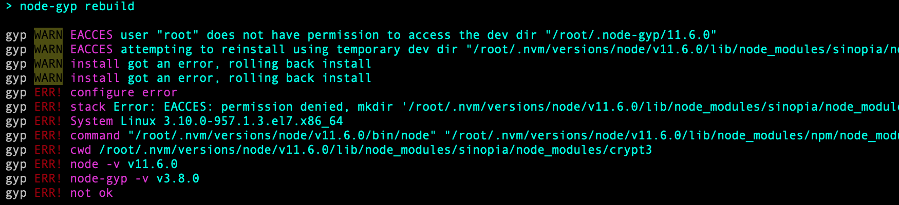
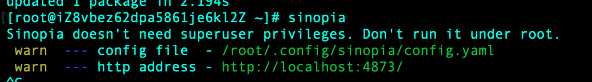
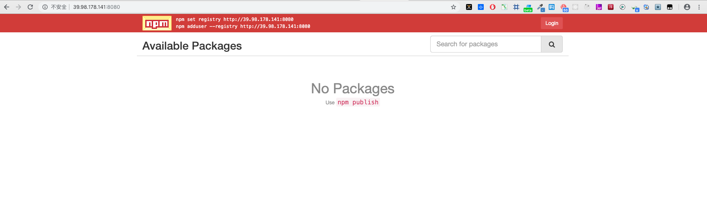

# Sinopia (npm 私有镜像搭建)

[Sinopia](https://github.com/rlidwka/sinopia) 是一个零配置的私有的带缓存功能的 npm 包管理工具

## 安装 Sinopia

安装 node

```bash
wget -qO- https://raw.githubusercontent.com/creationix/nvm/v0.33.11/install.sh | bash  //下载nvm
source  /root/.bashrc //执行
nvm install stable //下载node
npm -v
npm i sinopia -g
```

如果报错 以下错误不要慌



```bash
sudo chmod -R 777 /root
```

然后继续执行

```bash
npm i sinopia -g
```

启动 sinopia

```bash
sinopia
```



## 配置 Sinopia

vim 打开 sinopia 配置文件 config.yaml

```bash
vim /root/.config/sinopia/config.yaml
```

```bash
#
# This is the default config file. It allows all users to do anything,
# so don't use it on production systems.
#
# Look here for more config file examples:
# https://github.com/rlidwka/sinopia/tree/master/conf
#

# path to a directory with all packages
storage: ./storage  #npm包存放的路径

auth:
  htpasswd:
    file: ./htpasswd   #保存用户的账号密码等信息
    # Maximum amount of users allowed to register, defaults to "+inf".
    # You can set this to -1 to disable registration.
    max_users: -1  #默认为1000，改为-1，禁止注册

# a list of other known repositories we can talk to
uplinks:
  npmjs:
    url: http://registry.npm.taobao.org/  #默认为npm的官网，由于国情，修改 url 让sinopia使用 淘宝的npm镜像地址

packages:  #配置权限管理
  '@*/*':
    # scoped packages
    access: $all  #表示哪一类用户可以对匹配的项目进行安装 【$all 表示所有人都可以执行对应的操作，$authenticated 表示只有通过验证的人可以执行对应操作，$anonymous 表示只有匿名者可以进行对应操作（通常无用）】
    publish: $authenticated  #表示哪一类用户可以对匹配的项目进行发布

  '*':
    # allow all users (including non-authenticated users) to read and
    # publish all packages
    #
    # you can specify usernames/groupnames (depending on your auth plugin)
    # and three keywords: "$all", "$anonymous", "$authenticated"
    access: $all  #表示哪一类用户可以对匹配的项目进行安装

    # allow all known users to publish packages
    # (anyone can register by default, remember?)
    publish: $authenticated  #表示哪一类用户可以对匹配的项目进行发布

    # if package is not available locally, proxy requests to 'npmjs' registry
    proxy: npmjs  #如其名，这里的值是对应于 uplinks

# log settings
logs:
  - {type: stdout, format: pretty, level: http}
  #- {type: file, path: sinopia.log, level: info}

# you can specify listen address (or simply a port)
listen: 0.0.0.0:8080  #默认没有，只能在本机访问，添加后可以通过外网访问
```

再次执行一下操作 检查配置文件是否出错

```bash
sinopia
```

访问 http://39.98.178.141:8080 地址出现下图 ，sinopia 安装成功了！



## 发布自定义包

添加 sinopia 仓库地址

```bash
npm install -g nrm
nrm add sinopia http://39.98.178.141:8080/
```

### 切换私有仓库

```bash
nrm use sinopia
```

### 发包

```bash
cd [name]
npm init  -y
```

进入 package.json 文件

```bash
 "name": "[name]", //必填项目名称
 "version": "0.0.1" //必填版本信息

 "repository": { //关联github 的库
    "type": "git",
    "url": "git@github.com:****/**.git"
  },
```

添加新用户

```bash
 npm adduser
```

?>账户信息保存在 /root/.config/sinopia/htpassw

登录 npm

```bash
 npm login //输入用户名、密码和邮箱 （用户名：admin；密码：123456；邮箱：admin@xxx.com）
```

更新 npm 包 修改 package.json 文件夹中的 version 版本信息 执行

```bash
 npm publish
```


