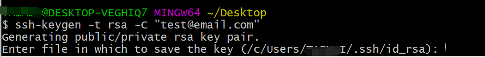
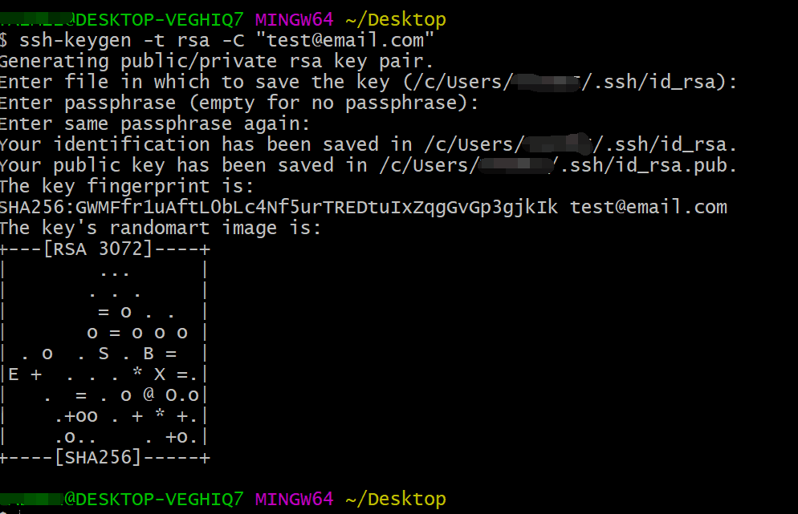
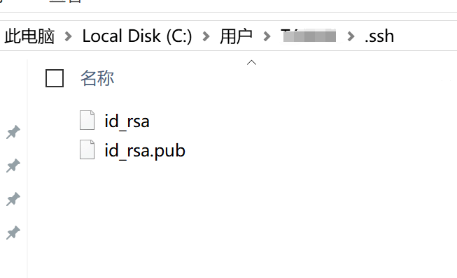
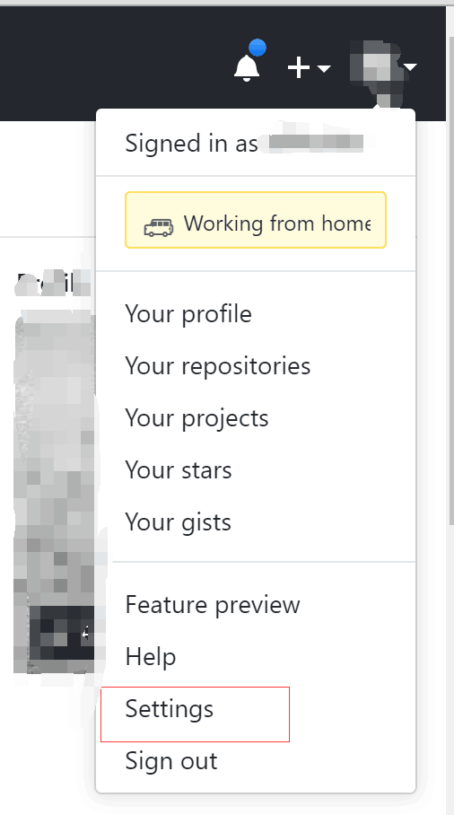
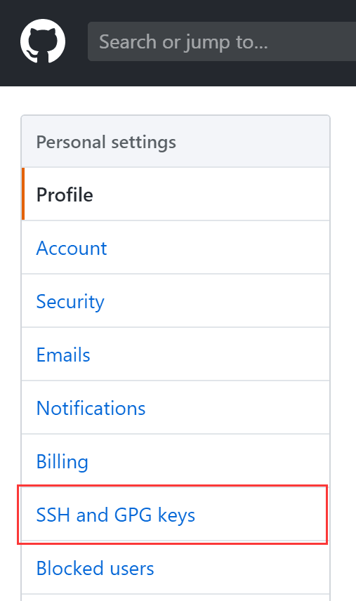
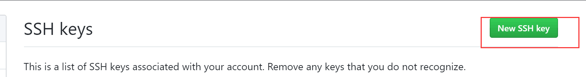
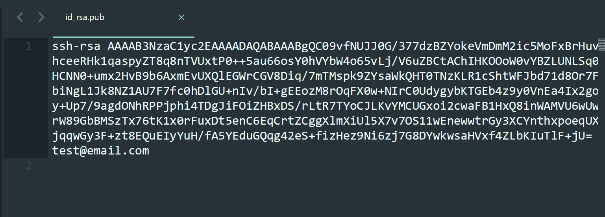
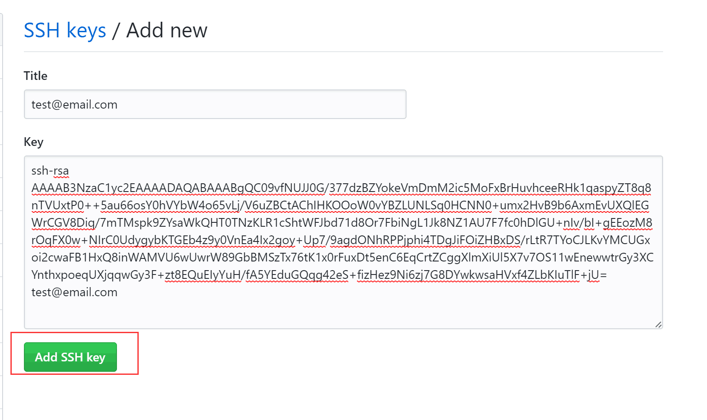
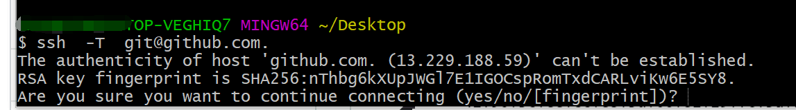
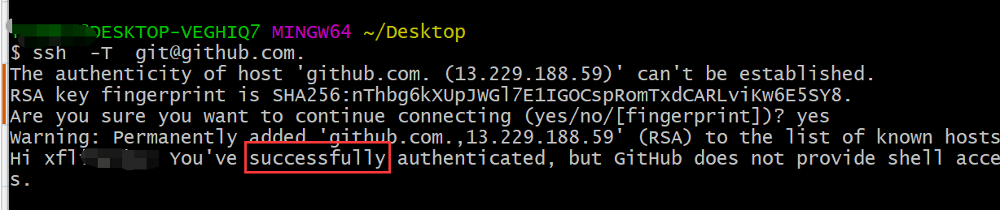

# ssh 免密登录

## 生成密钥对

-   语法： ssh-keygen –t rsa –C ‘name’ -f 'xx_key’
-   参数：
    -   -t 选择加密算法 rsa
    -   -C 名字
    -   -f 生成密钥名字

```shell
ssh-keygen -t rsa -C "test@email.com" -f 'test_key’
ssh-keygen -t rsa -C "test@email.com"
```

1.  第一步生成密钥对 'ssh-keygen -t rsa -C "test@email.com"'



2.  回车！回车！！回车！！！



3.  在用户下有一个 .ssh 的隐藏文件夹会出现 id_rsa ,id_rsa.pub 两个文件



## github 配置

1.  登录 github 打开个人中心 点击 "Settings"



2.左侧有一个 "SSH and GPG Keys" 选项 “点击进入“



3.  点击右上角 "New SSH key"



4.  打开本地生成的 ”id_rsa.pub“文件 复制



5.  把 ”id_rsa.pub“ 文件的代码拷贝到 Key 中 然后添加一个标题“Title” ，点击 “Add SSH key”



## 测试密钥

```shell
ssh  -T  git@github.com.
ssh  -T  git@github.com. debue
```

1.  输入 ‘ssh -T git@github.com. ’ 测试 ssh 是否生效，第一次 ssh 会有提示 输入 ‘yes’就可以了



2.  看到 提示 “Hi XXXX ...” 说明配置成功！


