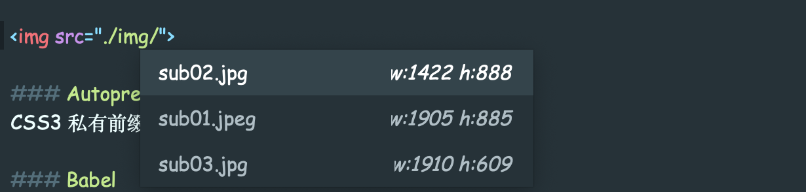
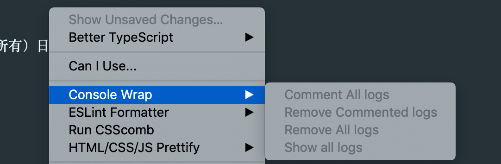
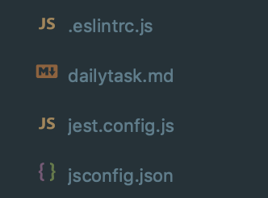
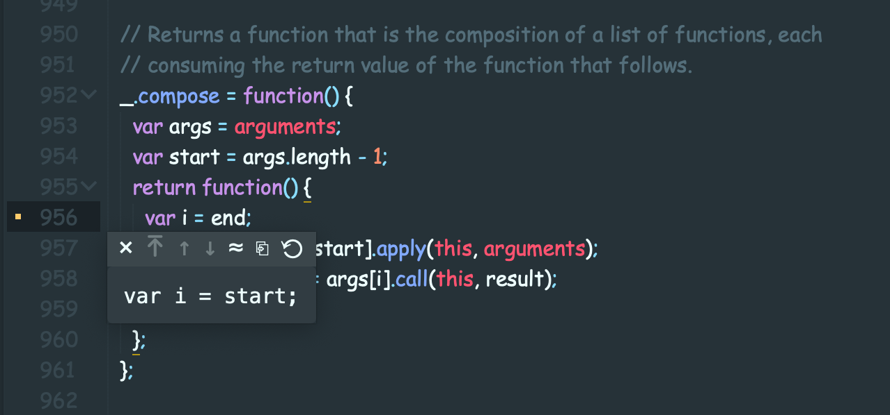
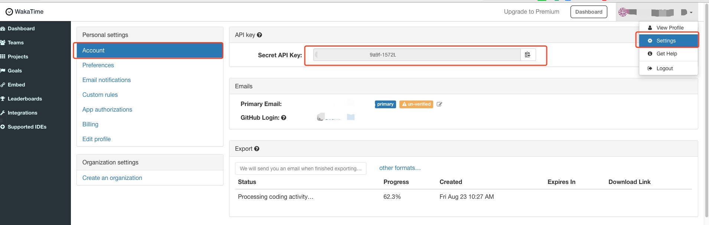
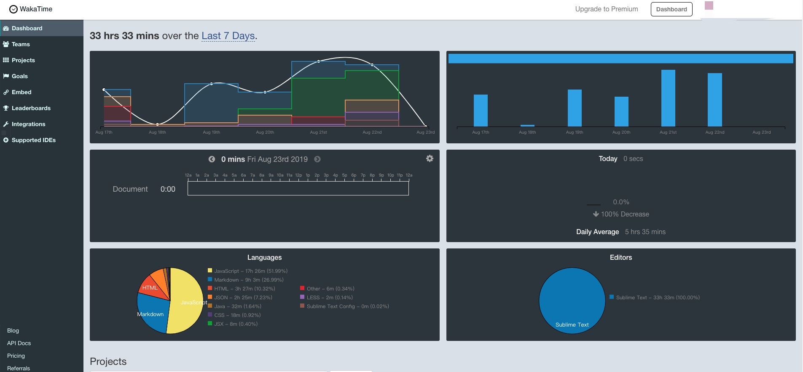
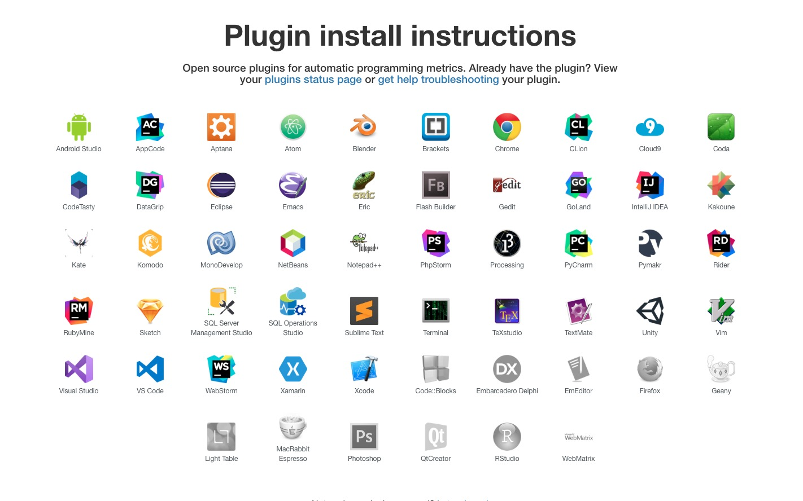

# Sublime 编辑器常用设置

<div align="center">
  
</div>

## 首选项设置

```json
{
    "color_scheme": "Packages/Color Scheme - Default/Mariana.sublime-color-scheme",
    "font_face": "Comic Sans MS", //设置字体
    "font_size": 14, //设置字体大小
    "ignored_packages": ["Vintage"],
    "spell_check": false,
    "tab_size": 4, //tab 4个空格
    "theme": "Adaptive.sublime-theme",
    "translate_tabs_to_spaces": true, //空格代替tab缩近
    "dpi_scale": 1.0 //文件名称中文乱码问题
     "expand_tabs_on_save": true // //设置保存时自动转换
}
```

### 设置 js 文件在 sublime 面板中执行

-   选择菜单 Tools --> Build System --> new Build System
-   中文版的话是 工具 --> 编译系统 --> 新建编译系统
-   然后写入下面内容:

```json
{
    "cmd": ["node", "$file"],
    "file_regex": "^[ ]*File \"(...*?)\", line ([0-9]*)",
    "working_dir": "${project_path:${folder}}",
    "selector": "source.js",
    "shell": true,
    "encoding": "utf-8",
    "windows": {
        "cmd": ["taskkill /F /IM node.exe >nul 2>nul & node", "$file"]
    },
    "linux": {
        "cmd": ["killall node; node", "$file"]
    },
    "osx": {
        "cmd": ["killall node >/dev/null 2>&1; node $file"]
    }
}
```

-   接着保存为 javascript.sublime-build，保存位置默认即可
-   Ctrl + B 或者 F7 运行

<!-- [请参考](https://blog.csdn.net/w13770269691/article/details/78390224) -->

## 插件

### All Autocomplete

Sublime Text 默认的 Autocomplete 功能只考虑当前的文件，而 AllAutocomplete 插件会搜索所有打开的文件来寻找匹配的单词提示

### AutoFileName

快速录入文件路径



### Autoprefixer

CSS3 私有前缀自动补全插件，显然也很有用哇

-   打开 sublime ，选择菜单 Preferences > Browse Packages 将下载的压缩包解压到这里
-   设置快捷键：选择菜单 Preferences > Key Bindings – User，可自定义，也可直接 ctrl+shift+p 选择 autoprefixer

```code
[
    { "keys": ["ctrl+alt+p"], "command": "autoprefixer" }
]
```

-   选择菜单：Preferences > Package Settings > Autoprefixer > Settings - User
-   为浏览最新版本添加前缀，市场份额大于 0.1%，份额>5%

```code
{
    "browsers": ["last 2 version", "> 0.1%", "> 5%"]
}
```

### Babel

这个插件可以在你的 ES6/2015 和 React JSX 代码上添加语法高亮。安装插件之后，第一件要做的事就是把它设置为 .es6、 .jsx、 以及 .js 文件的默认语法。然而，如果你正在使用 ES3/5 工作，那你要注意最后一种文件，不要使用 Babel 编译你的代码。

### Bracket Highlighter

这个插件提供高亮功能

### Can I Use

如果您想检查浏览器是否支持你包括在你的代码中的 CSS 和 HTML 元素，那么这是你需要的插件。所有您需要做的就是选择有疑问的元素，插件将为你做其余的事情。

### Console Warp

这个插件帮助您轻松地创建（注释、删除、显示所有）日志语句（控制台、日志、打印等）


### ChineseLocalizations

一种让 sublime 汉化的插件

<!-- 偶尔出现乱码 -->

### ctranslator-sublime3-plugin


Usage
Use the keyboard shortcut CTRL + Alt + H ( COMMAND + Alt + H on Mac OS X ).

### CSS3

CSS 3 支持对 css3 的支持插件

### CSScomb

CssComb （ make your code more beautiful）是为 CSS 属性进行排序和格式化插件（需安装 Node.js 使用）

1.  自定义 css 属性排序规则；
2.  代码作用不发生变化，只是格式变化
3.  完全支持 CSS2/CSS2.1/CSS3
4.  支持在线排序和本地编辑器安装

排序之前

```css
body {
    height: 500px;
    position: relative;
    background: #fff;
    border: 1px solid #f7f7f7;
}
```

排序之后

```css
body {
    position: relative;
    height: 500px;
    border: 1px solid #f7f7f7;
    background: #fff;
}
```

### DocBlockr

注释插件，生成优美的注释。标准的注释，包括函数名、参数、返回值等，并以多行显示，省去手动编写。

自定义配置

```json
{
    "jsdocs_extra_tags": ["@Author manji", "@DateTime {{datetime}}", "@version  1.0"]
}
```

显示效果

```js
/**
 * [reduce description]
 * @Author  manji
 * @version                          1.0
 * @since   2019-08-23T14:54:12+0800
 * @param   {[type]}                 num1 [description]
 * @param   {[type]}                 num2 [description]
 * @return  {[type]}                      [description]
 */
function reduce(num1, num2) {
    return num1 - num2;
}
```

### Emmet

emmet 通过一套简单的语法让你快速生成大量的 HTML 代码

?>例如 ul>li\*4 tab


### FileDiffs

[FileDiffs](https://github.com/colinta/SublimeFileDiffs) 插件可以让开发者比较两个不同文件的差异，比较的对象包括当前文件、另一文件、剪切板中的代码甚至未保存文件

### FileIcons

对文件分类前加图标提示，更加清晰文件类别



### GitGutter

它能在 gutter 中显示你这次编辑的文件相比目前 git 暂存区中的文件的异同,将鼠标放在提示符上，会自动显示修改之前的内容信息


### html-css-js prettify

-   [html-css-js prettify](https://packagecontrol.io/packages/HTML-CSS-JS%20Prettify):html、css、javascript、json、react/jsx 和 vue 格式化压缩代码 （需安装 Node.js 使用）

### HTML5

支持 hmtl5 规范的插件包

### JavaScript Completions

[JavaScript Completions](https://packagecontrol.io/packages/JavaScript%20Completions#on-hover-description)最基本的 api 快查片段


### JsPrettier

JsPrettier 代码的风格进行自动格式化处理
['配置文档'](https://prettier.io/docs/en/options.html)
['参考文档'](https://realroyhsu.github.io/2018/09/02/Sublime3%20React%E3%80%81JSX%20%E4%BB%A3%E7%A0%81%E7%BE%8E%E5%8C%96--[Prettier]/)

!> 需全局安装 prettier;

```json
{
    "e4x": false,
    "format_on_save": true,
    "auto_format_on_save": true,
    "auto_format_on_save_excludes": ["*/node_modules/*"],
    "custom_file_extensions": ["js", "jsx", "less", "css", "json"],
    "prettier_options": {
        "bracketSpacing": false,
        "arrowParens": "avoid",
        "semicolons": true,
        "semi": true,
        "singleQuote": true,
        "tabs": true,
        "requirePragma": false,
        "proseWrap": "preserve",
        "printWidth": 120,
        "tabWidth": 4,
        "tabs": true,
        "parser": "babylon",
        "trailingComma": "none",
        "jsxBracketSameLine": false
    }
}
```

### JSX

解析 JSX 文件的语言定义

### LESS

less 文件语法高亮插件

### LiveStyle

-   LiveStyle 是 Chrome 中提高开发效率的一款 CSS 编辑器插件。利用 LiveStyle 和 Sublime Text3 编辑器结合可实现可视化开发，一次配置，简单易用！，并且最近支持 less,scss 你本地 css 文件可以和浏览器的 css 文件映射，同步到本地，但是必须在 chrome 上运行，chrome 必须安装相应的插件

#### Markdown Preview

直接在浏览器里预览 markdown 的写作效果

通过  Preferences -> Key Bindings - User 打开 sublime 的快捷键配置文件，把下面内容复制到这个设置文件里保存。

```jsonÂ
{
    "keys": ["alt+m"],
    "command": "markdown_preview",
    "args": { "target": "browser", "parser": "markdown" }
}
```

配置完成后，按下 alt + m 即可直接在浏览器里预览 markdown 的写作效果。

### Terminal

-   在编辑的文件目录打开 cmd：ctrl+shift+t

```json
{
    "keys": ["ctrl+shift+t"],
    "terminal": "iTerm2-v3.sh", //设置item2 打开
    "command": "open_terminal_project_folder",
    "args": {
        "parameters": ["-T", "Working in directory %CWD%"]
    }
}
```

### WakeTime

[WakeTime](https://wakatime.com) 自动记录 code 时间, 高效管理 code 时间,无须在自己统计时间

#### 安装

> -   在 Package Control: Install Package ，输入 wakatime,选择 WakaTime 安装
> -   安装完成后 会弹出一个要你输入 api key 的框, 输入 APIkey 之后
> -   插件会自动的统计的你的编程时间

##### APIkey 获取

打开 WakeTime 的个人设置面板 Account 里的 API Key 单击获取 key


#### 控制面板



#### 插架支持



```javascritpt
{
    "api_key": "***********"
}
```

### React ES6 snippets

-   同 sublime-react 一样，作为 react 语法提示，但是 sublime-react-es6 支持 es6 语法。

## sidebartools

-   菜单栏右键扩展

## sidebarenhancements

-   菜单栏右键扩展

## AdvancedNewFile

-   快速创建文件

## local history

本地文件版本记录

## SyncedSideBar

每次打开文件，侧边栏都会同步显示该文件所在目录树中的位置(如果打开的文件是目录树的子集，还能将目录树自动展开，真是爱之不已，挺有用的一款插件)。
