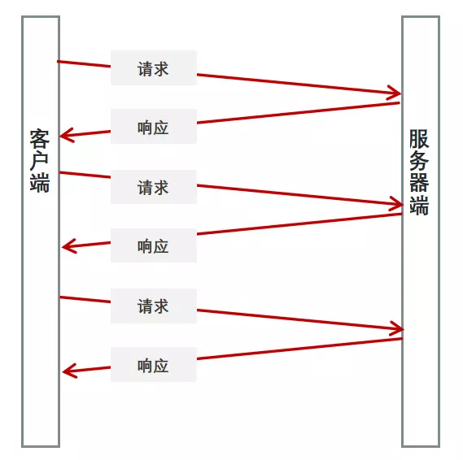

# HTML

<div align="center">
  
</div>

## HTML5

1.  提高可用性和改进用户的友好体验;
2.  有几个新的标签，这将有助于开发人员定义重要的内容；
3.  可以给站点带来更多的多媒体元素(视频和音频)；
4.  可以很好的替代 FLASH；
5.  语义化标签,当涉及到网站的抓取和索引的时候，对于 SEO 很友好；
6.  将被大量应用于移动应用程序和游戏。

### contenteditable

可编辑标签类似 input

```html
<p contenteditable="true">这是一个可编辑的段落。</p>
```

## canvas

HTML5 canvas 标签用于绘制图像（通过脚本，通常是 JavaScript）。不过，canvas 元素本身并没有绘制能力（它仅仅是图形的容器） - 您必须使用脚本来完成实际的绘图任务。
getContext() 方法可返回一个对象，该对象提供了用于在画布上绘图的方法和属性。

## Audio/Video

HTML5 视频和音频

### src 与 href 的区别

1.  href 是指向网络资源所在位置，建立和当前元素（锚点）或当前文档（链接）之间的链接，用于超链接。
2.  src 是指向外部资源的位置，指向的内容将会嵌入到文档中当前标签所在位置；在请求 src 资源时会将其指向的资源下载并应用到文档内，例如 js 脚本，img 图片和 frame 等元素。当浏览器解析到该元素时，会暂停其他资源的下载和处理，直到将该资源加载、编译、执行完毕，图片和框架等元素也如此，类似于将所指向资源嵌入当前标签内。这也是为什么将 js 脚本放在底部而不是头部。

## 本地存储

cookie 非常小，它的大小限制为 4KB 左右。它的主要用途有保存登录信息，这通常就是通过在 Cookie 中存入一段辨别用户身份的数据来实现的

localStorag、sessionStorage： HTML5 提供了两种在客户端存储数据的新方法

|      特性      |                                       Cookie                                        |                          localStorage                           | sessionStorage                                                  |
| :------------: | :---------------------------------------------------------------------------------: | :-------------------------------------------------------------: | --------------------------------------------------------------- |
|  数据的生命期  | 一般由服务器生成，可设置失效时间。如果在浏览器端生成 Cookie，默认是关闭浏览器后失效 |                  除非被手动清除，否则永久保存                   | 仅在当前会话下有效，关闭页面或浏览器后则被清除                  |
|  存放数据大小  |                                       4K 左右                                       |                           一般为 5MB                            | 一般为 5MB                                                      |
| 与服务器端通信 |        每次都会携带在 HTTP 头中，如果使用 cookie 保存过多数据会带来性能问题         |       仅在客户端（即浏览器）中保存，不参与和服务器的通信        | 仅在客户端（即浏览器）中保存，不参与和服务器的通信              |
|     易用性     |                    需要程序员自己封装，源生的 Cookie 接口不友好                     | 原生接口可以接受，亦可再次封装来对 Object 和 Array 有更好的支持 | 原生接口可以接受，亦可再次封装来对 Object 和 Array 有更好的支持 |
|      用途      |                                用于标识用户身份信息                                 |              用于浏览器端数据处理，或者页面间通信               | 用于浏览器端数据处理，或者页面间通信                            |
|     安全性     |                 低（设置 https 时，客户端无法直接读取，安全性较好）                 |                               低                                | 高                                                              |

## EventSource

EventSource 接口用于接收服务器发送的事件(长链接)。它通过 HTTP 连接到一个服务器，以 text/event-stream 格式接收事件, 不关闭连接。



-   语法：Arr.concat(arr1,arr2,……,arrn)

1.  EventSource.onerror：是一个 EventHandler，当发生错误时被调用，并且在此对象上派发 error 事件。
1.  EventSource.onmessage：是一个 EventHandler，当收到一个 message 事件，即消息来自源头时被调用。
1.  EventSource.onopen：是一个 EventHandler，当收到一个 open 事件，即连接刚打开时被调用。
1.  EventSource.readyState 只读 ，一个 unsigned short 值，代表连接状态。可能值是 CONNECTING (0), OPEN (1), 或者 CLOSED (2)。
1.  EventSource.url 只读 一个 DOMString，代表源头的 URL。
1.  EventSource.close() 如果存在，则关闭连接，并且设置 readyState 属性为 CLOSED。如果连接已经被关闭，此方法不做任何事。

```javascript
//客户端
const EventSour = new EventSource('/api/home');
// 监听指定类型的事件（可以监听多个）
EventSour.addEventListener('myopen', function(event) {
    console.log('myopen', event.data);
});

//服务端
app.get('/api/home', (ewq, res) => {
    // 根据 EventSource 规范设置报头
    res.writeHead(200, {
        'Content-Type': 'text/event-stream' // 规定把报头设置为 text/event-stream
    });
    // 用write返回事件流，事件流仅仅是一个简单的文本数据流，每条消息以一个空行(\n)作为分割。
    res.write('event: myopen' + '\n' + 'data:' + '消息内容' + '\n' + 'retry:' + '2000' + '\n\n');
});
```

## SEO

SEO（Search Engine Optimization）：汉译为搜索引擎优化。是一种方式：利用搜索引擎的规则提高网站在有关搜索引擎内的自然排名。目的是让其在行业内占据领先地位，获得品牌收益。很大程度上是网站经营者的一种商业行为，将自己或自己公司的排名前移

## iframe

1.  程序调入静态页面比较方便;
2.  页面和程序分离;

### 缺点

1.  iframe 有不好之处：样式/脚本需要额外链入，会增加请求。另外用 js 防盗链只防得了小偷，防不了大盗。
2.  iframe 好在能够把原先的网页全部原封不动显示下来,但是如果用在首页,是搜索引擎最讨厌的.那么你的网站即使做的在好,也排不到好的名次! 如果是动态网页，用 include 还好点！但是必须要去除他的 html,head,title,body 标签！
3.  框架结构有时会让人感到迷惑，特别是在多个框架中都出现上下、左右滚动条的时候。这些滚动条除了
    会挤占已经特别有限的页面空间外，还会分散访问者的留心力。访问者遇到这种站点往往会立刻转身离开
    。他们会想，既然你的主页如此混乱，那么站点的其他部分也许更不值得阅读。
4.  链接导航疑问。运用框架结构时，你必须保证正确配置所有的导航链接，如不然，会给访问者带来很大
    的麻烦。比如被链接的页面出现在导航框架内，这种情况下访问者便被陷住了，因为此时他没有其他地点
    可去。
5.  调用外部页面,需要额外调用 css,给页面带来额外的请求次数;
