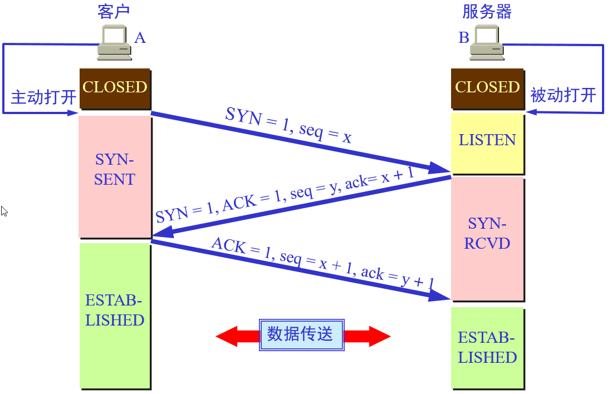
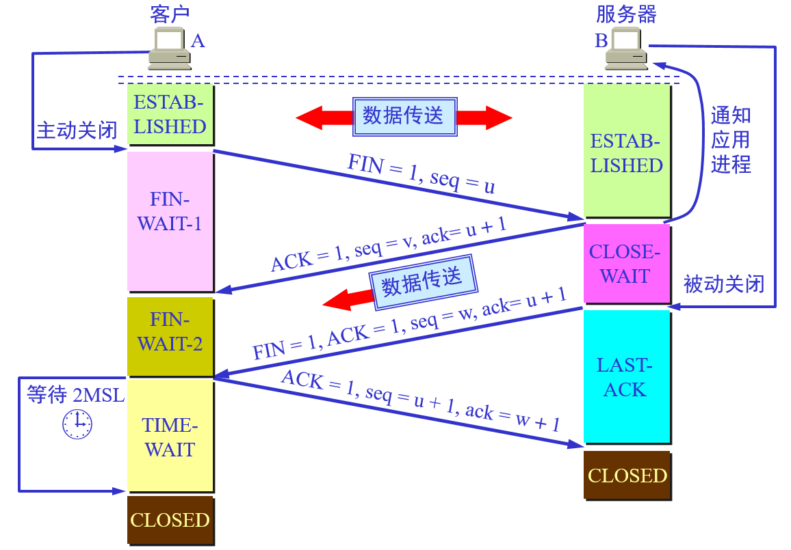
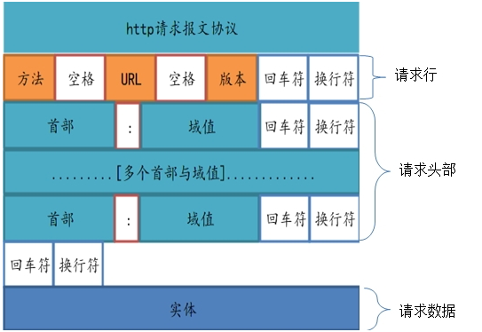

# HTTP

<div align="center">
  
</div>

超文本传输协议（英语：HyperText Transfer Protocol，缩写：HTTP）是一种用于分布式、协作式和超媒体信息系统的应用层协议[1]。HTTP 是万维网的数据通信的基础

## 七层模型

七层模型，亦称 OSI（Open System Interconnection）。参考模型是国际标准化组织（ISO）制定的一个用于计算机或通信系统间互联的标准体系，一般称为 OSI 参考模型或七层模型。


1.  物理层：主要定义物理设备标准，如网线的接口类型、光纤的接口类型、各种传输介质的传输速率等。它的主要作用是传输比特流（就是由 1、0 转化为电流强弱来进行传输,到达目的地后在转化为 1、0，也就是我们常说的数模转换与模数转换），这一层的数据叫做比特。
1.  链路层——以太网、VLAN
1.  网络层：进行逻辑地址寻址，实现不同网络之间的路径选择，协议有：IP（IPV4 IPV6） ICMP IGMP ARP RARP
1.  传输层：定义传输数据的协议端口号，以及流控和差错校验， 协议有：TCP/UDP 协议
1.  会话层：通过传输层（端口号：传输端口与接收端口）建立数据传输的通路，主要在你的系统之间发起会话或者接受会话请求（设备之间需要互相认识可以是 IP 也可以是 MAC 或者是主机名）。
1.  表示层：可确保一个系统的应用层所发送的信息可以被另一个系统的应用层读取。例如，PC 程序与另一台计算机进行通信，其中一台计算机使用扩展二一十进制交换码（EBCDIC），而另一台则使用美国信息交换标准码（ASCII）来表示相同的字符。如有必要，表示层会通过使用一种通格式来实现多种数据格式之间的转换
1.  应用层：网络服务与最终用户的一个接口，协议有：HTTP FTP TFTP SMTP SNMP DNS TELNET HTTPS POP3 DHCP

## TCP 协议


TCP/IP 是一组协议的代名词，它还包括许多协议，组成了 TCP/IP 协议簇。TCP/IP 协议簇分为四层，IP 位于协议簇的第二层(对应 OSI 的第三层)，TCP 位于协议簇的第三层(对应 OSI 的第四层)

TCP 协议对应于传输层，而 HTTP 协议对应于应用层协议, 通常用 IP 地址+端口号描述通信双方、server 服务的提供方,client 服务的使用方;

#### TCP 请求的三次握手：



1.  客户端向服务器发起 SYN 报文：嘿， 哥们，在不，我要和你通信一下？
2.  服务器接收到请求报文之后，回复 SYN+ACK 报文，并未这次连接分配资源：嘿，小弟弟，我收到你的请求了，我这边 ok 👌 了，
3.  客户端接收到服务器的确认报文之后再一次发送 ACK 报文 📃 给服务器：嘿哥们，我也准备好了；ok 这就是三次握手

#### TCP 四次挥手



1.  客户端发起中断请求，发送 FIN 报文给服务器：”嘿，哥们，我客户端没有数据给你了，要断开哦“
2.  服务器接收到客户端请求，立即发送 ACK 确认报文：“嘿，小弟弟，你的请求我收到了，但是我还没准备好，等我一下”
3.  服务器确认数据发送完毕之后，再次发送 FIN 报文给客户端：“嘿，小弟弟，我这边数据发送完毕了，准备好关闭了哦”
4.  客户端接收到服务器的关闭通知之后，发送 ACK 确认报文：“嘿，哥们，你关闭吧”
    这样子之后，服务端收到确认报文，直接断开连接，客户端等待 2ms ⏲️ 之后依然没有收到回复，证明服务端已经关闭了，ok，这样子客户端也关闭了

### 为什么建链接要 3 次握手，断链接需要 4 次挥手？

对于建链接的 3 次握手，因为服务端的 listen 状态下的 socket 当收到 SYN 报文的建连请求后，它可以把 ACK 和 SYN（ACK 起应答作用，而 SYN 起同步作用）放在一个报文里来发送。

对于 4 次挥手，当收到对方的 FIN 报文通知时，它仅仅表示对方没有数据发送给你了；但未必你所有的数据都全部发送给对方了，所以你可以未必会马上会关闭 SOCKET,也即你可能还需要发送一些数据给对方之后，再发送 FIN 报文给对方来表示你同意现在可以关闭连接了，所以它这里的 ACK 报文和 FIN 报文多数情况下都是分开发送的。

## HTTP 协议

HTTP 协议（HyperText Transfer Protocol，超文本传输协议）是用于从 WWW 服务器传输超文本到本地浏览器的传送协议。它可以使浏览器更加高效，使网络传输减少。
它不仅保证计算机正确快速地传输超文本文档，还确定传输文档中的哪一部分，以及哪部分内容首先显示(如文本先于图形)等

Http 协议是建立在 TCP 协议基础之上的应用层;当浏览器需要从服务器获取网页数据的时候，会发出一次 Http 请求。

!> 一次 Request, Response 操作称为一个事务



### HTTP 请求方法

1.  GET： 方法用来请求访问已被 URI 识别的资源。也就是指定了服务器处理请求之后响应的内容。
2.  POST：POST 方法用来传输实体主体。POST 与 GET 的区别之一就是目的不同，二者之间的区别会在文章的最后详细说明。虽然 GET 方法也可以传输，但是一般不用，因为 GET 的目的是获取，POST 的目的是传输。
3.  PUT：方法用来传输文件。类似 FTP 协议，文件内容包含在请求报文的实体中，然后请求保存到 URL 指定的服务器位置。
4.  HEAD：方法类似 GET 方法，但是不同的是 HEAD 方法不要求返回数据。用于确认 URI 的有效性及资源更新时间等。
5.  DELETE：方法用来删除文件，是与 PUT 相反的方法。DELETE 是要求返回 URL 指定的资源。
6.  OPTIONS：因为并不是所有的服务器都支持规定的方法，为了安全有些服务器可能会禁止掉一些方法例如 DELETE、PUT 等。那么 OPTIONS 就是用来询问服务器支持的方法。
7.  TRACE：回显服务器收到的请求，主要用于测试或诊断。
    8.CONNECT：HTTP/1.1 协议中预留给能够将连接改为管道方式的代理服务器。

### 常见 HTTP 状态码

1.  200 ok 👌
2.  206 断点续传
3.  301 **永久**本地重定向
4.  302 **临时**本地重定向
5.  304 本地缓存文件 📃
6.  401 token 失效请求未经授权
7.  403 没有权限
8.  404 找不到文件
9.  405 请求方式错误 🙅 get post
10. 415 请求数据方式错误 🙅‍♂️ json form
11. 500 server 错误
12. 502 服务器挂了
13. 503 服务器不可用
14. 504 超时 ⏰

### 输入网址浏览器做了哪些

1.  DNS 解析
1.  浏览器向服务器发送 http 请求
1.  服务器向浏览器发送 html 响应
1.  浏览器接收 html 响应
1.  浏览器处理 html 相应
1.  继续处理其他请求

### 浏览器做那些

1.  HTML 代码转化成 DOM
1.  CSS 代码转化成 CSSDOM（CSS Object Model）
1.  结合 DOM 和 CSSDOM，生成一棵渲染树 🌲（包含每个节点的视觉信息）
1.  生成布局（layout），即将所有渲染树 🌲 的所有节点进行平面合成
1.  将布局绘制（paint）在屏幕上

### 影响 HTTP 的因素：

1.  带宽
1.  延迟 浏览器阻塞 一个浏览器对于同一个域名只能有四个链接（不同的浏览器不一样），如果超过了会被阻塞
1.  dns 查询：浏览器建立链接是需要知道服务器 IP 地址的，DNS 用来将域名解析为 ip 地址，可以通过刷新 DNS 缓存来加快速度
1.  建立链接：http 协议是基于 TCP 的，即使网络，浏览器再快也得进行三次握手，在高延迟的网络环境下影响比较明显

### 优化 HTTP 请求

1.  合并请求 雪碧图
2.  缓存 强缓存 协商缓存 本地缓存
3.  tcp 调优 http2 keep-alice
4.  带宽 智能 cdn
5.  gzip webp 压缩静态资源文件
6.  预加载 多个 cdn 异步读取 js
7.  雅虎军规

### HTTP 缺陷

1.  耗时：每次传输都要建立链接
1.  不安全：http 是明文传输的，只要在路由器或者交换机上面截取，所有东西（账户，密码 ）都是可见的、采用 wireshark 抓包
1.  header 内 SPDY 容太大：通常用户的请求 header 变化的概率很小，但是每次请求都要携带大量的 header 信息，导致传输成本增加
1.  keepalive 压力太大：持久连接虽然有优点，但同时也会给服务器造成大量的性能压力，特别是传输图片的时候

## HTTPS

HTTPS 超文本传输安全协议（英语：Hyper Text Transfer Protocol over Secure Socket Layer，缩写 HTTPS。也被称为 HTTP over TLS，HTTP over SSL 或 HTTP Secure）。 上面说到的加密㊙ ️ 协议叫 SSL，应用层（安全层） 传输层 网络层 数据链路层


## HTTP2.0

[HTTP/2](https://http2.akamai.com/demo) （原名 HTTP/2.0）即超文本传输协议 2.0，是下一代 HTTP 协议

### HTTP2.0 优点

1.  使用二进制传输
2.  报头压缩 📦
3.  多路复用 一个网络连接实现并行请求
4.  服务器主动推送,减少请求延迟
5.  流量控制 优先级设置

## SPDY

SPDY 是 Google 开发的基于 TCP 的应用层协议，用以最小化网络延迟，提升网络速度，优化用户的网络使用体验。SPDY 并不是一种用于替代 HTTP 的协议，而是对 HTTP 协议的增强。新协议的功能包括数据流的多路复用、请求优先级以及 HTTP 报头压缩。

### SPDY：综合了 HTTPS 和 HTTP 两者优点

1.  降低延迟：才用多路复用降低延迟
2.  请求优先级：给 request 设置优先级，这样子重要的请求就会优先得到响应
3.  头部压缩 📦
4.  服务端推送 ：比如我要请求一个 style.css 的文件，在客户端接收到这个数据的同时，服务器会把 style.js 文件推送给客户端，在客户端再来请求这个文件的时候，就可以直接从缓存中去取了

## DNS

域名解析是把域名指向网站空间 IP，让人们通过注册的域名可以方便地访问到网站的一种服务。IP 地址是网络上标识站点的数字地址，为了方便记忆，采用域名来代替 IP 地址标识站点地址。域名解析就是域名到 IP 地址的转换过程。域名的解析工作由 DNS 服务器完成。

### DNS 预解析

dns-prefetch 链接关系类型用于指示将用于获取所需资源的源，并且用户代理应该尽可能早地解析，可以提高网页的载入速度。

```html
<link rel="dns-prefetch" href="//hm.baidu.com" />
```

<!--
#### 强缓存

> -   开启 expires
> -   expires 30d;
> -   add_header Cache-Control no-cache;
> -   Cache-Control 新版本

#### 协商缓存

-   开启 etag on 空间换时间 文件过大性能很差
-   last-modified if-modified-since

nginx 请求资源合并
多个 cdn 域名

#### 埋点

> navigator.sendBeacon('a.html')
 -->

### http3.0 （QUIC）

QUIC 协议从 TCP 切换到 UDP

### http3.0 优势

1. 大大缩短建立链接时间 减少 TCP 三次握手及 TLS 握手时间
2. 改进拥塞时间
3. 无线头阻塞的多路复用
4. 前向纠错
5. 链接迁移

### TCP 和 UDOP 区别

1. TCP 是面向连接的，UDP 是面向无连接的
2. UDP 程序结构较简单
3. TCP 是面向字节流的，UDP 是基于数据报的
4. TCP 保证数据正确性，UDP 可能丢包
5. TCP 保证数据顺序，UDP 不保证
