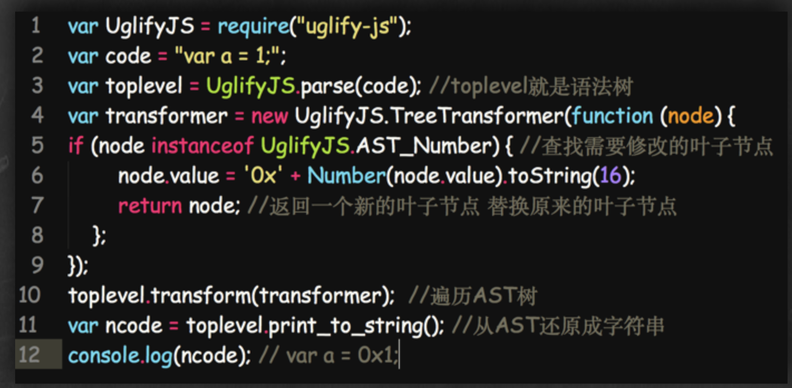

<div align="center">
  
</div>

## console

-   如果打印的是 obj 类型 默认转 valueOf()
-   如果打印的是 其他类型 默认转 toString()

## es5 三剑客

-   this:谁调用 this 指向谁 改变 this 指向 (call apply bind new)
-   闭包: 函数嵌套函数,函数外部的不能引用函数内部的函数变量,函数内部的可以引用函数外部的变量(用完记得回收掉,容易引起内存泄漏)
-   原型:为一群对象添加属性和方法的对象 **proto** 指向根
-   原型链:由原型组成的链式查找
-   继承:复用其他对象的属性和方法,来扩张自己的属性和方法
    > -   函数提升的优先级高于变量
    > -   已经声明的变量再次声明会被忽略
    > -   如果局部变量未被声明引用，者默认声明为全局变量，
-   setTimeout 共有 4 个参数。最后那两个参数，将在 1000 毫秒之后回调函数执行时，作为回调函数的参数. 最小的间隔是 4 毫秒

## call apply bind 的用法和区别

-   函数.call(对象,arg1,arg2....)
-   函数.apply(对象，[arg1,arg2,...])
-   var ss=函数.bind(对象,arg1,arg2,....)
-   bind() 方法和前两者不同在于： bind() 方法会返回执行上下文被改变的函数而不会立即执行，而前两者是直接执行该函数。他的参数和 call()相同。

```javascript
function.prototype.call=function(context){
    context=context?Object(context):window;
    context.fn=this;
    var args=[]
    for(i=1;i<arguments.length;i++){
    args.push('arguments['+i+']');
}
let r=eval('context.fn('+args+']')
delete context.fn;
return r;
}


function.prototype.apply=function(context,args){
    context=context?Object(context):window;
    context.fn=this;
    if(!args){
         return context.fn()
    }
    let r=context.fn(args)
    delete context.fn;
    return r;
}
```

## prototype **proto** constructor

把 公用的方法与属性抽离出来 生成一个构造函数， 把抽离出来的方法 通过 prototype 绑定在构造函数上，
如果要继承构造函数的属性与方法 需要通过实例化(new)，实例的方法就继承构造函数的方法与属性，实例的原型对象（**proto**）与构造函数的原型(prototype)对象相同
构造函数.prototype.constructor 指向 构造函数
实例的**proto**.constructor 指向 构造函数
constructor 指向构造函数

```javascript
hasOwnProperty(propertyName) ：判断对象是否拥有一个指定名称的实例属性(非继承)
isPrototypeOf(obejct) ：判断某个原型是否出现在对象的原型链中
propertyIsEnumerable(propertyName) ：判断指定名称的属性是否为实例属性并且是可枚举的(可用for/in循环枚举)
Object.getOwnPropertyNames(object) ：返回一个数组，包含对象的所有实例属性和方法，不包含原型继承的属性和方法
Object.getPrototypeOf(object) ：返回对象的上一级原型
Object.keys(object) ：返回一个数组，包含对象的可枚举的实例属性名称
```


#### with 语句 扩展一个语句的作用域链。

-   with 语句 扩展一个语句的作用域链
-   利: with 语句可以在不造成性能损失的情況下，减少变量的长度。其造成的附加计算量很少
-   弊: with 语句使得程序在查找变量值时，都是先在指定的对象中查找。所以那些本来不是这个对象的属性的变量，查找起来将会很慢

```code
var a, x, y;
var r = 10;

with (Math) {
  a = PI * r * r;
  x = r * cos(PI);
  y = r * sin(PI / 2);
}
console.log('%cI am a button', 'color: white; background-color: green; padding: 2px 5px; border-radius: 2px');
```

#### new 操作符会经历以下四个步骤

> -   创建一个新对象
> -   将构造函数的作用域赋给新对象（因此 this 指向了这个新对象）
> -   执行构造函数中的代码（为这个新对象添加属性）
> -   返回新对象

## 创建对象的方式

> -   new
> -   object.create()
> -   var obe={a:'12'}
> -   function(){}

## 继承方法

> -   Child.prototype.**proto**=Parent.prototype;
> -   object.create();
> -   object.setPrototypeof()

## 判断数据类型的方法

#### typeof 实现原理

> -   typeof 一般被用于判断一个变量的类型，我们可以利用 typeof 来判断 number, string, object, boolean, function, undefined,symbol 这七种类型，这种判断能帮助我们搞定一些问题，比如在判断不是 object 类型的数据的时候，typeof 能比较清楚的告诉我们具体是哪一类的类型。但是，很遗憾的一点是，typeof 在判断一个 object 的数据的时候只能告诉我们这个数据是 object, 而不能细致的具体到是哪一种 object
> -   null：所有机器码均为 0 typeof null 是 object

#### instanceof 操作符的实现原理

> -   instanceof 主要的实现原理就是只要右边变量的 prototype 在左边变量的原型链上即可。因此，instanceof 在查找的过程中会遍历左边变量的原型链，直到找到右边变量的 prototype，如果查找失败，则会返回 false，告诉我们左边变量并非是右边变量的实
> -   原型的链式查找

#### Object.prototype.toString.call()

> -   Object.prototype.toString.call(1) // "[object Number]"
> -   Object.prototype.toString.call('hi') // "[object String]"
> -   Object.prototype.toString.call({a:'hi'}) // "[object Object]"
> -   Object.prototype.toString.call([1,'a']) // "[object Array]"
> -   Object.prototype.toString.call(true) // "[object Boolean]"
> -   Object.prototype.toString.call(() => {}) // "[object Function]"
> -   Object.prototype.toString.call(null) // "[object Null]"
> -   Object.prototype.toString.call(undefined) // "[object Undefined]"
> -   Object.prototype.toString.call(Symbol(1)) // "[object Symbol]"

#### 函数重载（多态）

> -   重载就是一组具有相同名字、不同参数列表的函数（方法）(多态就是通过对传递的参数判断来执行逻辑，即可实现一种多态处理机制)
> -   使用 arguments.length 可以实现重载

## Promise

#### 三种状态:

> -   pending：进行中
> -   fulfilled :已经成功 reslove
> -   rejected 已经失败 reject
> -   promise 有一个 then 方法， then 方法可以接受 3 个函数作为参数。前两个函数对应 promise 的两种状态 fulfilled 和 rejected 的回调函数,第三个函数用于处理进度信息（对进度回调的支持是可选的）。
> -   Promise.all 表示全部成功才成功 有任意一个失败 都会失败(同时执行队列),可以将多个 Promise 实例包装成一个新的 Promise 实例。同时，成功和失败的返回值是不同的，成功的时候返回的是一个结果数组，而失败的时候则返回最先被 reject 失败状态的值
> -   Promse.race 就是赛跑的意思，意思就是说，Promise.race([p1, p2, p3])里面哪个结果获得的快，就返回那个结果，不管结果本身是成功状态还是失败状态。

#### 原理

```javascript
function Promise(executor) {
    let _this = this;
    _this.value = undefined;
    _this.reason = undefined;

    //Promise 三个状态
    _this.status = 'pending';

    function resolve(value) {
        if (_this.status == 'pending') {
            _this.value = value;
            _this.status = 'resolved';
        }
    }
    function reject(reason) {
        if (_this.status == 'pending') {
            _this.reason = reason;
            _this.status = 'rejected';
        }
    }
    executor(resolve, reject);
}
//then
Promise.prototype.then = function(onFufilled, onRejected) {
    let _this = this;
    if (_this.status === 'resolved') {
        onFufilled(_this.value);
    } else if (_this.status === 'rejected') {
        onRejected(_this.reason);
    }
};
module.exports = Promise;


var promise = new Promise(function (resolve, reject) {
   if (/* 异步操作成功 */){
     resolve(value);
   } else { /* 异步操作失败 */
     reject(new Error());
   }
 });
```

## enent

> -   event.preventDefault()//，是用来阻止点击 a 默认跳转
> -   event.stopPropagation()// 该方法将停止事件的传播，阻止它被分派到其他 Document 节点
> -   event.stopImmediatePropagation() //函数用于阻止剩余的事件处理函数的执行，并防止当前事件在 DOM 树上冒泡。
> -   event.target //返回的是点击的元素节点
> -   event.currentTarget //事件属性返回其监听器触发事件的节点，即当前处理该事件的元素、文档或窗口。

## 自定义事件

```javascript
var ev = document.getElementById('ev');
var eve = new Event('custome');
window.addEventListener('custome', function() {
    console.log('custome');
});
setTimeout(function() {
    window.dispatchEvent(eve);
}, 1000);
```

## 模块化

模块化是一种将系统分离成独立功能部分的方法，严格定义模块接口，模块间具有透明性

## 内存泄漏

#### 内存泄漏

> -   javaScript 会自动垃圾收集，但是如果我们的代码写法不当，会让变量一直处于“进入环境”的状态，无法被回收

#### 那些会引起内存泄漏

-   1.意外的全局变量
-   2.被遗忘的计时器或回调
-   3.超出 DOM 引用
-   4.闭包
-   5.递归

#### 内存泄漏检测

> Chrome 内存分析工具

###### Timeline 视图


###### Profile 视图


#### 垃圾回收机制

-   标记清除（mark and sweep）

        1.  垃圾回收器，在运行的时候会给存储在内存中的所有变量都加上标记。
        2.  去掉环境中的变量以及被环境中的变量引用的变量的标记。
        3.  再被加上标记的会被视为准备删除的变量。
        4.  垃圾回收器完成内存清除工作，销毁那些带标记的值并回收他们所占用的内存空间。

    > 大部分浏览器都是使用这种方式进行垃圾回收，区别在于如何标记及垃圾回收间隔而已，只有低版本 IE，不出所料，又是 IE。

-   引用计数(reference counting)
    > 1.  声明了一个变量并将一个引用类型的值赋值给这个变量，这个引用类型值的引用次数就是 1。
    > 2.  同一个值又被赋值给另一个变量，这个引用类型值的引用次数加 1.
    > 3.  当包含这个引用类型值的变量又被赋值成另一个值了，那么这个引用类型值的引用次数减 1.
    > 4.  当引用次数变成 0 时，说明没办法访问这个值了。
    > 5.  当垃圾收集器下一次运行时，它就会释放引用次数是 0 的值所占的内存。

#### 什么时候触发垃圾回收

## 事件队列

> JavaScript 语言的一大特点就是单线程，也就是说，同一个时间只能做一件事

##### 怎么才能多线程

> webworker(html5),
> concurrent.Thread.js

#### 任务可以分成两种:

> -   同步任务(synchronous):在主线程上排队执行的任务 **(执行栈)** ，只有前一个任务执行完毕(入栈出栈)，才能执行后一个任务
> -   异步任务(asynchronous):不进入主线程、而进入"任务队列"(task queue)的任务，只有"任务队列"通知主线程，某个异步任务可以执行了，该任务才会进入主线程执行

#### 任务队列分为:

> -   微任务:process.nextTick, Promises, Object.observe, MutationObserver
> -   宏任务: MessageChannel setImmediate setTimeout,setInterval
> -   任务队列:是一个先进先出的数据结构，排在前面的事件，优先被主线程读取

## [node 相关](https://github.com/Silence520/Documentdescription/tree/master/node%E7%9B%B8%E5%85%B3)


> [node 相关](https://github.com/Silence520/Documentdescription/tree/master/node%E7%9B%B8%E5%85%B3)

## js 设计模式

> -   单例模式
> -   代理模式
> -   命令模式
> -   职责链模式
> -   发布订阅者模式
> -   工厂模式
> -   迭代器模式
> -   适配器模式

## 函数式编程

> -   说到函数式编程，大家可能第一印象都是学院派的那些晦涩难懂的代码，充满了一大堆抽象的不知所云的符号，似乎只有大学里的计算机教授才会使用这些东西。在曾经的某个时代可能确实如此，但是近年来随着技术的发展，函数式编程已经在实际生产中发挥巨大的作用了，越来越多的语言开始加入闭包，匿名函数等非常典型的函数式编程的特性，从某种程度上来讲，函数式编程正在逐步“同化”命令式编程

> \*JavaScript 作为一种典型的多范式编程语言，这两年随着 React 的火热，函数式编程的概念也开始流行起来，RxJS、cycleJS、lodashJS、underscoreJS 等多种开源库都使用了函数式的特性。所以下面介绍一些函数式编程的知识和概念。

### 纯函数

> -   纯函数的定义是，对于相同的输入，永远会得到相同的输出，而且没有任何可观察的副作用，也不依赖外部环境的状态

```javascript
var arr = [1, 2, 3, 4, 5];

// Array.slice是纯函数，因为它没有副作用，对于固定的输入，输出总是固定的
xs.slice(0, 3); //=> [1,2,3]
xs.slice(0, 3); //=> [1,2,3]

// Array.splice是不纯的，它有副作用，对于固定的输入，输出不是固定的
xs.splice(0, 3); //=> [1,2,3]
xs.splice(0, 3); //=> [4,5]
xs.splice(0, 3); //=> []
```

### 函数的柯里化

> -   函数柯里化（curry）的定义很简单：传递给函数一部分参数来调用它，让它返回一个函数去处理剩下的参数
> -   比如对于加法函数 var add = (x, y) =>　 x + y ，我们可以这样进行柯里化：

```jacascript
var add = function(x){ //比较容易读懂的ES5写法
    return function(y){
        return x + y
    }
}
var add = x => (y => x + y); //ES6写法，也是比较正统的函数式写法

var add2 = add(2);
add2(2); // 4
var add200 = add(200);
add200(80); // 280
```

> -   事实上柯里化是一种“预加载”函数的方法，通过传递较少的参数，得到一个已经记住了这些参数的新函数，某种意义上讲，这是一种对参数的“缓存”，是一种非常高效的编写函数的方法;

### 函数组合 f(g(y(x))

> -   学会了使用纯函数以及如何把它柯里化之后，我们会很容易写出这样的“包菜式”代码

```javascript
h(g(f(x)));
```

```javascript
//es5 两个函数的组合
var compose = function(f, g) {
    return function(x) {
        return f(g(x));
    };
};

//es6
var compose = (f, g) => x => f(g(x));
var add1 = x => x + 1;
var mul5 = x => x * 5;
compose(
    mul5,
    add1
)(2); //15
```

> -   我们定义的 compose 就像双面胶一样，可以把任何两个纯函数结合到一起。

-   这种灵活的组合可以让我们像拼积木一样来组合函数式的代码

```javascript
var first = arr => arr[0];
var reverse = arr => arr.reverse();
var last = compose(
    first,
    reverse
);
last([1, 2, 3, 4, 5]); //5
```

### Point Free

> -   不要命名转瞬即逝的中间变量

```javascript
var f = str => str.toUpperCase().split(' '); //这不Piont free
//这个函数中，我们使用了 str 作为我们的中间变量，但这个中间变量除了让代码变得长了一点以外是毫无意义的。下面改造一下这段代码：

var toUpperCase = word => word.toUpperCase();
var split = x => str => str.split(x);
var f = compose(
    split(' '),
    toUpperCase
);
f('abcd efgh'); //["ABCD", "EFGH"]
```

<!-- ## 版本更新记录

#### ES6

> -   let const. 字符串模版, 箭头函数, 结构赋值, promise, 默认参数。import(导入) 和 export(导出):

#### ES7

> -   async/await 异步
> -   Array.prototype.includes()。 是查找一个值在不在数组里，若在，则返回 true，反之返回 false
> -   3 \*\* 2 求幂运算符

#### ES8

> -   async function foo() {}
> -   Object.entries() 如果一个对象是具有键值对的数据结构，则每一个键值对都将会编译成一个具有两个元素的数组，这些数组最终会放到一个数组中，返回一个二维数组
> -   Object.values()只返回自己的键值对中属性的值
> -   Object.getOwnPropertyDescriptors()
> -   padStart()。//'x'.padStart(4, 'ab') abax
> -   padEnd()。//'x'.padEnd(4, 'ab') xaba

#### ES9

> -   异步迭代器：使用 AsyncIterable 和 AsyncIterator 协议为异步迭代添加语法支持。该特性使创建异步生成器函数和方法的语法成为可能。
> -   为正则表达式添加 s (dotAll)标志：为这些表达式提供一致的行为。该特性旨在解决正则表达式中的点(.)不匹配行终止符的限制。s 标志改变了这一点。此标志将在选择的基础上运行，因此现有的正则表达式模式不会受到影响。
> -   Regexp(正则表达式) Unicode 属性转义：使开发者能够更好地访问 Unicode 字符属性。属性转义将以\p{…}和\P{…}的形式添加。
> -   Regexp 环视匹配断言：解决了环视（lookaround）的一个缺点，它是零宽度的断言，与字符串进行匹配，不消耗任何东西。使用隐藏的断言，开发人员可以确保模式之前有或没有另一个模式。例如：匹配美元的金额而不获取美元符号。
> -   Rest/spread 属性：提供一个较小的语法改进。
> -   prototype.finally()：用于在处理完资源后进行清理。
> -   Regexp 命名捕获组：用来标识捕获组，使它们更容易查找并使正则表达式更容易理解。以前，捕获组是通过数字访问的。
> -   模板文字的修订：为带标签的模板文字增加了语法的自由度。
> -   一个预期的功能，即 Function.prototype.toString 的更新被删除，因为仍然有人担心它正在解决中。 toString()方法会返回一个表示函数源代码的字符串

## babel

> -   Babel 默认只转换新的 JavaScript 句法（syntax），而不转换新的 API，比如 Iterator、Generator、Set、Maps、Proxy、Reflect、Symbol、Promise 等全局对象，以及一些定义在全局对象上的方法（比如 Object.assign）都不会转码。
> -   babel-polyfill 主要包含了 core-js 和 regenerator 两部分
> -   babel-polyfill：提供了如 ES5、ES6、ES7 等规范中 中新定义的各种对象、方法的模拟实现。
> -   regenerator：提供 generator 支持，如果应用代码中用到 generator、async 函数的话用到。 -->

## 错误监控

#### 错误分类

> 1 即时运行错误

###### 捕获错误

> -   try ...catch
> -   window.onerror()
>     2 资源加载失败

###### 捕获错误

> -   object.onerror()(img\ script)
> -   performance.getEnries() 返回数组

#### 资源加载失败不能用冒泡得到错误,可以用捕获处理可以到的错误监听

> 捕获错误
> try ...catch
> window.onerror()

### 错误上报

```javascript
new Image().src = 'http://www.baidu.com?sa=we';
navigator.sendBeacon('a.php'); //埋点
```

## 安全

#### 混淆

> 混淆:具体处理为重命名局部变量、在相同语义 的情况下压缩代码，比如去掉末尾分号(Remove Terminator Semicolons)，常量替 换(Constant Propagation)、移除代码空白(Space、Tab、Line-Feed)全局变量 不会更名如 LocalStorage。

#### 常⽤用混淆技术

UglifyJS, JS Packer, Closure Compiler, JS Min


#### 爆破

https://github.com/svent/jsdetox
http://jsnice.org/

```javascript
Number.prototype.constructor.constructor = function(a) {
    console.log('--------');
    console.log(a);
    return Function.apply(null, arguments);
};
```

#### 加密

> 加密重要的目的是出于对商业利益的保护。由于作品太容易被复制窜 改，容易会失去渠道先机
> 加密的目标:减少加密的成本增加破解的成本，需注意 加密后的文件不易过大、没有人工介入不能破解、限制在其他域名部署、不容易被 调试跟踪。

#### 加密算法

> 不基于 key 的算法就是消息双⽅方都通过⼀一定的 加密和解密算法来进⾏行行通信，这种算法缺点很 明显如果加密算法被破解了了就泄露露了
> key 是⼀一个什什么东⻄西呢?随便便你，可以是⼀一个随机产⽣生 的数字，或者⼀一个单词，只要你⽤用的算法认为你选来 做 key 的东⻄西合法就⾏行行。所以基于 key 的加密算法⼜又分 为 2 类:对称加密和不不对称加密

#### 常用的加密手段

base64、md5、 sha1

### AST 语法分析树



> 将代码分析成树状结构, transformer 进行遍历,碰到要替换的进行替换.

#### 常见的攻击

> Web 前端的黑客攻防技术是一门非常新颖且有趣的黑客技术，主要包含 Web 前端安全的跨站脚本(XSS)、 跨站请求伪造(CSRF)、界面操作劫持、WebShell 这 几大类，涉及的知识点涵盖信任与非信任关系、Cookie 安全、Flash 安全、DOM 渲染、字符集、跨域、原生态 攻击、高级钓鱼、蠕虫思想

#### CSRF 跨站请求

##### 存在问题

> 被黑客抓包，捕获请求地址，直接修改参数。
> 加入验证码，判断 reffer。 这些参数前端都是可以穆 改的。

##### 解决方案

> 验证 Token 请求。每次动 强验证码+动态 Token 请求 态刷新。
> 强验证码+动态 Token 请求

#### 跨站脚本(XSS)


payload
xsser

###### 跨站脚本(XSS)防患


