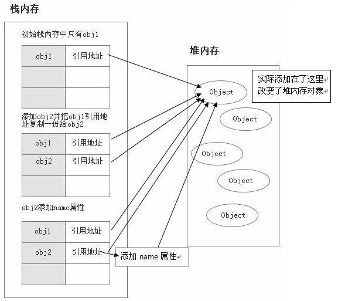
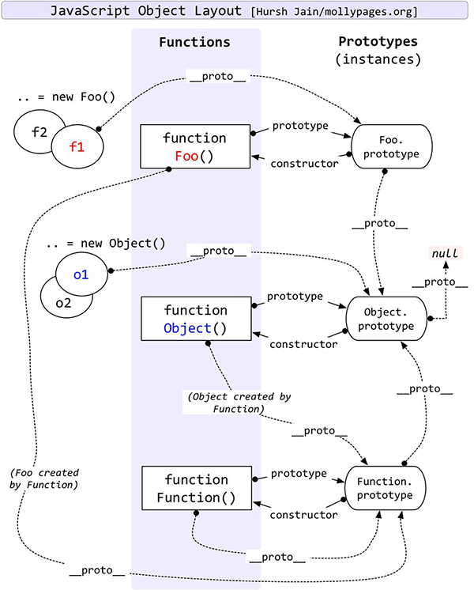
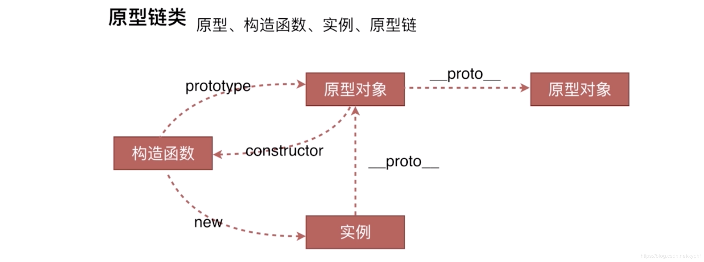
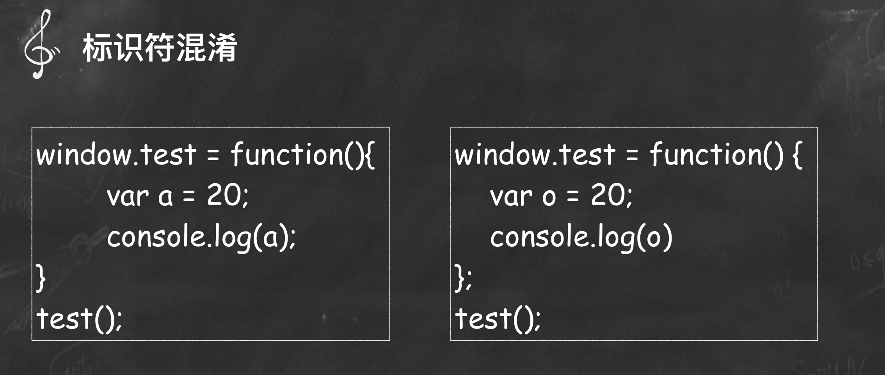
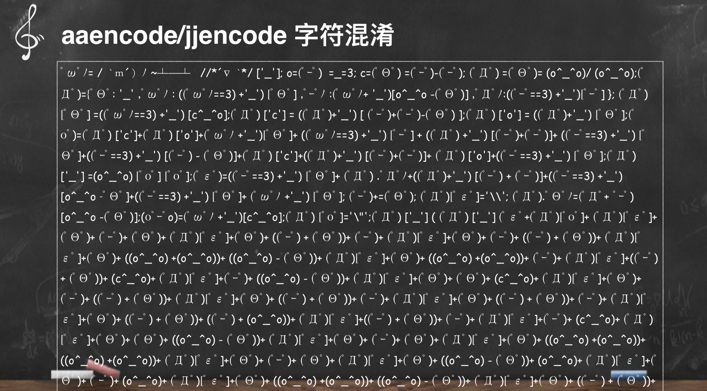
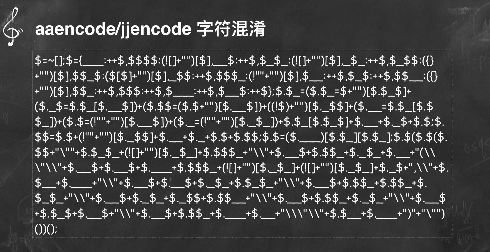

# Javascript

<div align="center">
  
</div>

JavaScript（通常缩写为 JS）是一种高级的、解释型的编程语言。JavaScript 是一门基于原型、函数先行的语言，是一门多范式的语言，它支持面向对象编程，命令式编程，以及函数式编程。它提供语法来操控文本、数组、日期以及正则表达式等，不支持 I/O，比如网络、存储和图形等，但这些都可以由它的宿主环境提供支持。它已经由 ECMA（欧洲计算机制造商协会）通过 ECMAScript 实现语言的标准化。它被世界上的绝大多数网站所使用，也被世界主流浏览器（Chrome、IE、Firefox、Safari、Opera）支持

<!-- ## console

-   如果打印的是 obj 类型 默认转 valueOf()
-   如果打印的是 其他类型 默认转 toString()
 -->

## 数据类型

基本类型(栈 stack) : Number、String 、Boolean、Null 和 Undefined , Symbol(es6 新增),BigInt(es10 新增)； 基本数据类型是按值访问 由高向低分配,栈内存最大是 8MB,（超出报栈溢出）， String:是特殊的栈内存 （向高分配大小不定）,开发者分配

引用类型(堆 heap) :Object 、Array 、Function 、Data；引用类型数据在栈内存中保存的实际上是对象在堆内存中的引用地址(指针),向高分配,系统自动分配



### 区别

1.  基本类型值：指的是保存在栈内存中的简单数据段；
2.  引用类型值：指的是那些保存在堆内存中的对象，意思是，变量中保存的实际上只是一个指针，这个指针指向内存堆中实际的值

```javascript
//基本类型
var a = 2;
var b = a;
b = 3;
console.log(a); //2
console.log(b); //2

//引用类型
var arrObj = [3, 4, 5];
var arrObj1 = arrObj;
arrObj1.push(6);
console.log(arrObj); // [3,4,5,6]
console.log(arrObj1); // [3,4,5,6]
```

## es5 三剑客

- this:谁调用 this 指向谁 改变 this 指向 (call apply bind new)
- 闭包: 函数嵌套函数,函数外部的不能引用函数内部的函数变量,函数内部的可以引用函数外部的变量(用完记得回收掉,容易引起内存泄漏)
- 原型:为一群对象添加属性和方法的对象 **proto** 指向根
- 原型链:由原型组成的链式查找
- 继承:复用其他对象的属性和方法,来扩张自己的属性和方法
  > - 函数提升的优先级高于变量
  > - 已经声明的变量再次声明会被忽略
  > - 如果局部变量未被声明引用，者默认声明为全局变量，

### setTimeout

setTimeout 共有 4 个参数。最后那两个参数，将在 1000 毫秒之后回调函数执行时，作为回调函数的参数. 最小的间隔是 4 毫秒,返回值 timeoutID 是一个正整数，表示定时器的编号。这个值可以传递给 clearTimeout()来取消该定时器。

## call apply bind 的用法和区别

- 函数.call(对象,arg1,arg2....)
- 函数.apply(对象，[arg1,arg2,...])
- var ss=函数.bind(对象,arg1,arg2,....)
- bind() 方法和前两者不同在于： bind() 方法会返回执行上下文被改变的函数而不会立即执行，而前两者是直接执行该函数。他的参数和 call()相同。

```javascript
function.prototype.call=function(context){
    context=context?Object(context):window;
    context.fn=this;
    var args=[]
    for(i=1;i<arguments.length;i++){
    args.push('arguments['+i+']');
}
let newFn=eval('context.fn('+args+')')
delete context.fn;
return newFn;
}


function.prototype.apply=function(context,args){
    context=context?Object(context):window;
    context.fn=this;
    if(!args){
         return context.fn()
    }
    let newFn=context.fn(args)
    delete context.fn;
    return newFn;
}

Function.prototype.bind = function (context, ...args) {
    const fn = this
    args = args ? args : []
    return function newFn(...newFnArgs) {
        if (this instanceof newFn) {
            return new fn(...args, ...newFnArgs)
        }
        return fn.apply(context, [...args,...newFnArgs])
    }
}

Function.prototype.bind = function() {
    var thatFunc = this, thatArg = arguments[0];
    var args = slice(arguments, 1);
    if (typeof thatFunc !== 'function') {
      // closest thing possible to the ECMAScript 5
      // internal IsCallable function
      throw new TypeError('Function.prototype.bind - ' +
             'what is trying to be bound is not callable');
    }
    return function(){
      var funcArgs = args.concat(slice(arguments))
      return thatFunc.apply(thatArg, funcArgs);
    };
  };
```

## prototype **proto** constructor



把 公用的方法与属性抽离出来 生成一个构造函数， 把抽离出来的方法 通过 prototype 绑定在构造函数上，
如果要继承构造函数的属性与方法 需要通过实例化(new)，实例的方法就继承构造函数的方法与属性，实例的原型对象（**proto**）与构造函数的原型(prototype)对象相同
构造函数.prototype.constructor 指向 构造函数
实例的**proto**.constructor 指向 构造函数
constructor 指向构造函数



```javascript
hasOwnProperty(propertyName) ：判断对象是否拥有一个指定名称的实例属性(非继承)
isPrototypeOf(obejct) ：判断某个原型是否出现在对象的原型链中
propertyIsEnumerable(propertyName) ：判断指定名称的属性是否为实例属性并且是可枚举的(可用for/in循环枚举)
Object.getOwnPropertyNames(object) ：返回一个数组，包含对象的所有实例属性和方法，不包含原型继承的属性和方法
Object.getPrototypeOf(object) ：返回对象的上一级原型
Object.keys(object) ：返回一个数组，包含对象的可枚举的实例属性名称
```

#### new 操作符会经历以下四个步骤

1.  创建一个新对象
1.  将构造函数的作用域赋给新对象（因此 this 指向了这个新对象）
1.  执行构造函数中的代码（为这个新对象添加属性）
1.  返回新对象

## 创建对象的方式

1.  new
1.  object.create()
1.  var obe={a:'12'}
1.  function(){}

## new

```javascript
function FunNew(fn, ...args) {
  let instance = Object.create(fn.prototype);
  let res = fn.apply(instance, args);
  return typeof res === 'object' ? res : instance;
}
```

## Object.create()

```javascript
function create(proto) {
  function Fun() {}
  Fun.prototype = proto;
  Fun.prototype.constructor = Fun;

  return new Fun();
}
```

## 继承方法

1.  Child.prototype.**proto**=Parent.prototype;
1.  object.create();
1.  object.setPrototypeof()

## 判断数据类型的方法

#### typeof 实现原理

1.  typeof 一般被用于判断一个变量的类型，我们可以利用 typeof 来判断 number, string, object, boolean, function, undefined,symbol 这七种类型，这种判断能帮助我们搞定一些问题，比如在判断不是 object 类型的数据的时候，typeof 能比较清楚的告诉我们具体是哪一类的类型。但是，很遗憾的一点是，typeof 在判断一个 object 的数据的时候只能告诉我们这个数据是 object, 而不能细致的具体到是哪一种 object
1.  null：所有机器码均为 0 typeof null 是 object

#### instanceof 操作符的实现原理

1.  instanceof 主要的实现原理就是只要右边变量的 prototype 在左边变量的原型链上即可。因此，instanceof 在查找的过程中会遍历左边变量的原型链，直到找到右边变量的 prototype，如果查找失败，则会返回 false，告诉我们左边变量并非是右边变量的实
1.  原型的链式查找

#### Object.prototype.toString.call()

1.  Object.prototype.toString.call(1) // "[object Number]"
1.  Object.prototype.toString.call('hi') // "[object String]"
1.  Object.prototype.toString.call({a:'hi'}) // "[object Object]"
1.  Object.prototype.toString.call([1,'a']) // "[object Array]"
1.  Object.prototype.toString.call(true) // "[object Boolean]"
1.  Object.prototype.toString.call(() => {}) // "[object Function]"
1.  Object.prototype.toString.call(null) // "[object Null]"
1.  Object.prototype.toString.call(undefined) // "[object Undefined]"
1.  Object.prototype.toString.call(Symbol(1)) // "[object Symbol]"

#### 函数重载（多态）

1.  重载就是一组具有相同名字、不同参数列表的函数（方法）(多态就是通过对传递的参数判断来执行逻辑，即可实现一种多态处理机制)
1.  使用 arguments.length 可以实现重载

<!-- ## 节流 防抖 -->

### 节流

```javascript
const throttle = (fn, delay = 500) => {
  let flag = true;
  return (...args) => {
    if (!flag) return;
    flag = false;
    setTimeout(() => {
      fn.apply(this, args);
      flag = true;
    }, delay);
  };
};
```

### 防抖

```javascript
const debounce = (fn, delay) => {
  let timer = null;
  return (...args) => {
    clearTimeout(timer);
    timer = setTimeout(() => {
      fn.apply(this, args);
    }, delay);
  };
};
```

## Promise

[Promise](https://promisesaplus.com/) An open standard for sound, interoperable JavaScript promises

#### 三种状态:

1.  pending：进行中
1.  fulfilled :已经成功 reslove
1.  rejected 已经失败 reject

!> pending 到 fulfilled 或 rejected 状态不可逆

### Api

1.  promise 有一个 then 方法， then 方法可以接受 3 个函数作为参数。前两个函数对应 promise 的两种状态 fulfilled 和 rejected 的回调函数,第三个函数用于处理进度信息（对进度回调的支持是可选的）。
1.  Promise.all 表示全部成功才成功 有任意一个失败 都会失败(同时执行队列),可以将多个 Promise 实例包装成一个新的 Promise 实例。同时，成功和失败的返回值是不同的，成功的时候返回的是一个结果数组，而失败的时候则返回最先被 reject 失败状态的值
1.  Promse.race 就是赛跑的意思，意思就是说，Promise.race([p1, p2, p3])里面哪个结果获得的快，就返回那个结果，不管结果本身是成功状态还是失败状态。

#### 原理

```javascript
function Promise(executor) {
    let _this = this;
    _this.value = undefined;
    _this.reason = undefined;

    //Promise 三个状态
    _this.status = 'pending';

    function resolve(value) {
        if (_this.status == 'pending') {
            _this.value = value;
            _this.status = 'resolved';
        }
    }
    function reject(reason) {
        if (_this.status == 'pending') {
            _this.reason = reason;
            _this.status = 'rejected';
        }
    }
    executor(resolve, reject);
}
//then
Promise.prototype.then = function(onFufilled, onRejected) {
    let _this = this;
    if (_this.status === 'resolved') {
        onFufilled(_this.value);
    } else if (_this.status === 'rejected') {
        onRejected(_this.reason);
    }
};
module.exports = Promise;


var promise = new Promise(function (resolve, reject) {
   if (/* 异步操作成功 */){
     resolve(value);
   } else { /* 异步操作失败 */
     reject(new Error());
   }
 });
```

## enent

1.  event.preventDefault()//，是用来阻止点击 a 默认跳转
1.  event.stopPropagation()// 该方法将停止事件的传播，阻止它被分派到其他 Document 节点
1.  event.stopImmediatePropagation() //函数用于阻止剩余的事件处理函数的执行，并防止当前事件在 DOM 树上冒泡。
1.  event.target //返回的是点击的元素节点
1.  event.currentTarget //事件属性返回其监听器触发事件的节点，即当前处理该事件的元素、文档或窗口。

## 自定义事件

```javascript
var ev = document.getElementById('ev');
var eve = new Event('custome');
window.addEventListener('custome', function() {
  console.log('custome');
});
setTimeout(function() {
  window.dispatchEvent(eve);
}, 1000);
```

### with 语句 扩展一个语句的作用域链。

- with 语句 扩展一个语句的作用域链
- 利: with 语句可以在不造成性能损失的情況下，减少变量的长度。其造成的附加计算量很少
- 弊: with 语句使得程序在查找变量值时，都是先在指定的对象中查找。所以那些本来不是这个对象的属性的变量，查找起来将会很慢

```code
var a, x, y;
var r = 10;

with (Math) {
  a = PI * r * r;
  x = r * cos(PI);
  y = r * sin(PI / 2);
}
console.log('%cI am a button', 'color: white; background-color: green; padding: 2px 5px; border-radius: 2px');
```

## 安全

### 混淆

混淆:具体处理为重命名局部变量、在相同语义 的情况下压缩代码，比如去掉末尾分号(Remove Terminator Semicolons)，常量替 换(Constant Propagation)、移除代码空白(Space、Tab、Line-Feed)全局变量 不会更名如 LocalStorage。

<!-- #### 常⽤用混淆技术

UglifyJS, JS Packer, Closure Compiler, JS Min




 -->

<!-- #### 爆破

https://github.com/svent/jsdetox
http://jsnice.org/

```javascript
Number.prototype.constructor.constructor = function(a) {
  console.log('--------');
  console.log(a);
  return Function.apply(null, arguments);
};
``` -->

### 加密

1.  加密重要的目的是出于对商业利益的保护。由于作品太容易被复制窜 改，容易会失去渠道先机
1.  加密的目标:减少加密的成本增加破解的成本，需注意 加密后的文件不易过大、没有人工介入不能破解、限制在其他域名部署、不容易被 调试跟踪。

### 加密算法

1.  不基于 key 的算法就是消息双⽅方都通过⼀一定的 加密和解密算法来进⾏行行通信，这种算法缺点很 明显如果加密算法被破解了了就泄露露了
1.  key 是⼀一个什什么东⻄西呢?随便便你，可以是⼀一个随机产⽣生 的数字，或者⼀一个单词，只要你⽤用的算法认为你选来 做 key 的东⻄西合法就⾏行行。所以基于 key 的加密算法⼜又分 为 两类:对称加密和不不对称加密

常用的加密手段有：base64、md5、 sha1 ， [obfuscator](https://obfuscator.io/)
