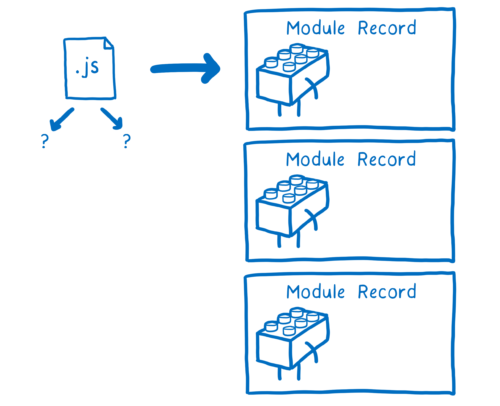

# Module

## 模块化

模块化是一种将系统分离成独立功能部门的方法，严格定义接口，模块间具有透明性，随着 web 应用越来越复杂，简单的代码组织方式已经无法满足业务和架构需求，需要通过模块化来组织代码，建立模块化的标准能够管理模块之间的依赖，从而提升代码的可维护性和复用性

### 解决的问题

1.  请求过多
1.  依赖模糊
1.  难以维护

## 早期模块化

1.  全局 function 模式:
    编码: 全局变量/函数
    问题: 污染全局命名空间, 容易引起命名冲突/数据不安全
2.  namespace 模式:
    编码: 将数据/行为封装到对象中
    解决: 命名冲突(减少了全局变量)
    问题: 数据不安全(外部可以直接修改模块内部的数据)
3.  IIFE 模式/增强
    IIFE: 立即调用函数表达式--->匿名函数自调用
    编码: 将数据和行为封装到一个函数内部, 通过给 window 添加属性来向外暴露接口
    引入依赖: 通过函数形参来引入依赖模块

```javascript
//module.js
let myModule = {
    data: 'hello module',
    say() {
        console.log(`${this.data}`);
    },
};

//index.js
myModule.say();

//IIFE模式
(function (window) {
  //数据
    data: 'hello module',
  //操作数据的函数
 say() {
        console.log(`${this.data}`);
    },
  //暴露行为
  window.selfModule = {say}
})(window)

selfModule.say()
```

## CommonJS

node 应用由模块组成，采用的 commonjs 模块规范。每一个文件就是一个模块，拥有自己独立的作用域，变量，以及方法等，对其他的模块都不可见

环境: 服务器端: Node.js ,浏览器端: Browserify

语法：

    1. 导入：require('文件路径')
    2. 导出：module.exports 和 exports

!>module.exports 和 exports 的的区别是 exports 只是对 module.exports 的一个引用，相当于 Node 为每个模块提供一个 exports 变量，指向 module.exports

特点

模块加载会阻塞接下来代码的执行，需要等到模块加载完成才能继续执行——同步加载

```javascript
// a.js
module.exports = {
  say() {
    console.log('moudle a.js');
  }
};
// b.js
module.exports = function() {
  console.log('moudle b.js');
};
// c.js
exports.say = function() {
  console.log('moudle c.js');
};

// index.js 使用方式
let moduleA = require('./a.js');
let moduleB = require('./b.js');
let moduleC = require('./c.js');

moduleA.says();
moduleB();
moduleC.say();
```

## AMD

AMD 即 Asynchronous Module Definition，中文名是异步模块定义的意思。它是一个在浏览器端模块化开发的规范

环境: 浏览器端, [require.js(常称:requireJS)](https://requirejs.org/),[curl.js](https://github.com/cujojs/curl)

语法：

    1. 导入：require(['依赖模块名称'], function ('模块变量引用'){ dosomething... });
    2. 导出：define(function (){ dosomething...);

特点

AMD 推崇依赖前置（在定义模块的时候就要声明其依赖的模块）管理模块之间的依赖性，便于代码的编写和后期的维护

```javascript
// 定义模块
// say.js
define(['jquery'] function ('$') {
  return function(){
    $('body').css('background','#f7f7f4')
        alert('hello AMD')
  }
});

//index.js
require.config({//配置
    baseUrl: 'src/',  //基本路径
    paths: {   //映射: 模块标识名: 路径
      //自定义模块
      'alerter': 'modules/say',
      //库模块
      'jquery': 'libs/jquery-1.10.1',
    },
})

  //引入模块使用
require(['alerter', 'jquery'], function (alerter, $) {
    alerter.showMsg()
    console.log($);
})
```

## CMD

CMD 是在 AMD 基础上改进的一种规范，和 AMD 不同在于对依赖模块的执行时机处理不同，CMD 是就近依赖，而 AMD 是前置依赖

环境: 浏览器端, [sea.js](https://seajs.github.io/seajs/docs/)

语法：

    1. 导入：define(function(require, exports, module) { dosomething... });
    2. 导出：ddefine(function (){return '值');

特点

CMD 推崇依赖就近（只有在用到某个模块的时候再去 require——按需加载）

```javascript
//a.js
define(function(require, exports, module) {
  var data = 'hello module';
  function show() {
    console.log('a.js ' + data);
  }
  //向外暴露
  exports.show = show;
});

//index.js
define(function(require) {
  var m1 = require('./a.js');
  m1.show();
});
```

## ES6

ES6 模块的设计思想是尽量的静态化，使得编译时就能确定模块的依赖关系，以及输入和输出的变量

环境: 浏览器或服务器环境（以后可能支持）

语法：

    1. 导入：import {模块名A，模块名B...} from '模块路径'
    2. 导出：export和export default

特点

按需加载（编译时加载）



```javascript
//a.js
export function say() {
  console.log(' say a.js');
}

//b.js
let name = 'Hello b.js';
function sayName() {
  console.log(name);
}
export {sayName};

// c.js
export default {
  name: 'Hello Module',
  setName: function(name) {
    this.name = name;
  }
};

// index.js
import {say} from './a.js';
import {sayName} from './b.js';
import setName from './c.js';

say();
sayName();
setName();
```
