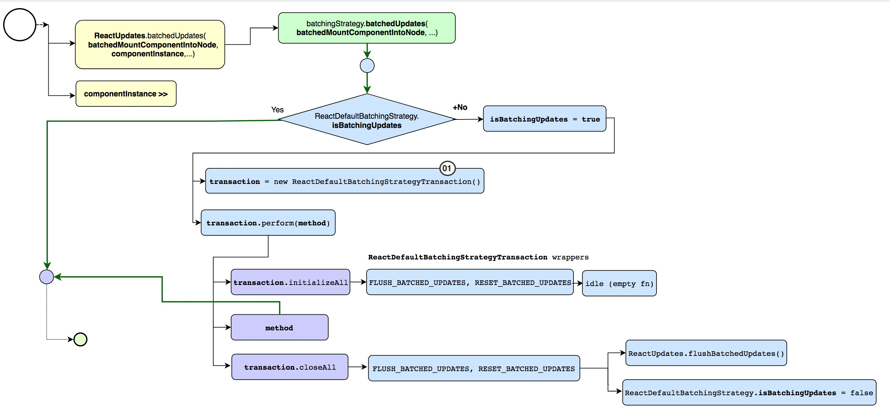
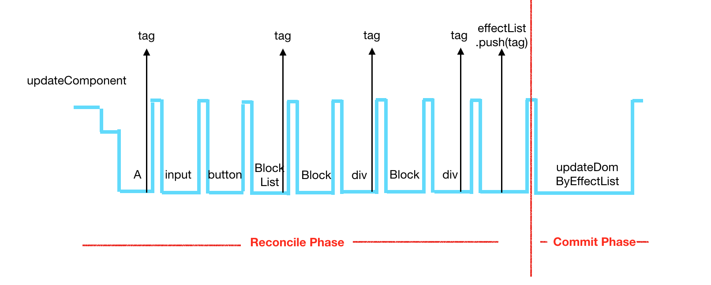
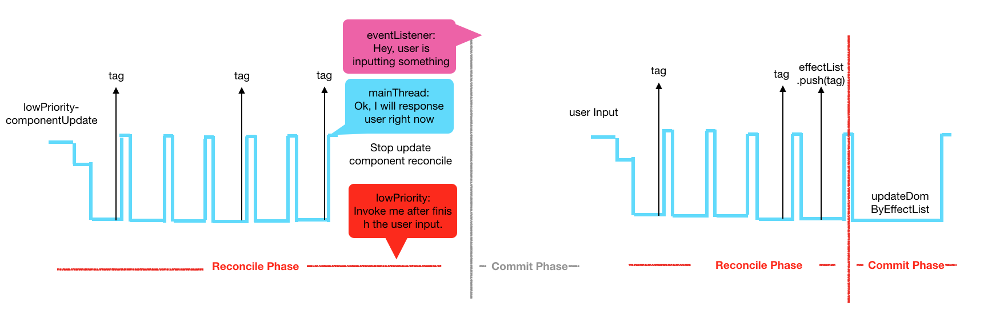
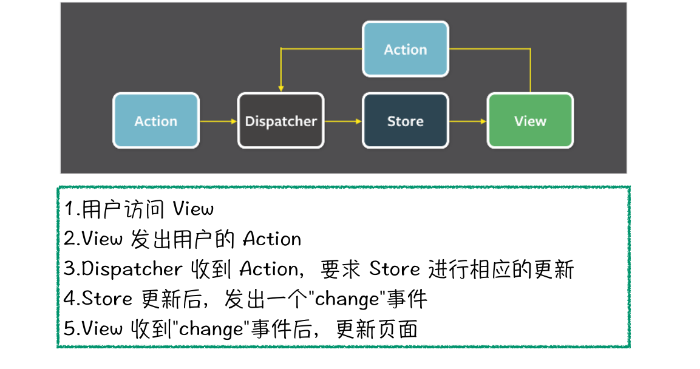
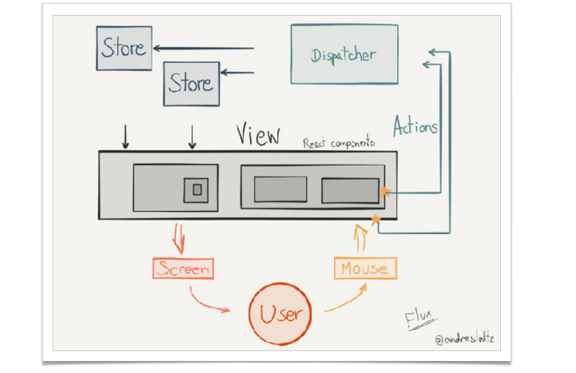

# React

<div align="center">
  
</div>

1.  React 本身只涉及 UI 层 如果搭建大型应用，必须搭配一个前端框架
1.  Flux 是一种架构思想 ，专门解决软件结构的问题，它跟 mvc 架构是同一类东西，更加简单清晰
1.  批处理：批处理就是对某对象进行批量的处理，通常被认为是一种简化的脚本语言
1.  事务： 一个事务是一个不可分割的工作单位，事务中包括的诸操作要么都做，要么都不做 , react 的 setState 同步线程执行

<!-- ## react.children.map() -->

#### setState 执行



1.  Stack reconcile 会深度优先遍历所有的 Virtual DOM 节点，进行 Diff。它一定要等整棵 Virtual DOM 计算完成之后，才将任务出栈释放主线程所以，在浏览器主线程被 React 更新状态任务占据的时候，用户与浏览器进行任何的交互都不能得到反馈，只有等到任务结束，才能突然得到浏览器的响应。
1.  react16 :为解决 setState 阻塞 而 React Fiber ReactDOMFiber.render();
1.  Reactdomfiber.render(Fiberexample/>, document. getelementbyid('app-container')
1.  Reconciler 就是我们所说的 Virtul DOM,用于计算新老 ∨iew 的差异。React16 之前的 Reconciler 叫叫 Stack reconciler。 Fiber 是 React 的新 reconciler。
1.  Renderer 则是和平台相关的代码,负责将 ∨ew 的变化渲染到不同的平台上 DOM、 Canvas、 Native、VR、 Webgl 等等平台都有自己的 renderer。我们
    可以看出 reconciler 是 Reac 的核心代码,是各个平台共用的。因此这次 React 的 reconciler 更新到 Fiber 架构是一次重量级的核心架构的更换

## 生命周期


1.  getDefaultProps() 设置默认的 props，也可以用 dufaultProps 设置组件的默认属性.
1.  getInitialState() 在使用 es6 的 class 语法时是没有这个钩子函数的，可以直接在 constructor 中定义 this.state。此时可以访问 this.props.
1.  componentWillMount() 组件初始化时只调用，以后组件更新不调用，整个生命周期只调用一次，此时可以修改 state.
1.  render() react 最重要的步骤，创建虚拟 dom，进行 diff 算法，更新 dom 树都在此进行。此时就不能更改 state 了.
1.  componentDidMount() 组件渲染之后调用，只调用一次.
1.  componentWillReceiveProps() 组件初始化时不调用，组件接受新的 props 时调用.
1.  shouldComponentUpdate(nextProps, nextState) react 性能优化非常重要的一环。组件接受新的 state 或者 props 时调用，我们可以设置在此对比前后两个 props 和 state 是否相同，如果相同则返回 false 阻止更新，因为相同的属性状态一定会生成相同的 dom 树，这样就不需要创造新的 dom 树和旧的 dom 树进行 diff 算法对比，节省大量性能，尤其是在 dom 结构复杂的时候.
1.  componentWillUpdata(nextProps, nextState) 组件初始化时不调用，只有在组件将要更新时才调用，此时可以修改 state.
1.  render 组件渲染.
1.  componentDidUpdate() 组件初始化时不调用，组件更新完成后调用，此时可以获取 dom 节点.
1.  componentWillUnmount() 组件将要卸载时调用，一些事件监听和定时器需要在此时清除.

### dangerouslySetInnerHTML

将 HTML 字符串解析为 html 样式显示

##Fiber

Fiber 是一种轻量的执行线程，同线程一样共享定址空间，线程靠系统调度，并且是抢占式多任务处理，Fiber 则是自调用，协作式多任务处理。

### Fiber Reconcile 与 Stack Reconcile 主要有两方面的不同。



首先，使用协作式多任务处理任务。将原来的整个 Virtual DOM 的更新任务拆分成一个个小的任务。每次做完一个小任务之后，放弃一下自己的执行将主线程空闲出来，看看有没有其他的任务。如果有的话，就暂停本次任务，执行其他的任务，如果没有的话，就继续下一个任务。

### Fiber 整个页面更新并重渲染过程分为两个阶段。


由 reconcile 和 renderer 两个概念引出的是 phase 的概念。 Phase 指的是 Reac 组件渲染时的阶段

1.  Reconcile 阶段。此阶段中，依序遍历组件，通过 diff 算法，判断组件是否需要更新，给需要更新的组件加上 tag。遍历完之后，将所有带有 tag 的组件加到一个数组中。这个阶段的任务可以被打断。
1.  Commit 阶段。根据在 Reconcile 阶段生成的数组，遍历更新 DOM，这个阶段需要一次性执行完。如果是在其他的渲染环境 -- Native，硬件，就会更新对应的元素。

## flux

Web 应用是一个状态机，视图与状态是一一对应的。 所有的状态，保存在一个对象里面。

1.view :视图层

1.  Action：动作
1.  dispatcher：派发起
1.  store：数据

### 应用

-   Store 就是保存数据的地方，你可以把它看成一个容器。整个应用只能有一个 Store。

> -   store.getState() 获取 state
> -   store.dispatch() 触发 state
> -   store.subscribe() 注册 state 变化监听
> -   createStore(reducer,[initialstate]) 创建

!> Redux 规定， 一个 State 对应一个 View。只要 State 相同，View 就相同。你知道 State，就知道 View 是什么样，反之亦然。




## HOC 高阶组件

高阶函数：函数作为参数传递。返回值 为函数

高阶组件：就是接受一个组件作为参数并返回一个新组件的函数 高阶组件是一个函数 并不是组件

代理模式高阶组件：将被包裹组件的 props 和新生成的 props 一起传递给此组件，这称之为属性代理

应用场景： 操纵 props ，抽取状态 ，访问 ref ，包装组件

继承模式高阶组件： 采用继承关联作为参数返回组件，假如传入的参数是 A 返回的组件直接继承 A

应用场景： 操纵 props ，操纵生命周期函数

### React Context Api

```code
context.js
import React, {Component} from 'react';
let {Provider, Consumer} = React.createContext();
export {Provider, Consumer};

parent.js
import {Provider} from '../context.js';
return <Provider value={value}>{this.props.children}</Provider>;

import {Consumer} from '../context.js';
 render() {
        return (
            <Consumer>
                {state => {
                    state.history.push(this.props.to);
                    return <div>hello world</div>;
                }}
            </Consumer>
        );
    }
```

## 版本更新记录

### react16

1.  React 16 采用了称为“Fiber”的全新的内部架构。官方对 Fiber 的一句话解释是“React Fiber 是对核心算法的一次重新实现
1.  render 方法能够返回数组了 //但是要使用 key
1.  ReactDOM.createPortal //新增了一个顶级 API
1.  setState 传入 null 时不会再触发更新
1.  componentDidCatch(error, info) 的生命周期函数，你可以定义组件的错误处理函数，这样组件在遇到运行时错误时会像增加了 try...catch 一样，不会将错误直接抛出了，错误被局部组件 catch 住，保证了整个应用的可用性。
1.  react 是 5.3kb（gzip：2.2kb），之前是 20.7kb（gzip：6.9kb）
1.  react-dom 是 103.7kb（gzip：32.6kb），之前是 141kb（gzip：42.9kb）
1.  react + react-dom 是 109kb（gzip：34.8kb），之前是 161.7kb（gzip：49.8kb）

### react 16.3

1.  React.createContext()，这样就创建了两个组件：
1.  标记为不安全 componentWillMount、componentWillReceiveProps、componentWillUpdate
1.  要被废弃的方法：
1.  componentWillMount--使用 componentDidMount 代替
1.  componentWillUpdate--使用 componentDidUpdate 代替
1.  componentWillReceiveProps--使用一个新的方法：static getDerivedStateFromProps 来代替。
1.  全新的 Context API。（Provider Consumer）
1.  使用了 React.createRef 取得 Ref 对象 this.myRef = React.createRef()
1.  React.Fragment 和 DocumentFragment 类似

### react 16.4

1.  Pointer Events
1.  react 异步渲染
1.  React DOM：修复在某些情况下阻止上下文传播的错误；
1.  React DOM：改进 forwardRef（）和 context consumers 在组件堆栈中的显示方式；
1.  React DOM：当 forwardRef（）渲染函数具有 propTypes 或 defaultProps 时发出警告；
1.  React Test Renderer：修复 getDerivedStateFromProps（）支持以匹配新的 React DOM 行为
1.  使用 createPortal 将组件渲染到当前组件树之外

### React 16.6

1.  lazy 最让人期待的功能肯定就是 lazy 功能了，配合发布了一个 Suspense 组件，也就是最开始命名为 Placeholder 的组件，用来配合 render 方法内部的异步操作的，让我们先来看一下 lazy 的用法
1.  React.memo 方法，来实现类似 PureComponent 的功能，即浅比较 props 是否有变化，如果没有变化，就不重新渲染当前组件
1.  static getDerivedStateFromError()
1.  StrictMode 是用来提醒开发者用了即将被废弃的 API 的，像 componentWillMount 这些声明周期都会提醒，这次新加了两个 API 的提醒，ReactDOM.findDOMNode()，和老的 context api
1.  static contextType 通过声明 static contextType = context，让 ClassComponent 可以订阅最近的一个 context provider，注意这里 contextType 是固定声明，换成别的名字都不行。如果 ConsumerComp 不在 Provider 的子树中，那么会使用 defaultValue

### React v16.7

1.  React 提供了一些内置 Hook

### React v16.8

1.  hooks 可以让你在不编写类的情况下使用 state 和 React 的其他功能。你还可以构建自己的 hooks，在组件之间共享可重用的有状态逻辑。
1.  useState 函数式更新。会保存其但是状态 2. usememo 记录优化 类似 pureComponent
1.  useCallback 本质上是添加了一层依赖检查。它以另一种方式解决了问题 - 我们使函数本身只在需要的时候才改变，而不是去掉对函数的依赖。
1.  useReducer
1.  useContext 接收一个 context 对象（React.createContext 的返回值）并返回该 context 的当前值
1.  useLayoutEffect： useEffect 相同，但它会在所有的 DOM 变更之后同步调用 effect

## React v17.0

1. React 17 的版本是非比寻常的，因为它没有添加任何面向开发人员的新功能。而主要侧重于「升级简化 React 本身
1. 更改事件委托
1. 更改事件委托

## react-router4

1.  所有组件更改为从 react-router-dom 导入
1.  v2 import {Router,Route,hashHistory} from 'react-router';
1.  在 react-router4 开始,所有的 router 组件均是从 react-router-dom 中导入, 所以一下的需要更改为以下代码:
1.  v4 import {Route,BrowserRouter, Switch} from 'react-router-dom
1.  将所有<Router>替换为<BrowserRouter>. 只能有一个子节点
