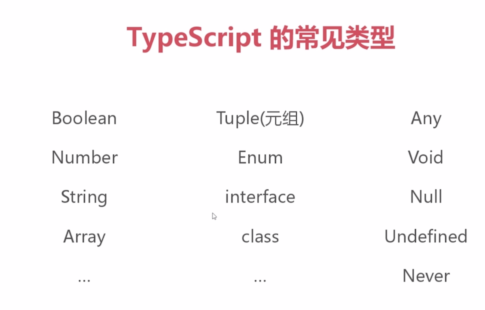
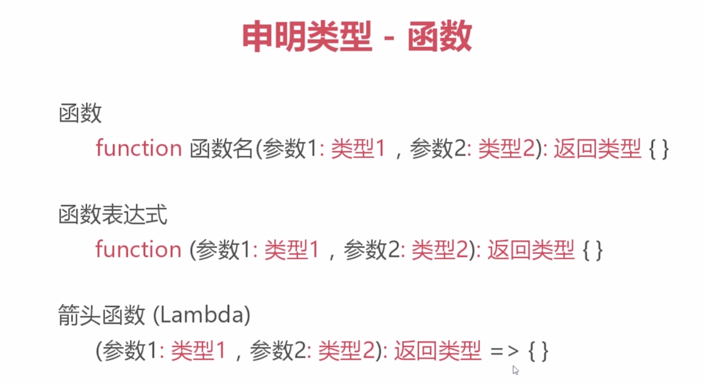
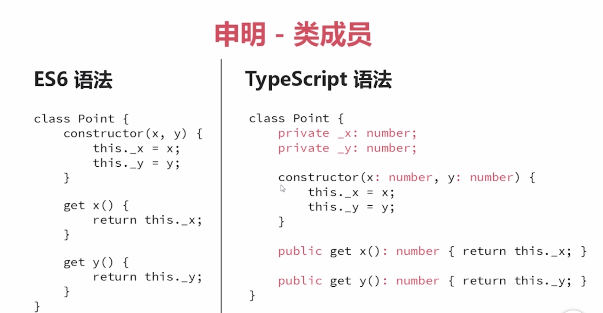
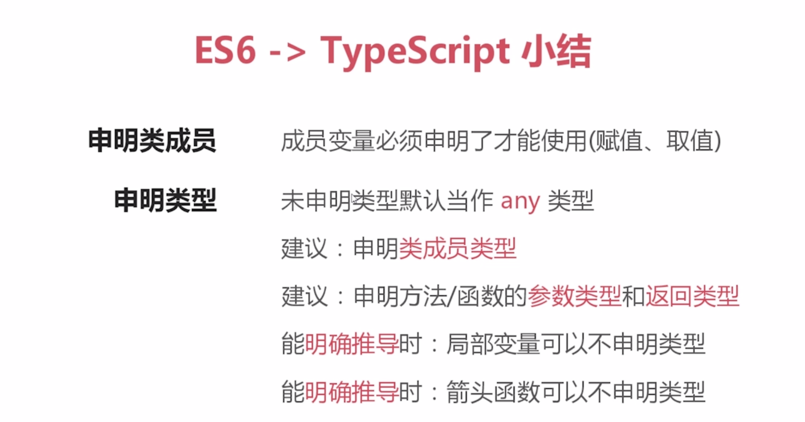

# Typescript

TypeScript 是一种由微软开发的自由和开源的编程语言。它是 JavaScript 的一个超集，而且本质上向这个语言添加了可选的静态类型和基于类的面向对象编程。

### 优势

-   支持 ES6 规范
-   强大的 IDE 支持 ，语法提示 重构

## 参数类型



```typescript
Undefined
Null 空
Number 数值
Boolean 布尔
enum 枚举
Array 数组
Tuple 元祖
Null 空
string:字符串
any：任何类型
void：不需要返回值 function
```

## Record

1. ts 文档上对 Record 的介绍不多，但却经常用到，Record 是一个很好用的工具类型

```typescript
type person = {
    prop1: string;
    prop2: string;
    prop3: string;
};

type someProps = Record<12 | keyof person, string>;

let newPerson: someProps = {
    prop1: '111',
    prop2: '222',
    prop3: '444',
    12: 'asdad'
};
```

```typescript
let a = 13; //默认number
let a; // any
let a: string = 'asd';
let a: string | number = 12; //string number 都可以
let arr: number[] = [1, 2, 3]; //array 是number
let arr: any[] = ['svb', 12, false]; //any

let point: { x: number; y: number; z?: number };
point = { x: 12, y: 30 };
point = { x: 12, y: 30, z: 99 };
```

### 外部引用第三方库

```typescript
declare var $;
$(function() {});
```

#### 参数默认值

```typescript
function test(a: string, b: string, c: string = 'hb') {
    console.log(a);
    console.log(b);
    console.log(c);
}
test('xxx', 'yyy');
```



#### 参数可选

```typescript
function test(a: string, b?: string, c: string = 'hb') {
    console.log(a);
    console.log(b);
    console.log(c);
}
test('xxx');
```

!>可选参数 默认值参数 声明必须声明在必选的后面

### Rest and Spread

```typescript
//code1:
function funrest(...args) {
    console.log(args);
}
funrest(1, 3, 4);
funrest(1, 3, 4, 4, 7, 8, 43);

//code2:
function funrest(a, b, c) {
    console.log(a);
    console.log(b);
    console.log(c);
}
let args1 = [1, 2];
let args2 = [1, 2, 3, 5, 7, 8];
funrest(...args1);
funrest(...args2);
```

### generator

```typescript
function doSome() {
    return __generator(this, function(_a) {
        switch (_a.label) {
            case 0:
                console.log('start');
                return [4 /*yield*/];
            case 1:
                _a.sent();
                console.log('end');
                return [2 /*return*/];
        }
    });
}
var func1 = doSome();
func1.next();
func1.next();
```

## 析构表达式

```typescript
object: function get() {
    return {
        code: 'IBM',
        price: {
            price1: 120,
            price2: 150
        }
    };
}
let {
    code: guname,
    price: { price2 }
} = get();
console.log(guname);
console.log(price2);
Array: let arrnum = [1, 2, 3, 4];
let [num1, num2, ...arg] = arrnum;
console.log(num1);
console.log(num2);
console.log(arg);
```

### 箭头函数

```typescript
let sum = arg => arg + '12';
console.log(sum(12));
```

### for of

```typescript
let arrnum = [1, 2, 3, 4];
// arrnum.forEach(val => console.log(val));
for (let n in arrnum) {
    if (arrnum[n] > 2) break;
    console.log(arrnum[n]);
}

for (let n of arrnum) {
    if (n > 2) break;
    console.log(n);
}
```

## 类



```typescript
class Person {
    //访问修饰符
    public name; //公共的
    private age = 12; //私有的
    protected money = 12; //受保护的
    public eat() {
        console.log(this.age);
    }
}

let p1 = new Person();
p1.name = 'xxx';
p1.eat();
```



## 泛型

-   泛型的参数只能代表类，不能代表个别对象
-   主要目的：加强类型安全，减少转换次数

```typescript
function hb<x>(num: x): x {
    return num;
}
console.log(hb<string>('hello'));

interface jicheng {
    length: number;
}
function testFun<t extends jicheng>(chr: t): t {
    console.log(chr.length);
    return chr;
}
console.log(testFun('hello'));
```

## 接口 interface

```typescript
interface Point {
    x: number;
    y: number;
    z?: number;
}
let p: Point;
p = {x: 12, y: 12};
p = {x: 12, y: 12, z: 20};

interface searchRepeat {
    (siurceText: string, findText: string): boolean;
}
let findFun: searchRepeat;
findFun = function(siurceX: string, findX: string) {
    var result = siurceX.search(findX);
    return result != -1;
};
console.log(findFun('hello world', 'he'));

interface Parents {
    name: string;
    age: number;
}
interface Childern extends Parents {
    money: number;
}
var val = <Childern>{};
val.name = 'Allon';
val.age = 12;
val.money = 12300;

function gril(val) {
    console.log(val.name);
}
gril(val);

class:1
interface ClockInter {
    currenttime: string;
    setTime(d: string);
}
class Clock implements ClockInter {
    constructor(h: number, m: number) {}
    currenttime: string;
    setTime(d: string) {
        this.currenttime = d;
    }
}
let clock = new Clock(2016, 2012);
console.log(clock.setTime('2018 19:35:47'));
console.log(clock.currenttime);
```

## 枚举

使用枚举我们可以定义一些有名字的数字常量 可以通过 enum 关键字定义

常数枚举：const enum 不允许计算
外部枚举： deClare enum 已经枚举信息再次进行赋值操作

```typescript
enum familyAge {
    father,
    mother,
    son ,
    docuder,
    nameleng
}
<!-- enum familyAge {
    father = 40,
    mother = 40,
    son = 12,
    docuder = 12 - 2,
    nameleng = 'lhb'.length
}
console.log(familyAge[familyAge.mother]);
console.log(familyAge.father);-->
```

### 配置信息

```json
// tsconfig.json
{
    "compilerOptions": {
        // 不报告执行不到的代码错误。
        "allowUnreachableCode": true,
        // 必须标注为null类型,才可以赋值为null
        "strictNullChecks": true,
        // 严格模式, 强烈建议开启
        "strict": true,
        // 支持别名导入:
        // import * as React from "react"
        "esModuleInterop": true,
        // 目标js的版本
        "target": "es5",
        // 目标代码的模块结构版本
        "module": "es6",
        // 在表达式和声明上有隐含的 any类型时报错。
        "noImplicitAny": true,
        // 删除注释
        "removeComments": true,
        // 保留 const和 enum声明
        "preserveConstEnums": false,
        // 生成sourceMap
        "sourceMap": true,
        // 生成目标文件所在路径
        "outDir": "./lib",
        // 编译过程中需要引入的库文件的列表
        "lib": ["dom", "es7"],
        // 额外支持解构/forof等功能
        "downlevelIteration": true,
        // 是否生成声明文件
        "declaration": true,
        // 声明文件路径
        "declarationDir": "./lib",
        // 此处设置为node,才能解析import xx from 'xx'
        "moduleResolution": "node"
    },
    // 入口文件
    "include": ["src/main.ts"]
}
```
