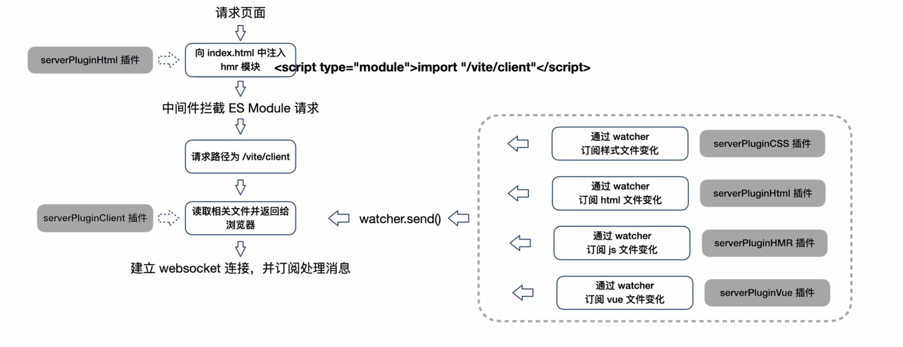

# vite

### 解析方式

### vite server 所有逻辑实现都依赖中间件 ，拦截请求实现以下内容

1.处理 esm 语法 2. 对.ts,.vue 等文件进行实时编译 3. 对 less/sass 的需要预编译的模块进行编译 4. 和浏览器简历 socket 链接实现 HMR

?> vite 利于浏览器原生支持 ESM 特性，省略对模块的打包，不需要生成 bundle,因此初次启动更快，HRM 特性更好
vite 开发模式下，通过 koa 服务器，在服务器完成模块的改写和请求处理，实现按需编译

### vite HRM 特性，实现方式：

1. 通过 watch 监听文件改动
2. 通过 server 端编译资源，并推送新模块内容给浏览器
3. 浏览器收到新的模块内容，执行框架层面的 render/reload

### rollup

1. 将每个模块拍平
2. 不使用包裹函数，不需要对每个模块进行包裹
