# Vue

<div align="center">
  
</div>

### MVVM

MVVM 是 Model-View-ViewModel 的简写。它本质上就是 MVC 的改进版。很早的时候微软就有了 Silverlight ，MVVM 就是将其中的 View 的状态和行为抽象化，让我们将视图 UI 和业务逻辑分开,它是将“数据模型数据双向绑定”的思想作为核心，因此在 View 和 Model 之间没有联系，通过 ViewModel 进行交互，而且 Model 和 ViewModel 之间的交互是双向的，因此视图的数据的变化会同时修改数据源，而数据源数据的变化也会立即反应到 View 上。

典型的应用有.NET 的 WPF，js 框架 VUE ,AngularJS, Knockout 等。

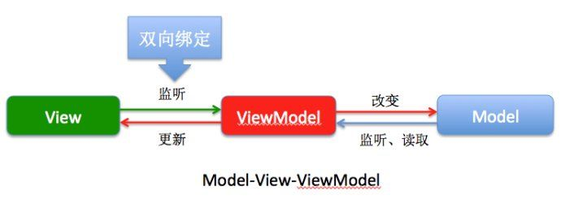

### MVVM 的出现，完美解决以下三个问题

1.  开发者在代码中大量调用相同的 DOM API, 处理繁琐 ，操作冗余，使得代码难以维护。
1.  大量的 DOM 操作使页面渲染性能降低，加载速度变慢，影响用户体验。
1.  当 Model 频繁发生变化，开发者需要主动更新到 View ；当用户的操作导致 Model 发生变化，开发者同样需要将变化的数据同步到 Model 中，这样的工作不仅繁琐，而且很难维护复杂多变的数据状态。

### 前端为什么要工程化

相对 HTML4 , HTML5 最大的亮点是它为移动设备提供了一些非常有用的功能，使得 HTML5 具备了开发 App 的能力, HTML5 开发 App 最大的好处就是跨平台、快速迭代和上线，节省人力成本和提高效率，因此很多企业开始对传统的 App 进行改造，逐渐用 H5 代替 Native，到 2015 年的时候，市面上大多数 App 或多或少嵌入都了 H5 的页面,既然要用 H5 来构建 App, 那 View 层所做的事，就不仅仅是简单的数据展示了，它不仅要管理复杂的数据状态，还要处理移动设备上各种操作行为等等。因此，前端也需要工程化，也需要一个类似于 MVC 的框架来管理这些复杂的逻辑，使开发更加高效

## VUE

Vue 是采用 Object.defineProperty 的 getter 和 setter，并结合观察者模式来实现数据绑定的

Object.defineProperty() 方法会直接在一个对象上定义一个新属性，或者修改一个对象的现有属性， 并返回这个对象。


因此导致了 VUE 不支持 IE9 一下浏览器如果想要向下兼容，则需要使用 VBbScript 或者 **defineGetter**, **defineSetter**,

<!-- ### 目录结构

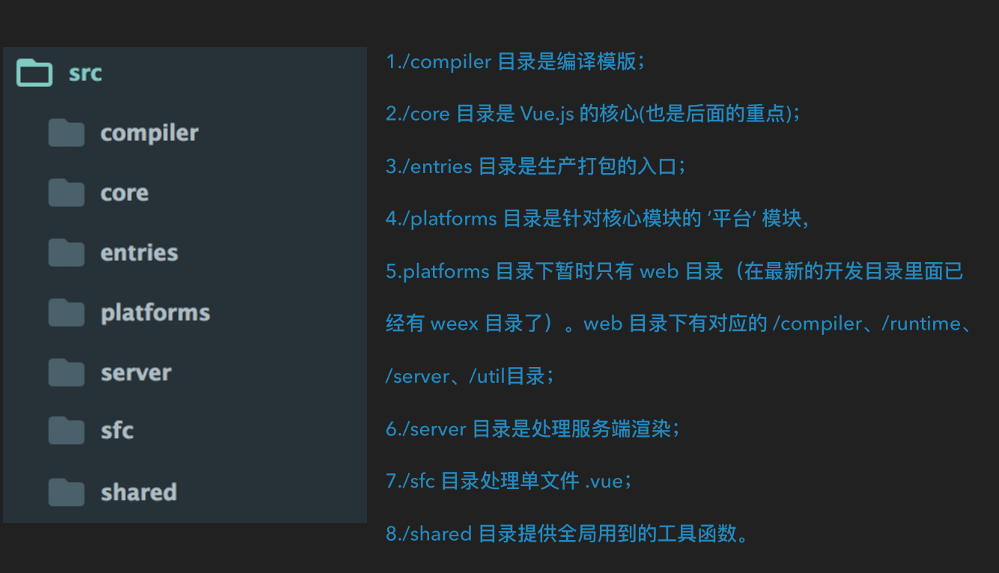
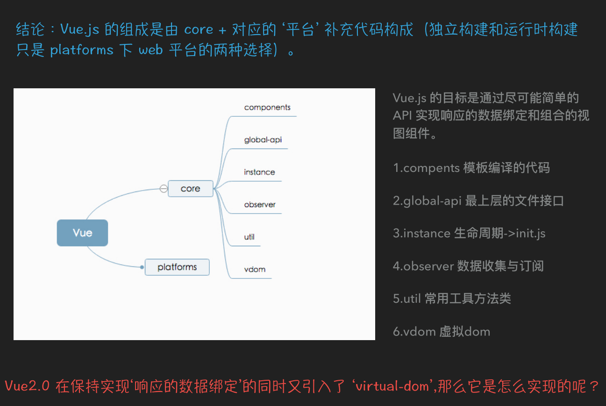
 -->

### 双向数据绑定

把一个普通 Javascript 对象传给 Vue 实例来作为它的 data 选项时，Vue 将遍历它的属性，用 Object.defineProperty 将它们转为 getter/setter。用户看不到 getter/setter，但是在内部它们让 Vue 追踪依赖，在属性被访问和修改时通知变化。


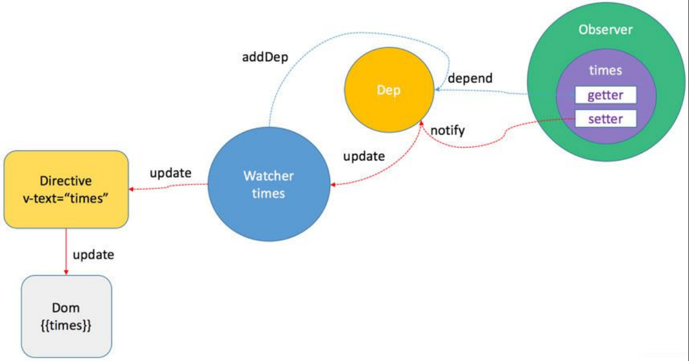

setter 触发消息到 Watcher watcher 帮忙告诉 Directive 更新 DOM DOM 修改数据也会通知 Watcher，watcher 帮忙修改数据

#### 双向数据绑定原理

1.  Observer 数据监听器，能够对数据对象的所有属性进行监听，如有变动可拿到最新值并通知订阅者，内部采用 Object.defineProperty 的 getter 和 setter 来实现。
1.  Compile 指令解析器，它的作用对每个元素节点的指令进行扫描和解析，根据指令模板替换数据，以及绑定相应的更新函数。
1.  Watcher 订阅者， 作为连接 Observer 和 Compile 的桥梁，能够订阅并收到每个属性变动的通知，执行指令绑定的相应回调函数。
1.  Dep 消息订阅器，内部维护了一个数组，用来收集订阅者（Watcher），数据变动触发 notify 函数，再调用订阅者的 update 方法。

> 从图中可以看出，当执行 new Vue() 时，Vue 就进入了初始化阶段，一方面 Vue 会遍历 data 选项中的属性，并用 Object.defineProperty 将它们转为 getter/setter，实现数据变化监听功能；另一方面，Vue 的指令编译器 Compile 对元素节点的指令进行扫描和解析，初始化视图，并订阅 Watcher 来更新视图， 此时 Wather 会将自己添加到消息订阅器中(Dep),初始化完毕
> 当数据发生变化时，Observer 中的 setter 方法被触发，setter 会立即调用 Dep.notify()，Dep 开始遍历所有的订阅者，并调用订阅者的 update 方法，订阅者收到通知后对视图进行相应的更新。

### 代码

```html
--------------html---------------------
1.全局创建一个vue实例
<div id="app">
  <input type="text" id="a" v-model="text">
  {{text}}
</div>
<script>
    var vm = new Vue({
      el: 'app',
      data: {
        text: 'hello world'
      }
    });
</script>

----------------MVVM------------------------
2.创建VUE 类
function Vue(options) {
    // 2.实例挂载属性 data: {text:'hello'}
    this.data = options.data;
    var data = this.data;
   // 3.observe 遍历了data对象，进行拆分
    observe(data, this);
    var id = options.el;
   //7.Compile(app节点,vue的实例对象)将app节点内容转换成文档片段，拿回html，编译指令，插回到dom,并创建一个watcher
    var dom =new Compile(document.getElementById(id),this);
    // 编译完成后，将dom替换到html模板
    document.getElementById(id).appendChild(dom);
}

-----------------Observe--------------------
/**
 * obj: {text:'hello'}
 * vm: vue实例
 */
function observe(obj, vm) {
  //遍历
  Object.keys(obj).forEach(function(key) {
    //拆分
    defineReactive(vm, key, obj[key]);
  })
}
4.Object.defineProperty将data数据里的属性分别进行 set和get
/**
 * obj: vue实例
 * key: text
 * val: 'hello'
 */
function defineReactive(vm, key, val) {
  var dep = new Dep();
  Object.defineProperty(vm, key, {
    get: function() {
      //5.addSub添加观察者watcher到主题对象Dep
      if (Dep.target) {
        //JS的浏览器单线程特性，保证这个全局变量在同一时间内，只会有同一个监听器使用
        dep.addSub(Dep.target);
      }
      return val;
    },
   // 5.notify
    set: function(newVal) {
      //如果set的值与原来的值相同则返回
      if (newVal === val) return;
      //不同则由dep来notify发通知给watcher
      val = newVal;
      console.log(val);
      5.作为发布者发出通知
      dep.notify();
    }
  })
}

-------------------Dep----------------------
5.Dep 就是发布者，subs就是收集来的订阅者（就是一个个watcher），很好的实现了观察者模式
function Dep() {
  this.subs = [];
}
Dep.prototype = {
  addSub: function(sub) {
    this.subs.push(sub);
  },
  notify: function() {
    this.subs.forEach(function(sub) {
      sub.update();
    })
  }
}

--------------------Compile----------------------
6.Compile(app节点,vue的实例对象)将app节点内容转换成文档片段，拿回html，编译指令，插回到dom,并创建一个watcher
//此处代码比较多，简写一下
function Compile(node, vm) {
  if (node) {
    this.$frag = this.nodeToFragment(node, vm);
    return this.$frag;
  }
}
Compile.prototype = {
  nodeToFragment: function(node, vm) {
    var self = this;
    //创建DOM片段
    var frag = document.createDocumentFragment();
    var child;

    while (child = node.firstChild) {
      self.compileElement(child, vm);
       // 将所有子节点添加到fragment中
      frag.append(child);
    }
    return frag;
  },
  compileElement: function(node, vm) {
    var reg = /\{\{(.*)\}\}/;
    //节点类型为元素
    if (node.nodeType === 1) {
      var attr = node.attributes;
      // 解析属性
      for (var i = 0; i < attr.length; i++) {
        if (attr[i].nodeName == 'v-model') {
          // 获取v-model绑定的属性名
          var name = attr[i].nodeValue;
          node.addEventListener('input', function(e) {
            // 给相应的data属性赋值，进而触发该属性的set方法
            vm[name] = e.target.value;
          });
          // 将data的值赋给该node
          // node.value = vm[name];
          new Watcher(vm, node, name, 'value');
        }
      };
    }
    //节点类型为文本节点或span
    if (node.nodeType === 3) {
      if (reg.test(node.nodeValue)) {
        // 获取匹配到的字符串
        var name = RegExp.$1;
        name = name.trim();
         // 将data的值赋给该node
        // node.nodeValue = vm[name];
        new Watcher(vm, node, name, 'nodeValue');
      }
    }
  },
}

----------------Watcher--------------------
//7.监听更新
function Watcher(vm, node, name, type) {
    Dep.target = this;
    this.name = name;
    this.node = node;
    this.vm = vm;
    this.type = type;
    this.update();
    Dep.target = null;
}
Watcher.prototype = {
    update: function() {
        this.get();
        //9.批量更新
        var batcher = new Batcher();
        batcher.push(this);
        // 订阅者执行相应操作
        // this.node[this.type] = this.value;
        // this.cb();
    },
    cb:function(){
        // 订阅者执行相应操作
        this.node[this.type] = this.value;
    },
    // 获取data的属性值
    get: function() {
        //触发相应属性的get
        this.value = this.vm[this.name];
    }
}
```

- 初始化：new vue ->
- observe.get- dep 存储一个监听数组
- Compile-Watcher.update 更新数据
- 更新：observe -dep - watcher.update 更新数组

## VUE 生命周期

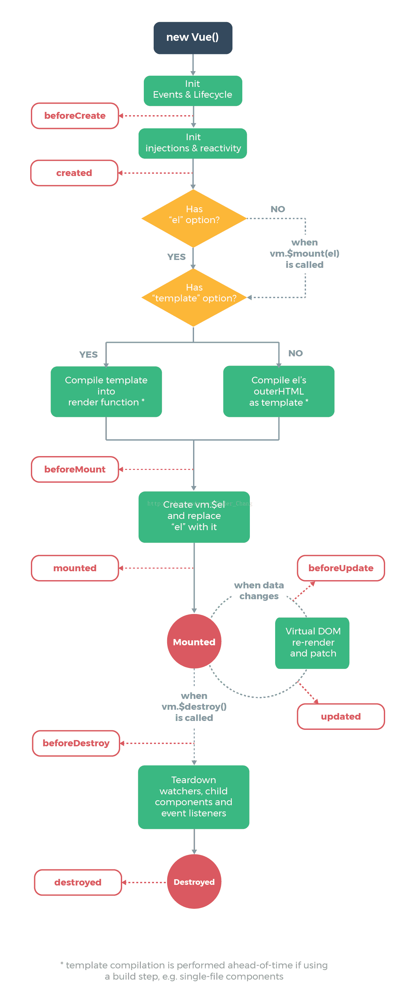
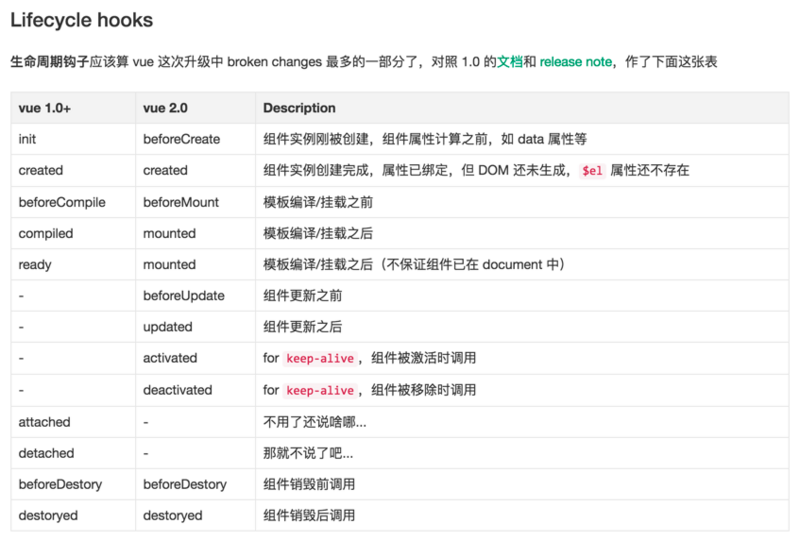

### VUE 3.0

vm.data="2333" 无效
vm.$set(this.$data,) 要走监听麻烦
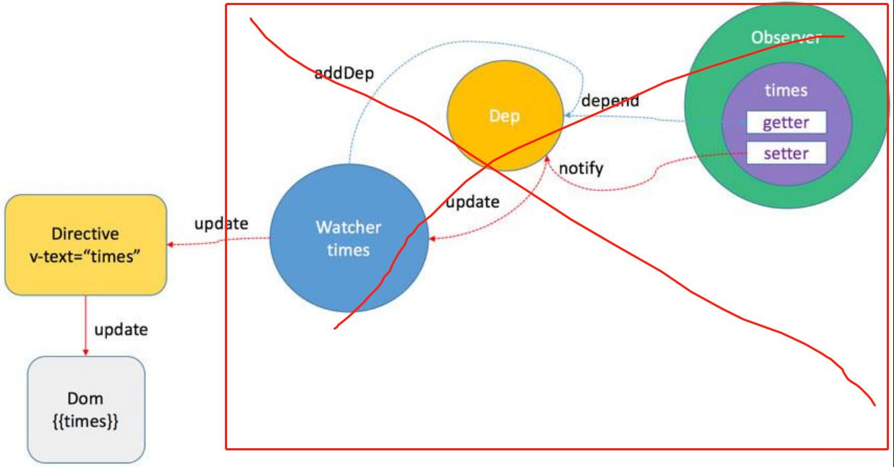

VUE3.0 会去掉 DEP，Watcher，Observer 这一坨东西，为什么这么说呢，VUE3.0 将利用 ES6 的 proxy 代理和 Reflect 反射来实现双向绑定，监听，那么流程图就应该是这样了

Proxy 可以理解成，在目标对象之前架设一层“拦截”，外界对该对象的访问，都必须先通过这层拦截，因此提供了一种机制，可以对外界的访问进行过滤和改写。Proxy 这个词的原意是代理，用在这里表示由它来“代理”某些操作，可以译为“代理器”。

Reflect 对象与 Proxy 对象一样，也是 ES6 为了操作对象而提供的新 API。Reflect 对象的设计目的有这样几个。

1.  将 Object 对象的一些明显属于语言内部的方法（比如 Object.defineProperty），放到 Reflect 对象上。现阶段，某些方法同时在 Object 和 Reflect 对象上部署，未来的新方法将只部署在 Reflect 对象上。
1.  修改某些 Object 方法的返回结果，让其变得更合理。比如，Object.defineProperty(obj, name, desc)在无法定义属性时，会抛出一个错误，而 Reflect.defineProperty(obj, name, desc)则会返回 false。

### Virtual DOM

JavaScript 对象表示的树结构来构建一个真正的 DOM 。当状态变更时，重新渲染这个 JavaScript 的对象结构，实现视图的变更，结构根据变更的地方重新渲染。

DOM 很慢，为啥说它慢，先看一下 Webkit 引擎，所有浏览器都遵循类似的工作流，只是在细节处理有些不同。一旦浏览器接收到一个 HTML 文件，渲染引擎 Render Engine 就开始解析它，根据 HTML 元素 Elements 对应地生成 DOM 节点 Nodes，最终组成一棵 DOM 树。

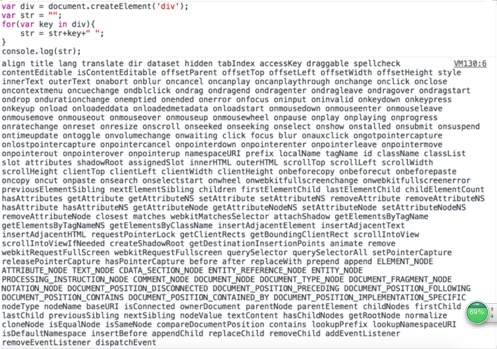

这仅仅是第一层。真正的 DOM 元素非常庞大，这是因为标准就是这么设计的。而且操作它们的时候你要小心翼翼，轻微的触碰可能就会导致页面重排，这可是杀死性能的罪魁祸首。

构造了渲染树以后，浏览器引擎开始着手布局 Layout。布局时，渲染树上的每个节点根据其在屏幕上应该出现的精确位置，分配一组屏幕坐标值。接着，浏览器将会通过遍历渲染树，调用每个节点的 Paint 方法来绘制这些 Render 对象。Paint 方法根据浏览器平台，使用不同的 UI 后端 API（Agnostic UI Backend API）通过绘制，最终将在屏幕上展示内容。只要在这过程中进行一次 DOM 更新，整个渲染流程都会重做一遍。

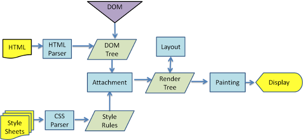

### Virtual DOM 树的差异介绍（Diff 算法）

比较两个 DOM 树的差异是 Virtual DOM 算法最核心的部分，这也是所谓的 Virtual DOM 的 diff 算法。在前端当中，很少会跨越层级地移动 DOM 元素。所以 Virtual DOM 只会对同一个层级的元素进行对比，下面的 div 只会和同一层级的 div 对比，第二层级的只会跟第二层级对比。采用的是深度优先遍历，来记录差异，这样每个节点都会有一个唯一的标记。

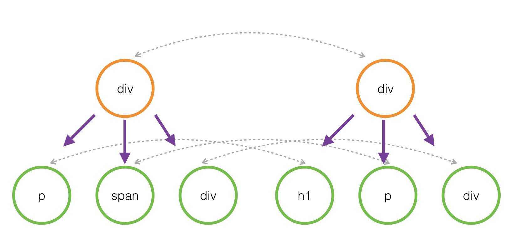

##### 节点的差异指的是什么呢？对 DOM 操作可能会：

1.  替换掉原来的节点，例如把上面的 div 换成了 section
1.  移动、删除、新增子节点，例如上面 div 的子节点，把 p 和 ul 顺序互换
1.  修改了节点的属性
1.  对于文本节点，文本内容可能会改变如修改上面的文本节点 2 内容为 Virtual DOM。

## 运行流程

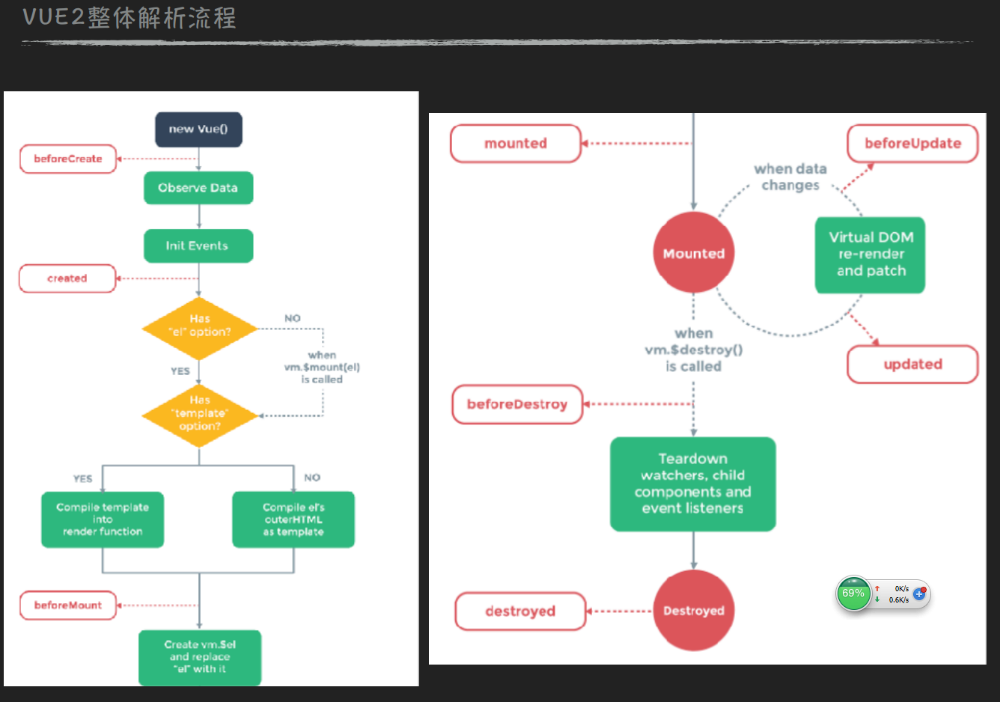

## 单向数据流


1.  state，驱动应用的数据源；
1.  view，以声明方式将 state 映射到视图；
1.  actions，响应在 view 上的用户输入导致的状态变化。

##### 但是，当我们的应用遇到多个组件共享状态时，单向数据流的简洁性很容易被破坏：

1.  多个视图依赖于同一状态。
1.  来自不同视图的行为需要变更同一状态。

## vuex

Vuex 是一个专为 Vue.js 应用程序开发的状态管理模式。它采用集中式存储管理应用的所有组件的状态，并以相应的规则保证状态以一种可预测的方式发生变化


1.  State: 单一状态树用一个对象就包含了全部的应用层级状态。至此它便作为一个“唯一数据源 (SSOT)”而存在。这也意味着，每个应用将仅仅包含一个 store 实例。单一状态树让我们能够直接地定位任一特定的状态片段，在调试的过程中也能轻易地取得整个当前应用状态的快照
1.  Getters 有时候我们需要从 store 中的 state 中派生出一些状态，例如对列表进行过滤并计数
1.  Mutations 更改 Vuex 的 store 中的状态的唯一方法是提交 mutation。Vuex 中的 mutation 非常类似于事件：每个 mutation 都有一个字符串的 事件类型 (type) 和 一个 回调函数 (handler)。
1.  Action 函数接受一个与 store 实例具有相同方法和属性的 context 对象，因此你可以调用 context.commit 提交一个 mutation，或者通过 context.state 和 context.getters 来获取 state 和 getters
1.  Modules Vuex 允许我们将 store 分割成模块（module）。每个模块拥有自己的 state、mutation、action、getter、甚至是嵌套子模块——从上至下进行同样方式的分割：

<!-- ## 项目结构

```base
├── index.html
├── main.js
├── api
│      └── ... # 抽取出API请求
├── components
│     ├── App.vue
│     └── ...
└── store
          ├── index.js          # 我们组装模块并导出 store 的地方
          ├── actions.js        # 根级别的 action
          ├── mutations.js      # 根级别的 mutation
          └── modules
                      ├── cart.js       # 购物车模块
                      └── products.js   # 产品模块
```
 -->
