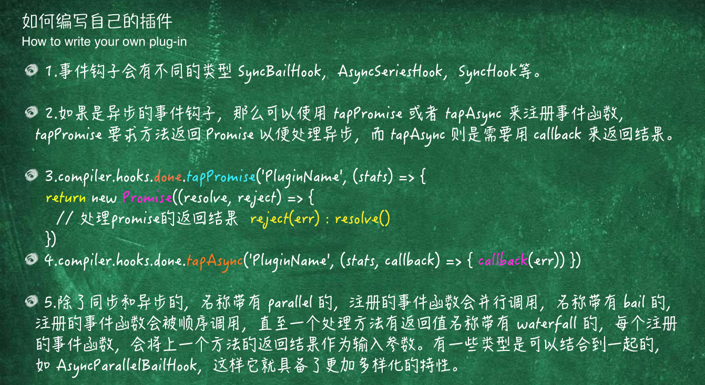
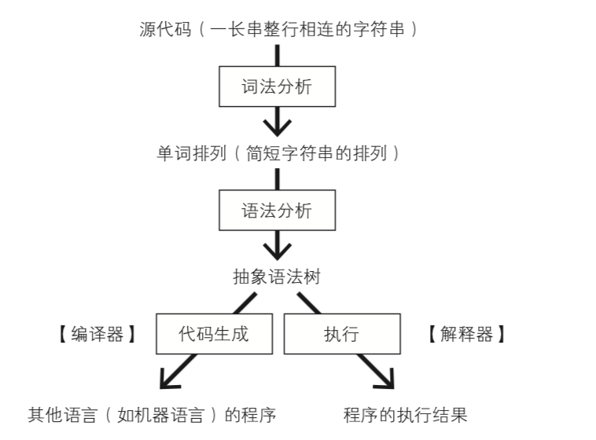

# Webpack

<div align="center">
  
</div>

[webpack](https://webpack.js.org/)是一个现代 JavaScript 应用程序的静态模块打包器(module bundler)。当 webpack 处理应用程序时，它会递归地构建一个依赖关系图(dependency graph)，其中包含应用程序需要的每个模块，然后将所有这些模块打包成一个或多个 bundle。

## 语法

```javascript
module.exports = {
    //页面入口文件配置
    entry: {
        index : './src/app.js'
    },
    //入口文件输出配置
    output: {
        path: 'dist/',
        filename: '[name:hash].js'
    },
    module: {
        //loader配置
        loaders: [
            { test: /\.js$/, loader: 'babel-loader' }
        ]
    },
    //插件项
    plugins: [new webpackPlugin()],
    //其它解决方案配置
    devServer: {
    contentBase: path.join(__dirname, "dist"),
    compress: true,
    port: 9000
    },
    resolve: {
        extensions: ['', '.js', '.json', '.less'],
        alias: {
            @ : './src/',
        }
    }
```

## 模块

1.  entry:入口起点(entry point)指示 webpack 应该使用哪个模块，来作为构建其内部依赖图的开始。进入入口起点后，webpack 会找出有哪些模块和库是入口起点（直接和间接）依赖的。
2.  output: 属性告诉 webpack 在哪里输出它所创建的 bundles，以及如何命名这些文件，默认值为 ./dist。基本上，整个应用程序结构，都会被编译到你指定的输出路径的文件夹中。
3.  module： 这些选项决定了如何处理项目中的不同类型的模块
4.  loaders：loader 用于对模块的源代码进行转换。loader 可以使你在 import 或"加载"模块时预处理文件。因此，loader 类似于其他构建工具中“任务(task)”，并提供了处理前端构建步骤的强大方法。
5.  plugins：插件是 webpack 的支柱功能。webpack 自身也是构建于，你在 webpack 配置中用到的相同的插件系统之上！插件目的在于解决 loader 无法实现的其他事
6.  devServer:利用 webpack-dev-server 能够快速启动一个本地服务
7.  resolve ： 这些选项能设置模块如何被解析。webpack 提供合理的默认值，但是还是可能会修改一些解析的细节

### hash、chunkhash 和 contenthash 三者的区别

1.  hash:所有文件的 hash 都是一样的，而且每次修改任何一个文件，所有文件名的 hash 至都将改变。所以一旦修改了任何一个文件，整个项目的文件缓存都将失效。
2.  chunkhash;根据不同的入口文件(Entry)进行依赖文件解析、构建对应的 chunk，生成对应的哈希值。在生产环境里把一些公共库和程序入口文件区分开，单独打包构建，接着我们采用 chunkhash 的方式生成哈希值，那么只要我们不改动公共库的代码，就可以保证其哈希值不会受影响
3.  contenthash: 表示由文件内容产生的 hash 值，内容不同产生的 contenthash 值也不一样。在项目中，通常做法是把项目中 css 都抽离出对应的 css 文件来加以引用,所以 css 文件最好使用 contenthash

## module.loader

loader 是 webpack 提供的最激动人心的功能之一了。通过使用不同的 loader，webpack 有能力调用外部的脚本或工具，实现对不同格式的文件的处理，比如说分析转换 scss 为 css，或者把下一代的 JS 文件（ES6，ES7)转换为现代浏览器兼容的 JS 文件，对 React 的开发而言，合适的 Loaders 可以把 React 的中用到的 JSX 文件转换为 JS 文件。

webpack 的规则提供了多种配置形式

1.  { test: ... } 匹配特定条件
2.  { include: ... } 匹配特定路径
3.  { exclude: ... } 排除特定路径
4.  { and: [...] }必须匹配数组中所有条件
5.  { or: [...] } 匹配数组中任意一个条件
6.  { not: [...] } 排除匹配数组中所有条件

上述的所谓条件的值可以是

1.  字符串：必须以提供的字符串开始，所以是字符串的话，这里我们需要提供绝对路径
2.  正则表达式：调用正则的 test 方法来判断匹配
3.  函数：(path) => boolean，返回 true 表示匹配
4.  数组：至少包含一个条件的数组
5.  对象：匹配所有属性值的条件

### 实现方式

webpack 先解析成字符串 然后字符串解析成 AST(静态语法分析树) (acorn)

```javascript
moduel.exports=function(content,map,meta){
     console.log('得到的数据：‘， content);
     console.log('loader预选处理‘， this.data.value);
}

moduel.exports.pitch=function(r1,r2,data){
     data.value='hello moto';
}
```

### 手写 loader

```javascript
module.exports = function(code) {
  //同步
  this.callback(null, code /*source-map*/);
  //异步
  var callback = this.callback;
  someAsyncOperation(code, function(err, res) {
    if (!err) {
      callback(null, res);
    }
  });
};
```

## module.type

webpack 会有针对性地进行处理，现阶段实现了以下 5 种模块类型。

1.  javascript/auto：即 webpack 3 默认的类型，支持现有的各种 JS 代码模块类型 —— CommonJS、AMD、ESM
2.  javascript/esm：ECMAScript modules，其他模块系统，例如 CommonJS 或者 AMD 等不支持，是 .mjs 文件的默认类型
3.  javascript/dynamic：CommonJS 和 AMD，排除 ESM
4.  javascript/json：JSON 格式数据，require 或者 import 都可以引入，是 .json 文件的默认类型
5.  webassembly/experimental：WebAssembly modules，当前还处于试验阶段，是 .wasm 文件的默认类型

```javascript
{
  test: /\.js/,
  include: [
    path.resolve(__dirname, 'src'),
  ],
  type: 'javascript/esm', // 这里指定模块类型
}
```

use 字段可以是一个数组，也可以是一个字符串或者表示 loader 的对象。如果只需要一个 loader，也可以这样：use: { loader: 'babel-loader', options: { ... } }。

### module.noParse

可以用于配置哪些模块文件的内容不需要进行解析。对于一些不需要解析依赖（即无依赖）的第三方大型类库等，可以通过这个字段来配置，以提高整体的构建速度。

```javascript
module.exports = {
  // ...
  module: {
    noParse: /jquery|lodash/, // 正则表达式

    // 或者使用 function
    noParse(content) {
      return /jquery|lodash/.test(content);
    }
  }
};
```

## Plugins

插件（Plugins）是用来拓展 Webpack 功能的，它们会在整个构建过程中生效，执行相关的任务。Loaders 和 Plugins 常常被弄混，但是他们其实是完全不同的东西，可以这么来说，loaders 是在打包构建过程中用来处理源文件的（JSX，Scss，Less..），一次处理一个，插件并不直接操作单个文件，它直接对整个构建过程其作用。



```javascript
const pluginName = 'ConsoleLogOnBuildWebpackPlugin';
class ConsoleLogOnBuildWebpackPlugin {
  //
  apply(compiler) {
    // 在 compiler的hooks中注册⼀个⽅法，当执⾏到该阶段时会调⽤
    compiler.hooks.run.tap(pluginName, compilation => {
      //运行时
      console.log('The webpack build process is starting!!!');
    });
  }
}

plugins: [new ConsoleLogOnBuildWebpackPlugin()];
```

### 原理

webpack 利用了 [tapable 这个库](https://github.com/webpack/tapable)来协助实现对于整个
构建流程各个步骤的控制。 tapable 定义了主要构建流程后，使用 tapable 这个库添加了各种各样的
钩子方法来将 webpack 扩展至功能十分丰富,这就是 plugin 的机制。

### 钩子方法

(参考文档)[https://webpack.docschina.org/api/compiler/#%E4%BA%8B%E4%BB%B6%E9%92%A9%E5%AD%90]

钩子作用参数类型

1.  after-plugins 设置完一组初始化插件之后 compiler sync
2.  after-resolvers 设置完 resolvers 之后 compiler sync
3.  run 在读取记录之前 compiler async
4.  compile 在创建新 compilation 之前 compilationParams sync
5.  compilation compilation 创建完成 compilation sync
6.  emit 在生成资源并输出到目录之前 compilationa sync
7.  after-emit 在生成资源并输出到目录之后 compilation async
8.  done 完成

### 手写插件

```javascript
new P();

class P {
  apply(compiler) {
    compiler.hooks.emit.tap('emit', () => {
      console.error('hello  Plugin');
      console.log('hello  Plugin');
      console.log('hello  Plugin');
      console.error('hello  Plugin');
    });
  }
}
```

## resolve

1.  resolve.alias 配置某个模块的别名
2.  resolve.extensions 定义在进行模块路径解析时，webpack 会尝试帮你补全那些后缀名来进行查找
3.  resolve.modules 这样配置在某种程度上可以简化模块的查找，提升构建速度
4.  resolve.mainFields 有 package.json 文件则按照文件中 main 字段的文件名来查找文件
5.  resolve.mainFiles 当目录下没有 package.json 文件时，我们说会默认使用目录下的 index.js 这个文件，其实这个也是可以配置的，是的，使用 resolve.mainFiles 字段，
6.  resolve.resolveLoader 用于配置解析 loader 时的 resolve 配置，原本 resolve 的配置项在这个字段下基本都有

```javascript
resolve: {
  alias: {
      utils$: path.resolve(__dirname, 'src/utils') // 只会匹配 import 'utils'
    },
   extensions: ['.wasm', '.mjs', '.js', '.json', '.jsx', '.css'],
  modules: [
    path.resolve(__dirname, 'node_modules'), // 指定当前目录下的 node_modules 优先查找
    'node_modules', // 如果有一些类库是放在一些奇怪的地方的，你可以添加自定义的路径或者目录
  ],
    mainFields: ["module", "main"],
    mainFiles: ['index'], // 你可以添加其他默认使用的文件名
},
```

## AST(静态语法分析树)

是源代码语法结构的一种抽象表示。它以树状的形式表现编程语言的语法结构，树上的每个节点都表示源代码中的一种结构。之所以说语法是“抽象”的，是因为这里的语法并不会表示出真实语法中出现的每个细节。

javascript 转译、代码压缩、css 预处理器、elint、pretiier 等。有很多 js 模块我们不会在生产环境用到，但是它们在我们的开发过程中充当着重要的角色。所有的上述工具，不管怎样，都建立在了 AST 这个巨人的肩膀上。

1.  [uglify](http://lisperator.net/uglifyjs/ast)
2.  [esprima](https://github.com/jquery/esprima)
3.  [Acorn](https://github.com/acornjs/acorn)（webpack）
4.  [Babel(https://github.com/babel/babel)
    <!-- 5. aglify、shift、espres -->

解析方式



1.  词法分析，也叫扫描 scanner：读取我们的代码，然后把它们按照预定的规则合并成一个个的标识 tokens。同时，它会移除空白符、注释等。最后，整个代码将被分割进一个 tokens 列表（或者说一维数组）
2.  语法分析，也称解析器:将词法分析出来的数组转换成树形的形式，同时，验证语法。语法如果有错的话，抛出语法错误

[esprima](https://esprima.org/demo/parse.html#)

```javascript
var add=function(a,b){
    return a+b
}

// 转换后的AST
{
    "type": "Program",
    "body": [
        {
            "type": "VariableDeclaration",
            "declarations": [
                {
                    "type": "VariableDeclarator",
                    "id": {
                        "type": "Identifier",
                        "name": "add"
                    },
                    "init": {
                        "type": "FunctionExpression",
                        "id": null,
                        "params": [
                            {
                                "type": "Identifier",
                                "name": "a"
                            },
                            {
                                "type": "Identifier",
                                "name": "b"
                            }
                        ],
                        "body": {
                            "type": "BlockStatement",
                            "body": [
                                {
                                    "type": "ReturnStatement",
                                    "argument": {
                                        "type": "BinaryExpression",
                                        "operator": "+",
                                        "left": {
                                            "type": "Identifier",
                                            "name": "a"
                                        },
                                        "right": {
                                            "type": "Identifier",
                                            "name": "b"
                                        }
                                    }
                                }
                            ]
                        },
                        "generator": false,
                        "expression": false,
                        "async": false
                    }
                }
            ],
            "kind": "var"
        }
    ],
    "sourceType": "script"
}
```

##### 为什么 parcel 比 webpack 快？

1.  webpack 先解析成字符串 然后字符串解析成 AST(静态语法分析树) (acorn)
2.  parcel 直接解析 AST(静态语法分析树)

## Webpack 整体运行流程


#### webpack 缺点：

1.  代码全量构建速度过慢，即使是很小的改动，也要等待很长时间才能查看更新与编译之后的结果（引入 HMR 热更新之后有明显的改进）
2.  随着项目业务的复杂度增加，工程模块的体积也会急剧增大，构建后的模块通常要以 M 为单位计算
3.  多个项目之间公用基础资源存在重复打包，基础库代码复用率不算太高
4.  node 的单进程实现在 CPU 计算型的 loader 中表现不佳

### webpack 分析工具

webpack-bundle-analyzer：自动帮你计算出各个模块在你的项目中的依赖和分部情况

### 优化建议：

1.  利用 dllPlugin 和 dllReferencePlugin 预编译资源模块：因为 npm 包不会进行修改，所以构建的时候没必要每次都去解析
2.  使用 happypack 加速代码构建--开启多线程：happypack 在编译过程中除了利用多进程的模式加速编译，还同时开启了 cache 计算，能充分利用缓存读取构建文件
3.  增加 uglify，在构建的时候发现，webpack build 走到 80%左右的时候，会发生很长时间的停滞，经测试对比发现正是 uglifyJS 在对我们 output 中的 bundle 部门进行压缩导致耗时过长，针对这块儿可以使用 webpack-uglify-parallel 来提成压缩速度（才用多核并行压缩的方式）
4.  配置 external +libraryTarget，把各种库的源码 external 一下，使用了之后，webpack 就不会去打包，加快速度
5.  生成输出的文件要走 chunkhash 而不用 trunk
6.  激活代码热更新功能 HMR

## 版本更新

### webpack4

1.  一个大的改变是 webpack 需要设置 mode 属性，可以是 development 或 production。
2.  webpack4 受 Parcel 打包工具启发，尽可能的让开发者运行项目的成本变低。为了做到 0 配置，webpack4 不再强制需要 webpack.config.js 作为打包的入口配置文件了，它默认的入口为'./src/'和默认出口'./dist'，
3.  webpack4 删除了 CommonsChunkPlugin 插件，它使用内置 API optimization.splitChunks 和 ** optimization.runtimeChunk ** 这意味着 webpack 会默认为你生成共享的代码块。其它插件变化如下:

> NoEmitOnErrorsPlugin 废弃，使用 optimization.noEmitOnErrors 替代，在生产环境中默认开启该插件。
> ModuleConcatenationPlugin 废弃，使用 optimization.concatenateModules 替代，在生产环境默认开启该插件。
> NamedModulesPlugin 废弃，使用 optimization.namedModules 替代，在生产环境默认开启。
> uglifyjs-webpack-plugin 升级到了 v1.0 版本, 默认开启缓存和并行功能。

### webpack 4 内置优化点

1.  v8 带来的优化（for of 替代 forEach , Map 、Set 替代 Objec、includes 替代 indexOf）
2.  默认使用更快的 md4 hash 算法
    3.webpack AST 可以直接从 loader 传递给 AST 减少解析时间
3.  使用字符串替代正则表达式
4.  开启多线程打包
5.  开启 tree shacking

### Webpack5 展望

已经有不少关于 webpack5 的计划正在进行中了，包括以下：

> - 对 WebAssembly 的支持更加稳定
> - 支持开发者自定义模块类型
> - 去除 ExtractTextWebpackPlugig 插件，支持开箱即用的 CSS 模块类型
> - 支持 Html 模块类型
> - 持久化缓存

今天 V5 可以在开发模式中启用了一个新命名的块 id 算法，该算法提供块(以及文件名)可读的引用。 模块 ID 由其相对于上下文的路径确定。 块 ID 是由块的内容决定的，所以你不再需要使用 Magic Comments。

V5 的版本中都带来些哪些改变呢？其实你只要在配置文件中加上这样一句

```code
module.exports = {
    cache: {
        type: "filesystem"
    }
}
```

minSize&maxSize 更好的方式表达

```code
module.exports = {
    optimization: {
        splitChunks: {
            cacheGroups: {
                commons: {
                    chunks: "all",
                    name: "commons",
                }
            },
            //最小的文件大小 超过之后将不予打包
            minSize: {
                javascript: 0,
                style: 0,
            },
            //最大的文件 超过之后继续拆分
            maxSize: {
                javascript: 1, //故意写小的效果更明显
                style: 3000,
            }
        }
    }
}
```

<!-- 打包过大  --max_old_space_size=4096 ./node_modules/.bin/webpack
> happypack thread-loader parellel-webpack:多核打包，加快 打包速度  
> 原理 nodejs 多线程模块 cluster
> cache-laoder HardSourceWebpackPlugin 缓存 提升二次构建速度 -->
<!-- ## plugin

### optimization

```code
module.exports = {
  optimization: {
    splitChunks: {
      chunks: "all", // 所有的 chunks 代码公共的部分分离出来成为一个单独的文件
    },
  },
}
```

"sideEffects": false, -->
